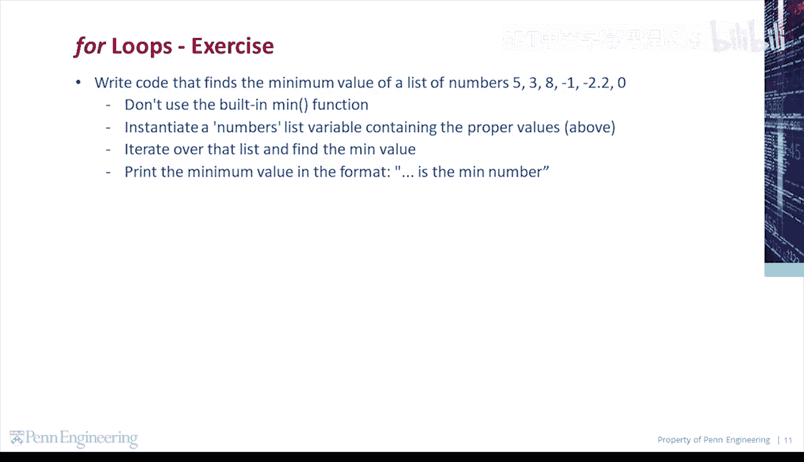
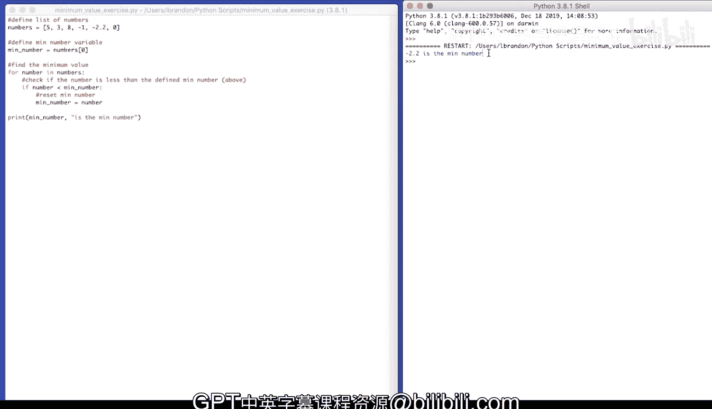

# Python和Java编程入门1-2：049：代码练习-查找最小值 📝

在本节课中，我们将学习如何编写代码来查找一组数字中的最小值。我们将不使用Python内置的`min`函数，而是通过手动遍历列表并比较数值来实现这一功能。

## 概述

我们将从一个包含多个数字的列表开始，通过遍历列表中的每个元素，并与一个初始设定的“最小值”进行比较，从而找出列表中的实际最小值。这个过程将帮助我们理解循环和条件判断在编程中的基本应用。

## 定义数字列表

首先，我们需要定义一个包含数字的列表。我们将使用以下数值：5, 3, 8, -1, -2, 2, 0。



```python
numbers = [5, 3, 8, -1, -2, 2, 0]
```

## 初始化最小值变量

在开始遍历列表之前，我们需要一个变量来记录当前找到的最小值。一个常见的做法是先将列表的第一个元素设为初始最小值。

```python
min_number = numbers[0]
```

这里，我们将`min_number`初始化为列表的第一个元素，即数字5。

## 遍历列表并查找最小值

接下来，我们将遍历列表中的每一个数字。对于列表中的每个元素，我们都会检查它是否小于当前记录的`min_number`。如果是，我们就更新`min_number`为这个更小的值。

以下是遍历和比较的逻辑：

```python
for number in numbers:
    if number < min_number:
        min_number = number
```

在这段代码中，`for`循环会依次将`numbers`列表中的每个值赋给变量`number`。然后，`if`语句会判断当前的`number`是否小于`min_number`。如果条件为真，`min_number`的值就会被更新为当前的`number`。

## 打印最终结果

在完成整个列表的遍历后，`min_number`变量中存储的就是列表中的最小值。最后，我们将其打印出来。

```python
print(min_number)
```

运行上述完整代码，输出结果将是`-2`，因为它是列表`[5, 3, 8, -1, -2, 2, 0]`中最小的数字。

## 总结



本节课中，我们一起学习了如何在不使用内置函数的情况下，通过编写代码来查找列表中的最小值。我们首先定义了一个数字列表，然后初始化了一个变量来跟踪最小值。接着，我们使用`for`循环遍历列表，并通过`if`条件语句比较和更新最小值。最后，我们打印出了找到的最小值。这个过程清晰地展示了循环和条件判断这两个基础编程概念的实际应用。