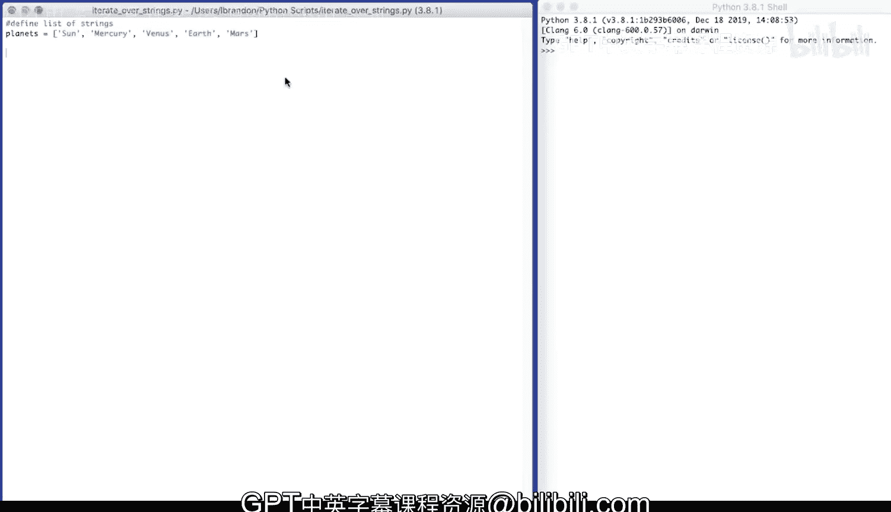
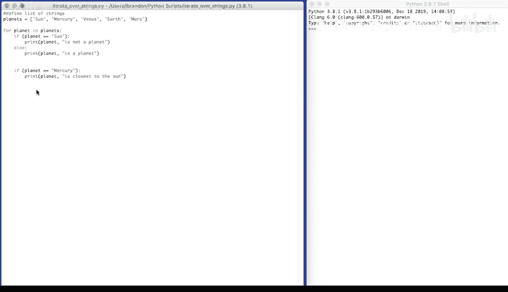
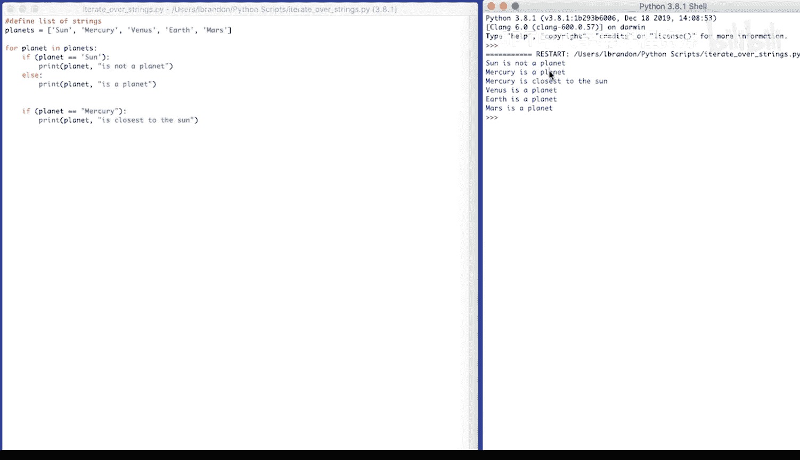
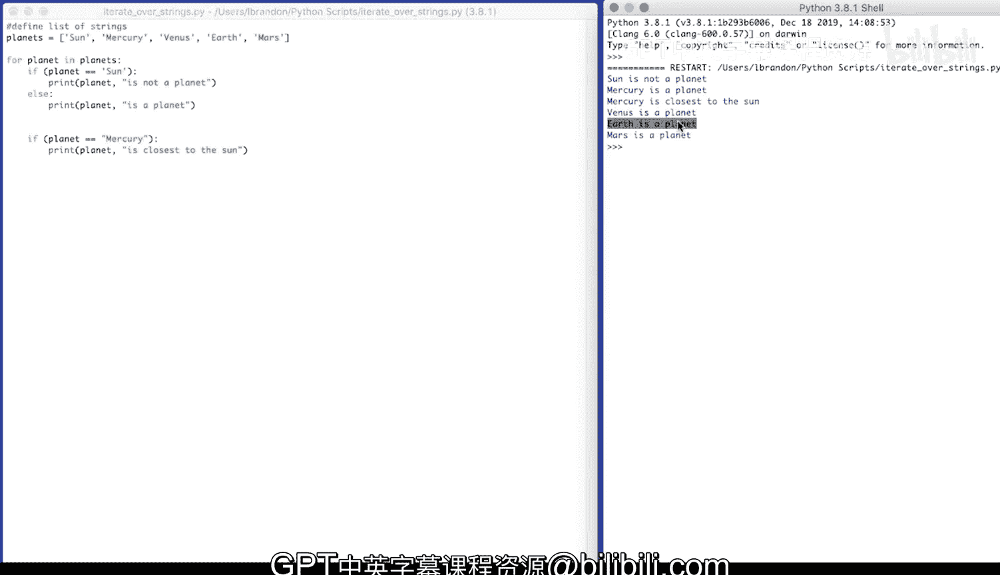

# Python编程入门：050_02_04：遍历字符串列表 🌟

在本节课中，我们将学习如何使用Python的`for`循环来遍历一个字符串列表，并根据条件执行不同的操作。我们将通过一个具体的例子来演示这个过程。



## 概述

我们将创建一个包含多个行星名称的列表，然后遍历这个列表。在遍历过程中，我们会检查每个元素，并根据其值打印出不同的信息。这有助于我们理解如何在实际编程中处理列表和条件判断。

## 教程内容

首先，我们定义一个名为`planets`的列表，其中包含几个字符串元素：`"Sun"`、`"Mercury"`、`"Venus"`、`"Earth"`和`"Mars"`。

```python
planets = ["Sun", "Mercury", "Venus", "Earth", "Mars"]
```

接下来，我们使用`for`循环来遍历这个列表。对于列表中的每一个元素（我们称之为`planet`），我们将执行一系列的条件判断。

以下是循环和条件判断的代码结构：

```python
for planet in planets:
    if planet == "Sun":
        print(planet, "is not a planet")
    else:
        print(planet, "is a planet")
    if planet == "Mercury":
        print(planet, "is closest to the sun")
```

在上面的代码中，我们首先检查当前`planet`是否等于`"Sun"`。如果是，我们打印一条信息表明它不是行星；否则，我们打印一条信息表明它是行星。此外，如果当前`planet`是`"Mercury"`，我们还会额外打印一条信息，说明它是最靠近太阳的行星。



## 执行结果

当运行上述代码时，控制台将输出以下结果：

```
Sun is not a planet
Mercury is a planet
Mercury is closest to the sun
Venus is a planet
Earth is a planet
Mars is a planet
```



从输出中可以看到，程序正确地识别了太阳不是行星，而其他元素都是行星，并且特别指出了水星是最靠近太阳的行星。

## 总结



在本节课中，我们一起学习了如何使用`for`循环遍历字符串列表，并结合`if-else`条件语句根据元素值执行不同的操作。通过这个例子，我们掌握了列表遍历和条件判断的基本用法，这是Python编程中非常基础和重要的技能。