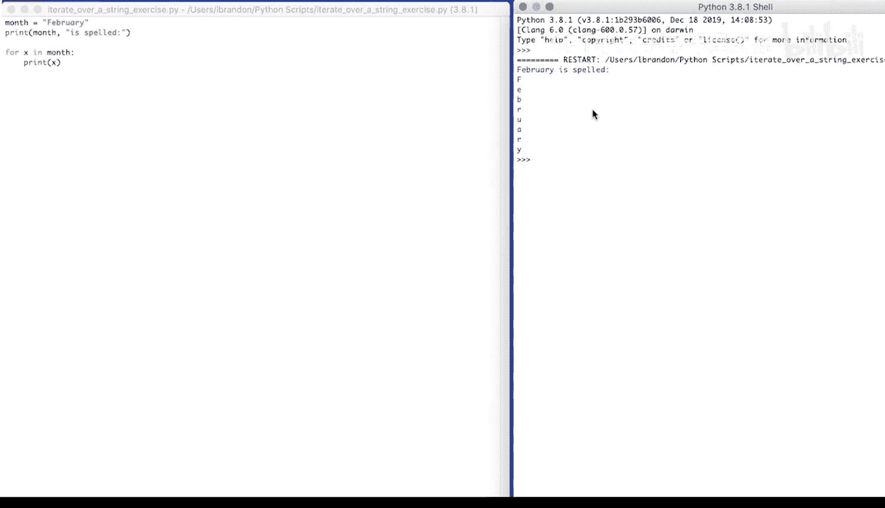
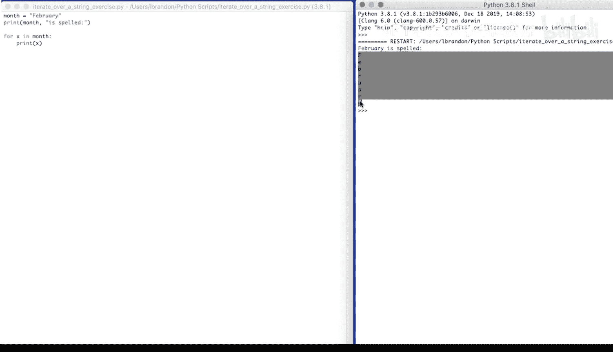
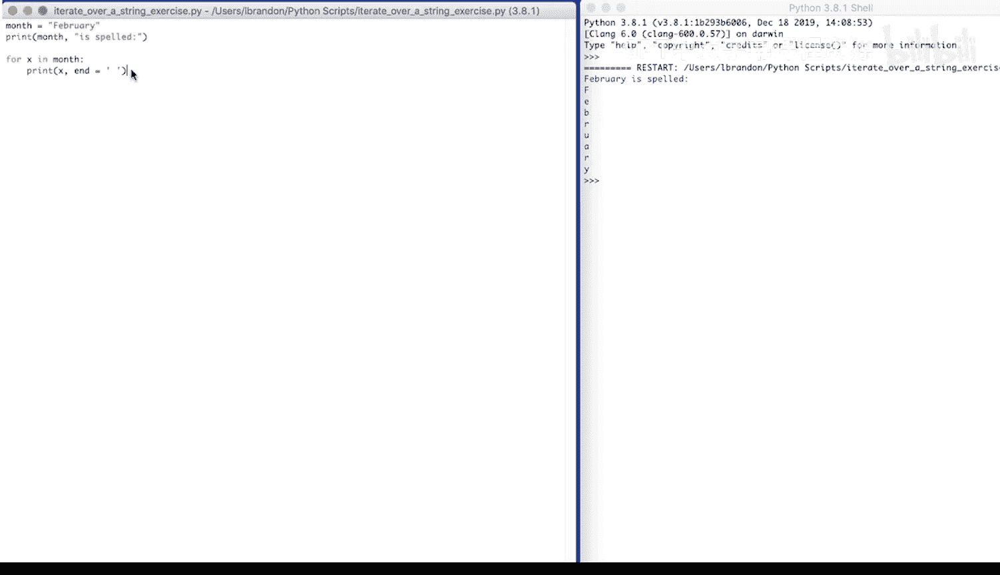
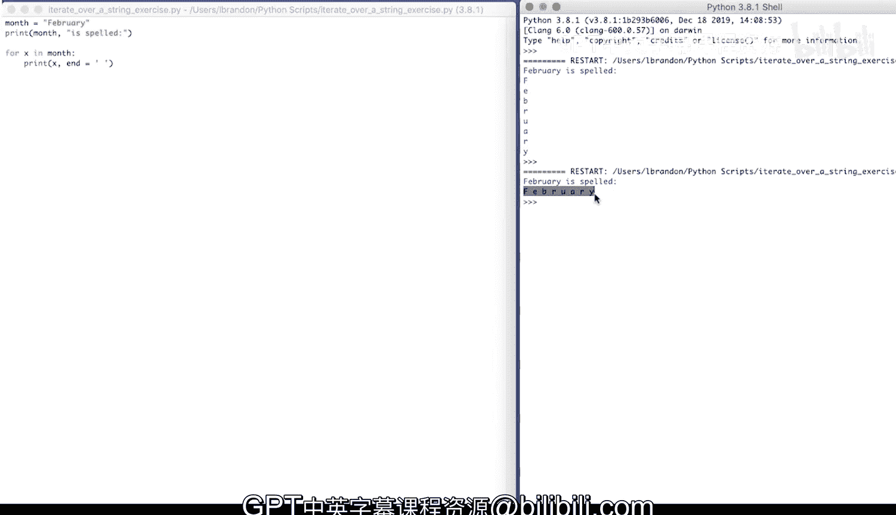

# Python和Java编程入门1-2：051：字符串迭代 🔄

在本节课中，我们将学习如何遍历字符串。字符串是由字符组成的序列，我们可以像遍历列表一样，逐个访问其中的每个字符。

---

上一节我们介绍了循环的基本概念，本节中我们来看看如何将循环应用于字符串。

## 遍历字符串

我们可以直接对字符串本身进行迭代。这意味着我们可以使用 `for` 循环来逐个访问字符串中的每一个字符。

以下是具体步骤：
1.  首先，定义一个字符串变量。
2.  然后，使用 `for` 循环遍历这个字符串变量。
3.  在循环体内，处理或打印每一个字符。

让我们通过一个例子来理解这个过程。

## 示例：拼写单词

我们定义一个变量 `month`，并将其赋值为 `"February"`。

```python
month = "February"
```

首先，我们打印月份本身，并加上提示语 “is spelled”。

```python
print(month, "is spelled")
```

接下来，我们遍历 `month` 字符串。在每次循环中，变量 `x` 会依次代表字符串中的一个字符。



```python
for x in month:
    print(x)
```

运行这段代码，输出结果如下：

> February is spelled
> F
> e
> b
> r
> u
> a
> r
> y



程序首先打印了 “February is spelled”，然后依次打印了月份中的每个字符，每个字符独占一行。

## 在同一行打印字符

如果我们希望所有字符打印在同一行，并以空格分隔，可以修改 `print` 函数的 `end` 参数。默认情况下，`print` 函数会在输出末尾添加换行符。我们可以将其改为一个空格。

```python
for x in month:
    print(x, end=' ')
```

再次运行代码，输出变为：



> February is spelled F e b r u a r y

现在，所有的字符都打印在了同一行，并且用空格分隔开来。



---

本节课中我们一起学习了字符串的迭代。我们了解到，字符串是可迭代对象，可以使用 `for` 循环轻松访问其中的每一个字符。通过控制 `print` 函数的 `end` 参数，我们可以灵活地控制输出的格式，例如将所有字符打印在同一行。这是处理文本数据的一项基础且重要的技能。