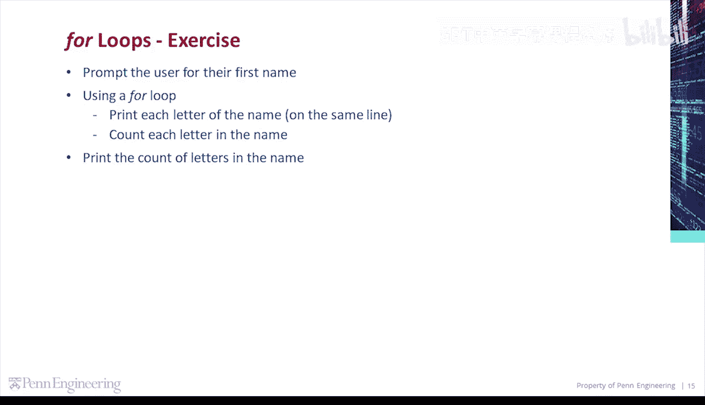
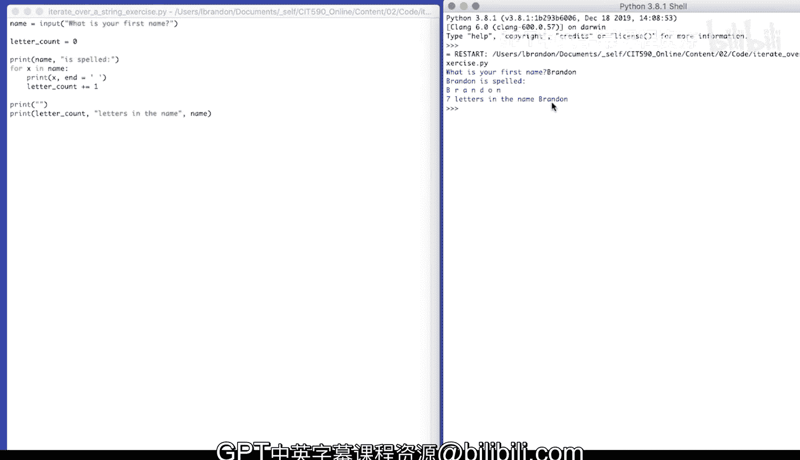

# 宾夕法尼亚大学《Python和Java编程入门1-2｜Introduction to Programming with Python and Java》中英字幕 p52 052_02_06_代码练习-遍历姓名.zh_en -BV13E421M7FF_p52-

Let's do an exercise。We're going to prompt the user for their first name。Using a for loop。

 print each letter of the name on the same line。

Count each letter in the name and then print the count of letters in the name。

So let's get some user input。We'll store that in name， input。What is your first name。

We're going to initialize a letter count。Letter count equals 0。That will store our count of letters。

Let's initially print the name。Print name。Is spelled。😔。

Then let's iterate over the name with a for loop。4 x in name。What is x X is Es letter in the name。

Print x。Followed by an empty space。Increment letter count。Finally， let's print the count of letters。

Print。ISay， letter count。Letters in the name。And then we'll concatenate name。And before that。

 let's just print。An empty line。And let's run our code。What is your first name？Brandon。

Brandon is spelled B，RA， A N， D， O， N 7 letters in the name， Brandon。

