# 宾夕法尼亚大学《Python和Java编程入门1-2｜Introduction to Programming with Python and Java》中英字幕 p53 053_02_07_使用range的for循环.zh_en -BV13E421M7FF_p53-

You can create a for loop using a list。You can also create a for loop using the range function。

 which generates a sequence or range of numbers。 This can be used like a list when you want to perform an action n number of times。

The format of the range function looks like this。 The start and step are both optional。

 Start is the number you start on up to means up to， but not including the value。

 And you can only use integers， no floats。

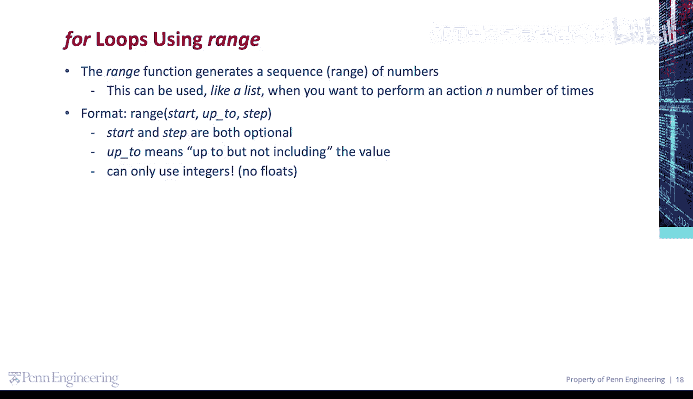

Let's iterate over a sequence of 10 numbers， from 0 to 9。So， 4 x in range 10。

Using the range function， I'm providing one argument here 10， so by default， that's the up to value。

 but not including。So I'm going to print X。Save that on my code。 this prints 0 through 9 by default。

 it starts on 0。And I'm telling it to stop on 9 by specifying 10 in the range function。

Let's add a line break here。 Now， let's iterate over a sequence of 10 numbers from 0 to 9 in a different way。

Copy paste。I'm going to tell range to start on 0。 and the up to， but not including is still 10。

This also prints 0 through 9。Add a line break。Now， we're going to iterate over a sequence of six numbers from  one to 6。

4 x。In range。😔，Start on one up to 7， but not including 7。Print x。

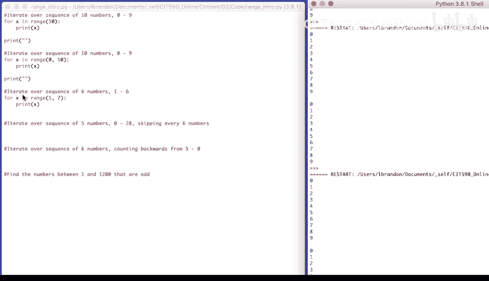

You'll see that prints 1 through 6。

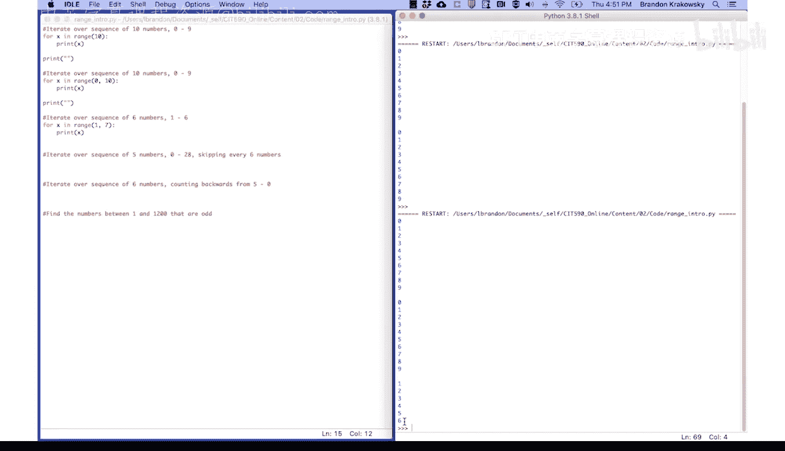

Let's add a line break there。 Let's iterate over a sequence of five numbers， 0 to 28。

 skipping every six numbers。4 x in。Range。0。😔，Up to 30， but not including。 And for the step。

 I'm going to provide 7。Print x。

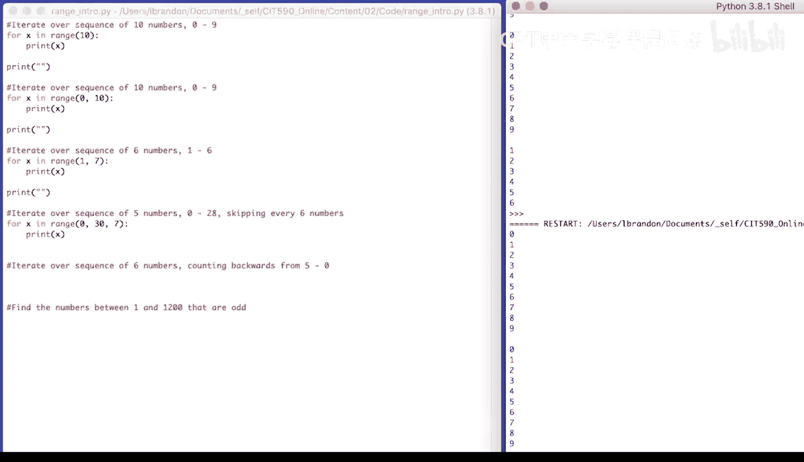

We could see it here， 0，7，14，21，28。

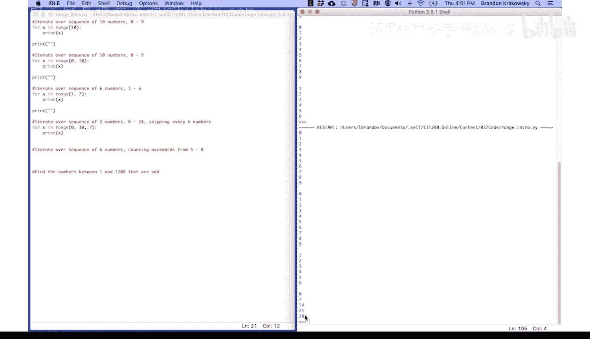

At a line break。Iterate over a sequence of six numbers， counting backwards from 5 to 0。

So4 x in range。 start with 5。 the up to， but not including is negative1。

And the step is negative  one， because we're going to go backwards。Print。😔，X。

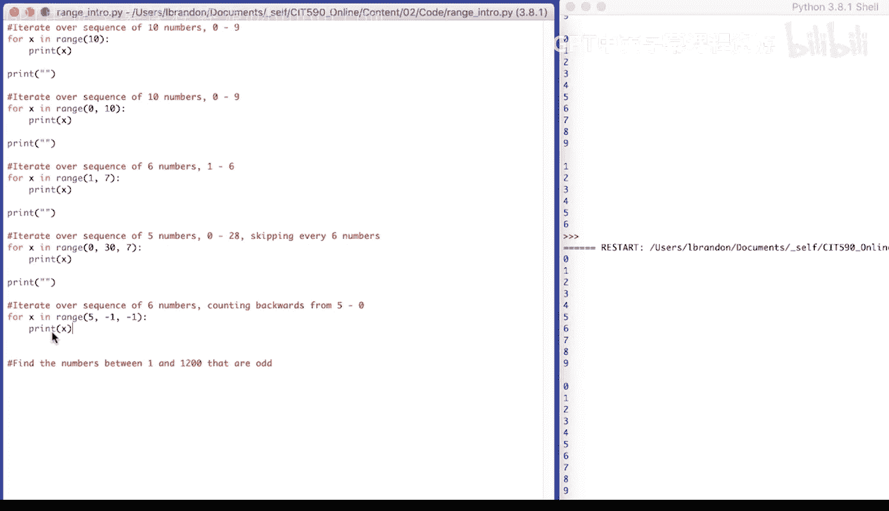

5，4，3，2，1，0。

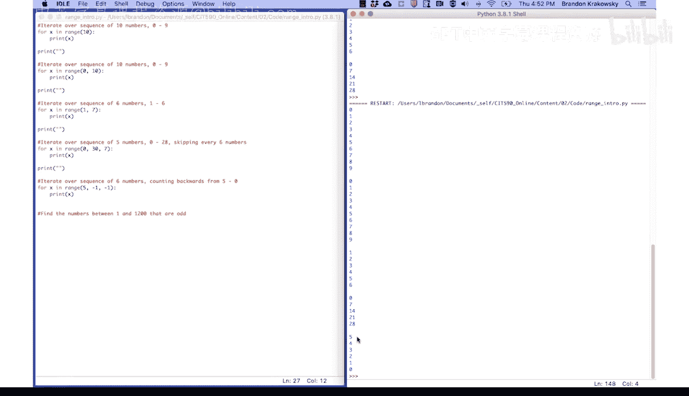

Going to add a line break here。Then let's find the numbers between 1 and 1，200 that are odd。

So I'm going to create a list。Od numbers， empty list to store odd numbers。

For each number in the range。1 to 1201。So that would be 1 to 1，200。If the number。

Mod2 is not equal to 0。If the number mod 2 is not equal to 0， it's odd。

We're going to append it to odd numbers。

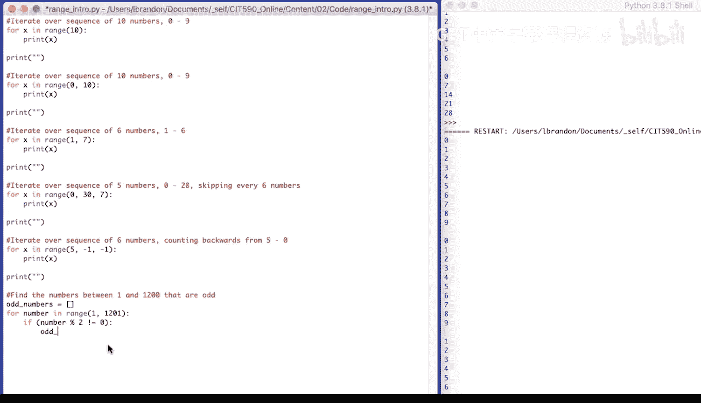

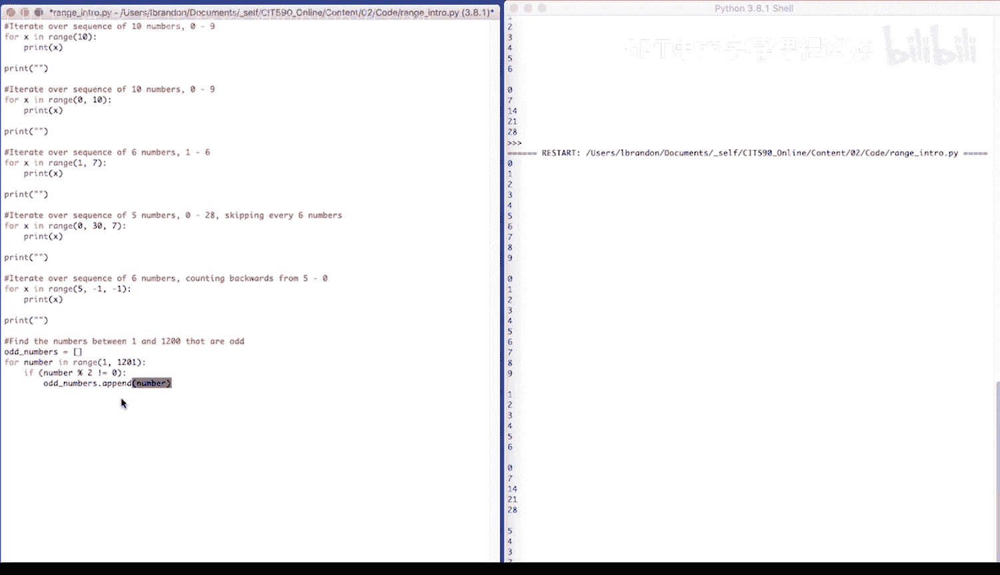

And then we'll print our odd numbers。So。😔，If odd， append。2 odd。Numbers list。And let's run our code。

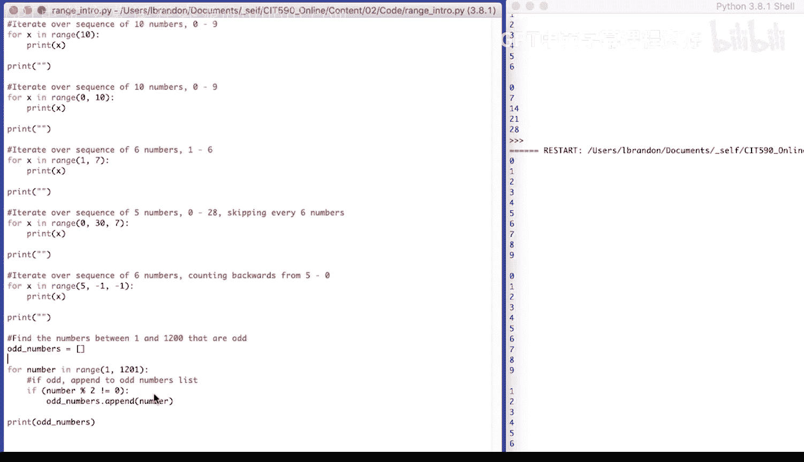

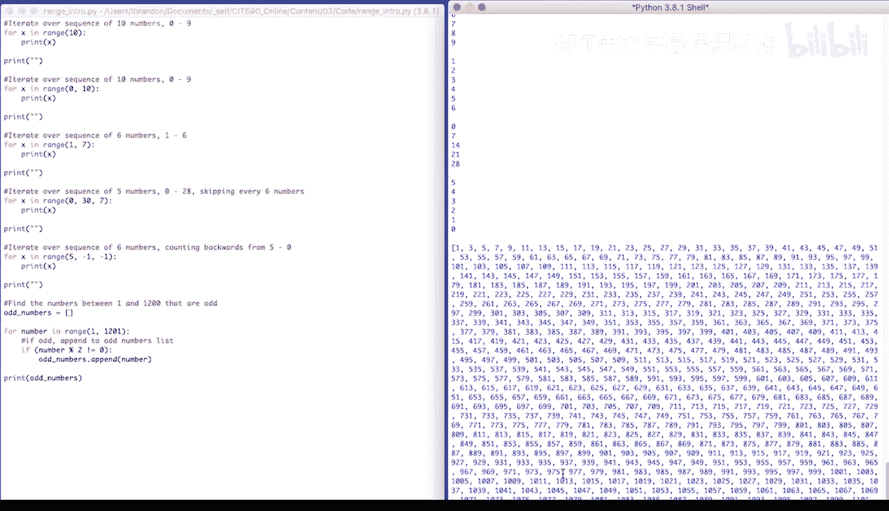

Here's the list of odd numbers， from 1 to 1200。

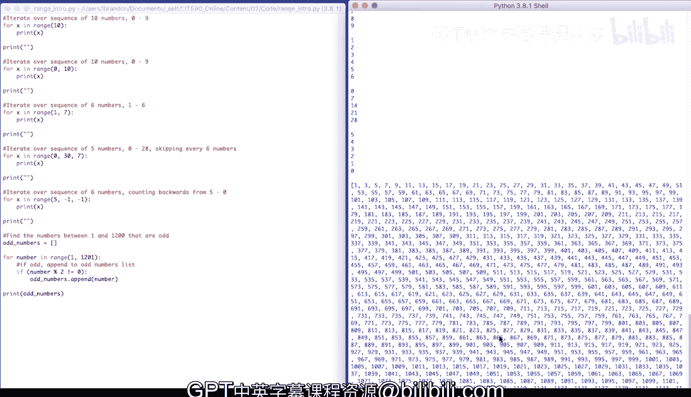