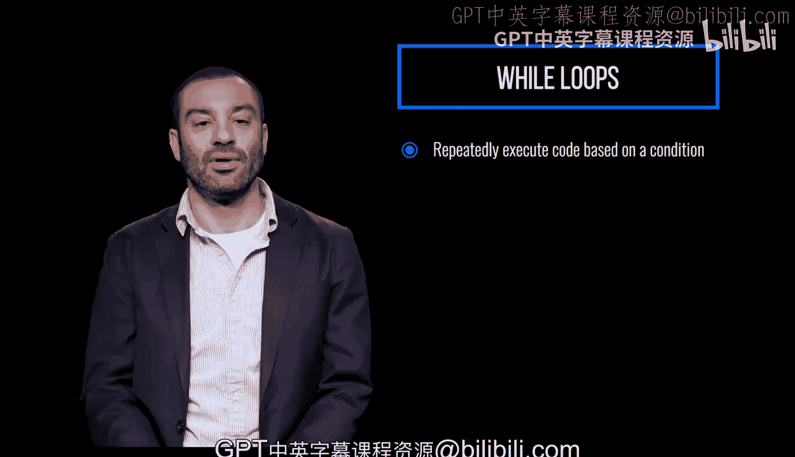
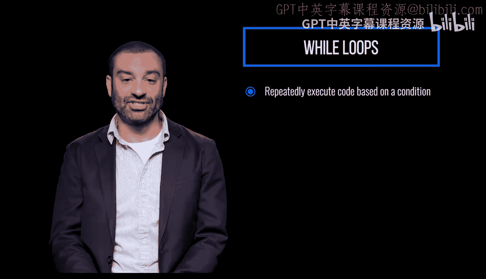
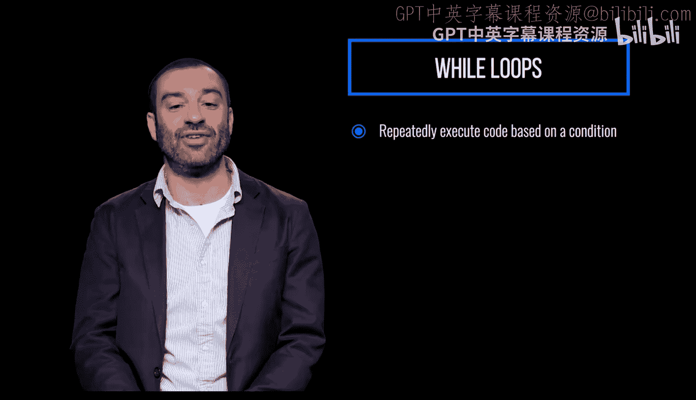
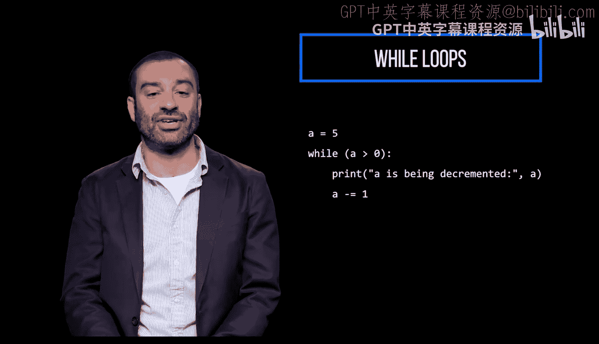
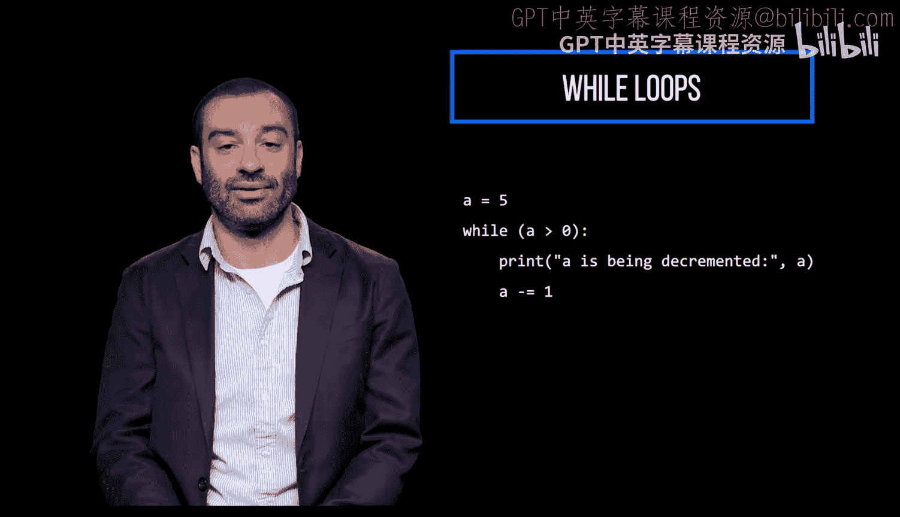
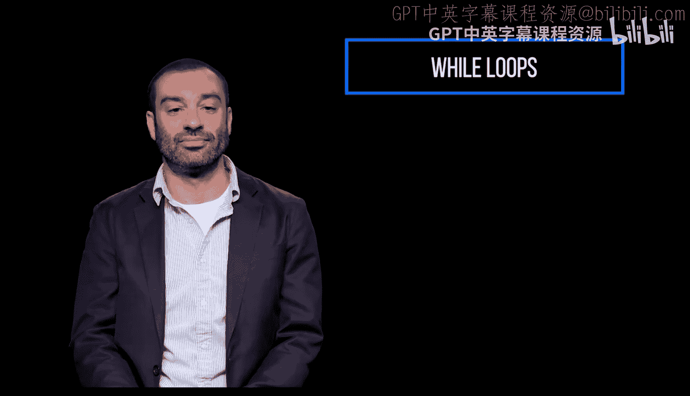
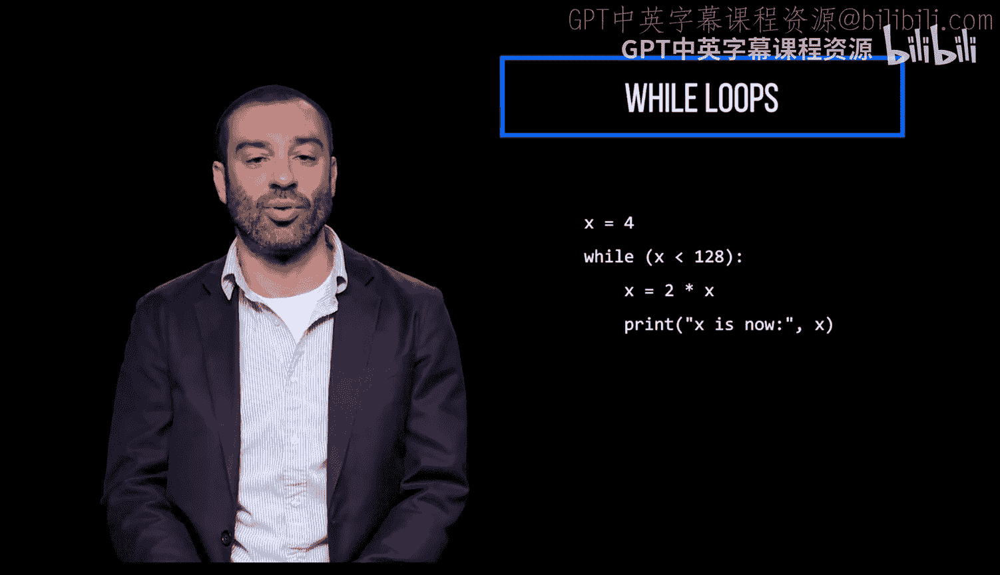
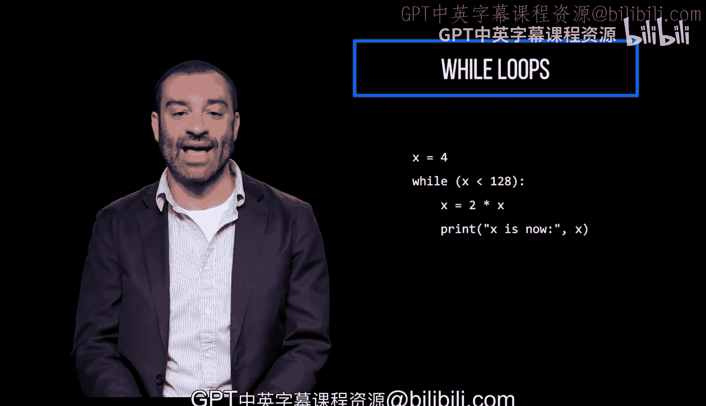

# 宾夕法尼亚大学《Python和Java编程入门1-2｜Introduction to Programming with Python and Java》中英字幕 p54 054_02_01_基于条件重复执行代码.zh_en -BV13E421M7FF_p54-

A while loop repeatedly executes code based on a condition。 In this scenario。

 you should be careful if the condition is never met。

 your loop becomes an infinite loop and never stops。 If this happens， your program could crash。

This prints the value of a until it reaches0。

We initially set8 to5， and as long as it's greater than zero， the enclosed code block will execute。

Every time the code block is executed， we're printing the current value of a and decrementing by one。

When a is no longer greater than zero， we exit the while loop。

Here's a program that multiplies x by 2 until an upper limit of 128， starting at4。

We initially set x to 4， and as long as it's less than 128， the enclosed code block will execute。

Every time the code block is executed， we're multiplying x by 2 and printing the current value of x in that order。

When x is no longer less than 128， we exit the while loop。

