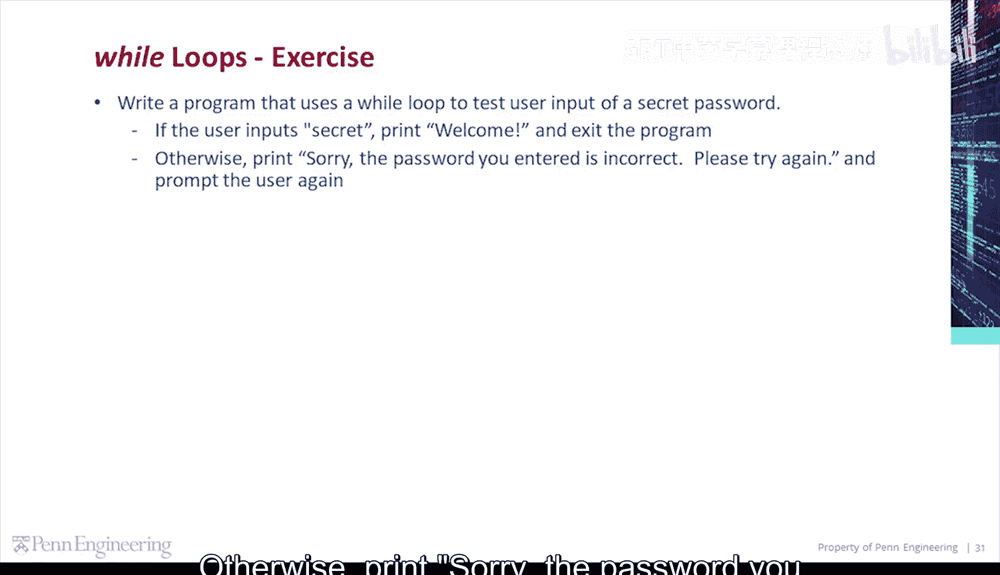
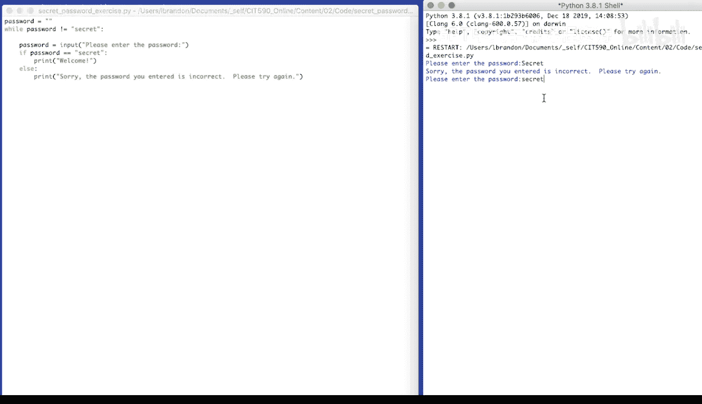

# 宾夕法尼亚大学《Python和Java编程入门1-2｜Introduction to Programming with Python and Java》中英字幕 p56 056_02_03_代码练习-密码验证.zh_en -BV13E421M7FF_p56-

Let's write a program that uses a while loop to test user input of a secret password。

 If the user inputs secret， print， welcome and exit the program， Otherwise， print， sorry。

 the password you entered is incorrect。 Please try again and prompt the user again。

I'm going to create a variable password。Set it to an empty string。While password is not equal to。

Secret。Enter the while loop。Set password。To the result of some user input。Please， enter the password。

Then we'll test the password if password is equal to。Secret。Print。Welcome。Else。Print。😔，Sorry。😔。

The password。You entered is incorrect。Please， try again。Then we'll go to the top of the loop。

 if password is still not secret， we'll reprompt the user。

 test the password again and print the correct message。 Once password is secret， we'll exit the loop。

Please enter the password。Secret with a capital S。Sorry， the password you entered is incorrect。

 Please try again。Secret。With a lowercase S。

Welcome。