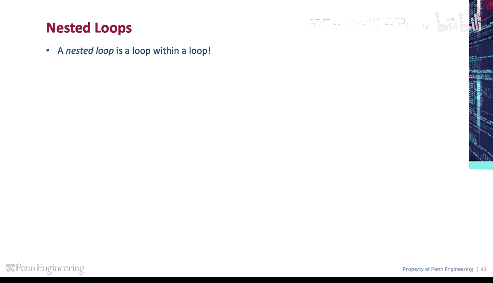
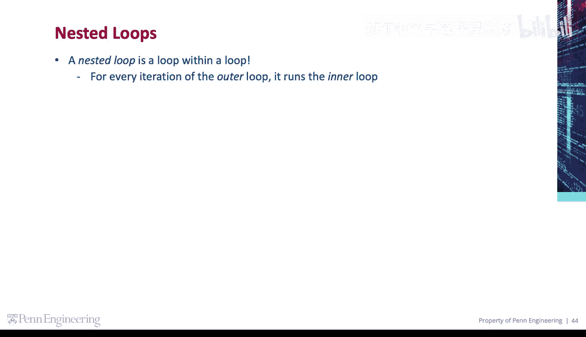
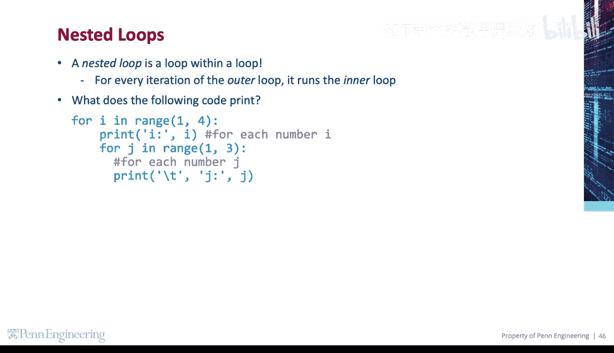
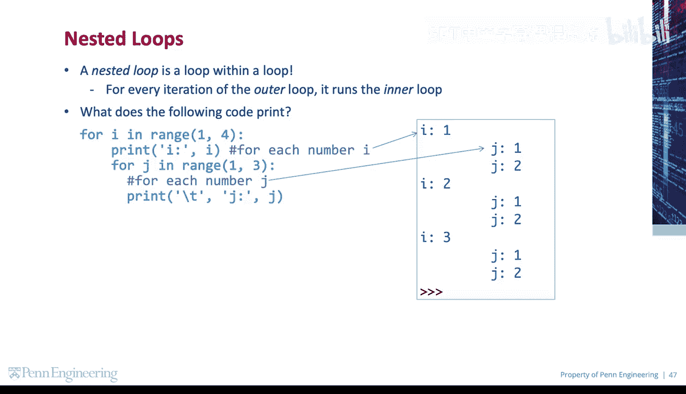
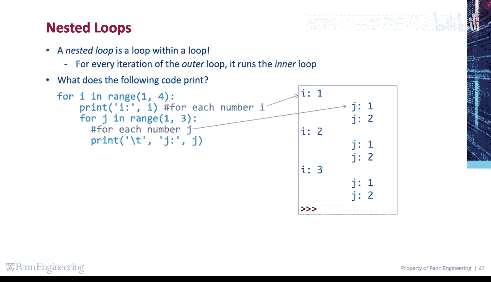
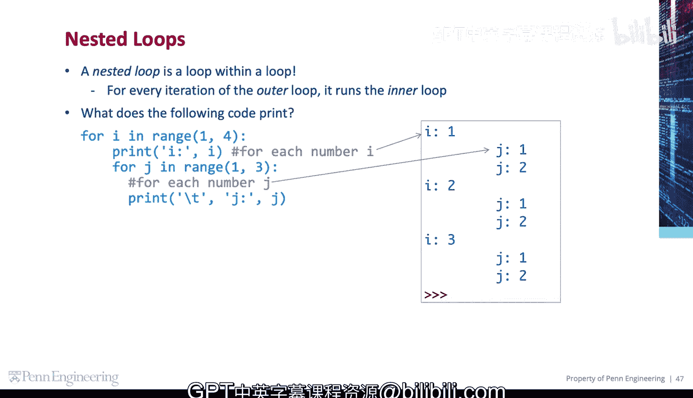
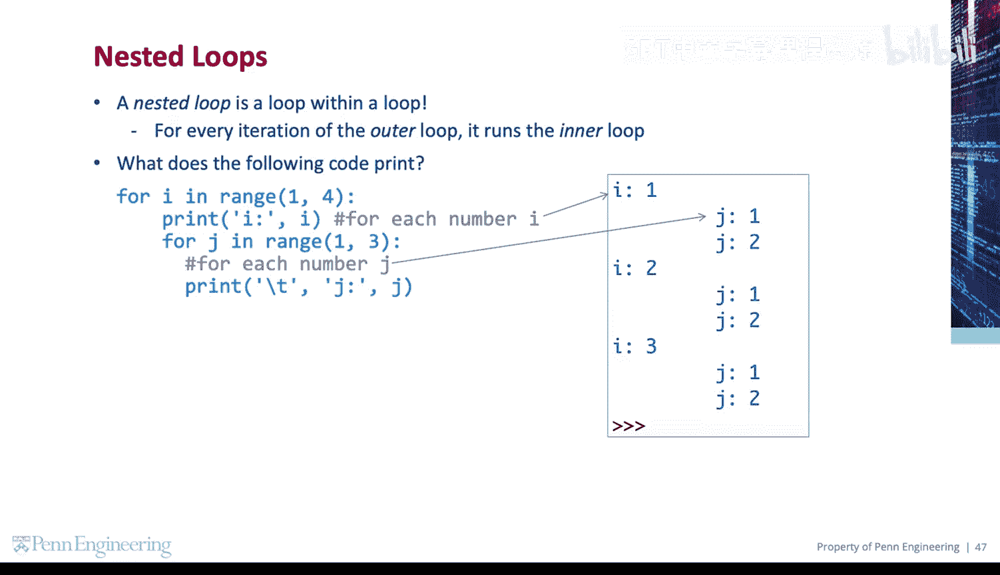

# 宾夕法尼亚大学《Python和Java编程入门1-2｜Introduction to Programming with Python and Java》中英字幕 p59 059_02_06_嵌套循环.zh_en -BV13E421M7FF_p59-

A nested loop is a loop within a loop。For every iteration of the outer loop。

 it runs the entire inner loop。

So what is the following code print？

For every iteration of the outer loop， it prints the current value of I。 So first， it prints one。

 then it enters the inner loop。

For every iteration of the inner loop， it prints the current value of J， so it prints one and two。

 each preceded by a tab character or backslash T。

Then it goes back out to the next iteration of the outer loop and print2。

It enters the inner loop again and runs every iteration of the inner loop。

 printing one and two again。

Lastly， it goes back out to the next and final iteration of the outer loop and Prince 3。

Then runs every iteration of the inner loop， printing one and2 one more time。

