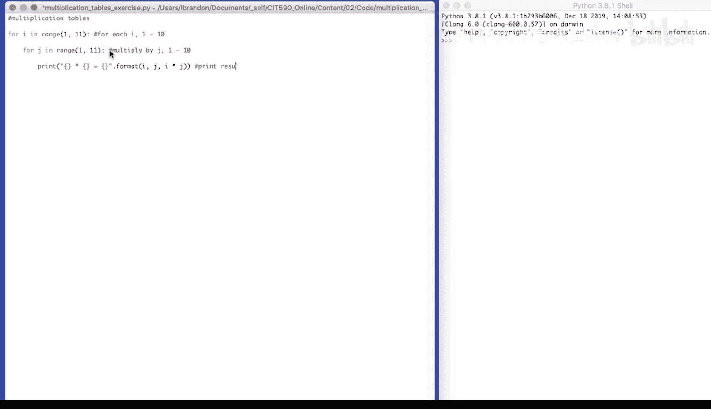
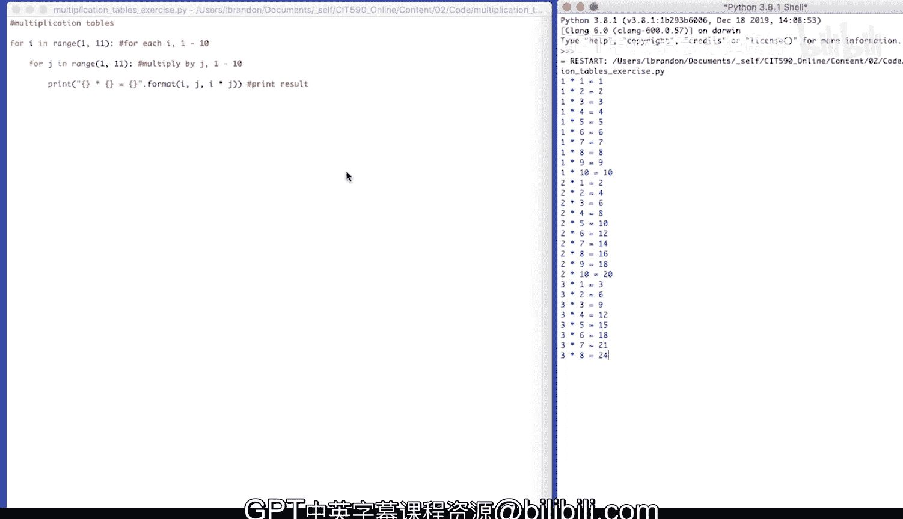
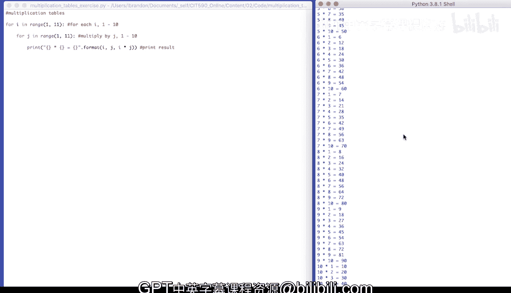

# 宾夕法尼亚大学《Python和Java编程入门1-2｜Introduction to Programming with Python and Java》中英字幕 p60 060_02_07_代码练习-乘法表.zh_en -BV13E421M7FF_p60-

Let's write a program just to make sure that we know our multiplication tables。

 We're going to use nested for loops。So4 I in range 1 through 11， which is1 through 10。

Iterate over4 J in。Range also 1 through 11， which is one through 10。So say4， each I1 through 10。😔。

We're going to actually multiply by J。1 through 10。And then， print the result。

I'll do placeholder times， placeholder equals placeholder。😔，Dot format and will insert the value。 I。

 J， I times J。Print result。

Let's run our code。

Our multiplication tables。

