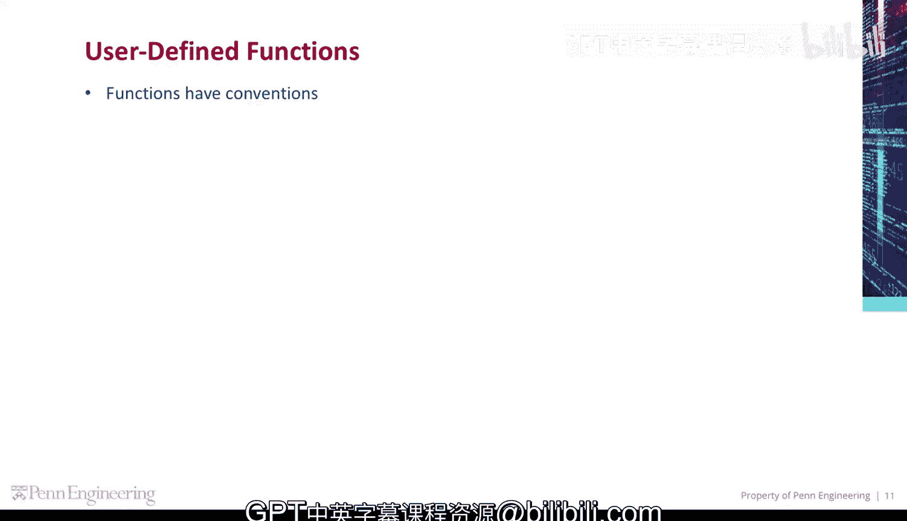
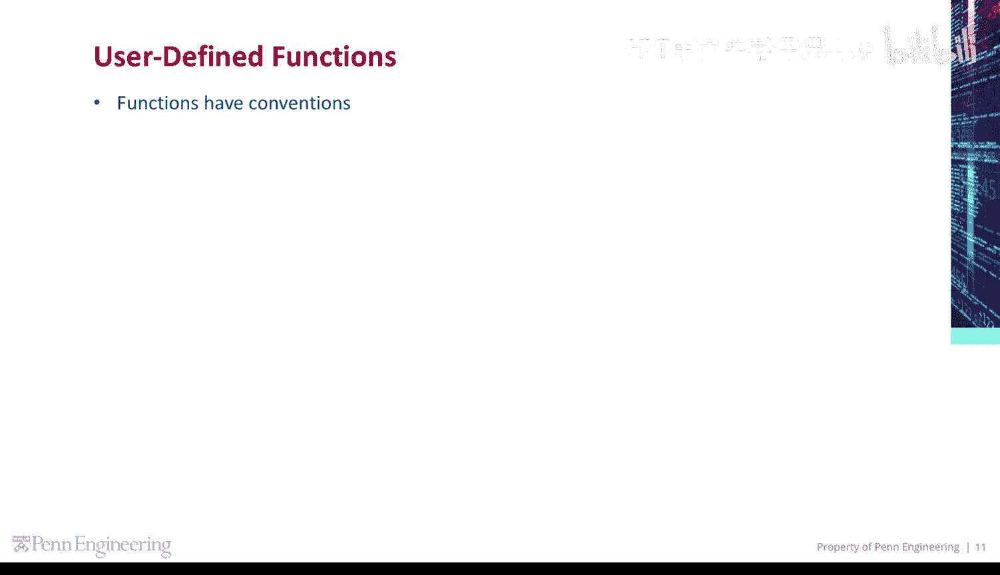
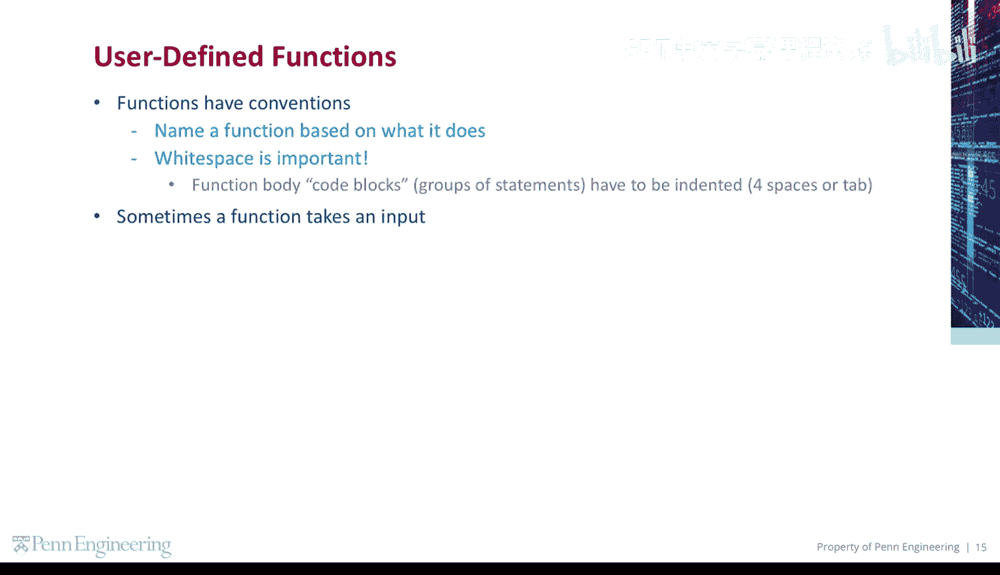
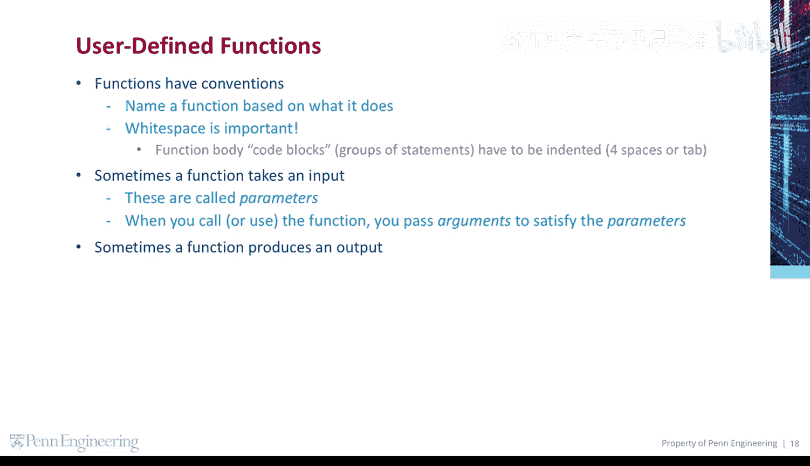
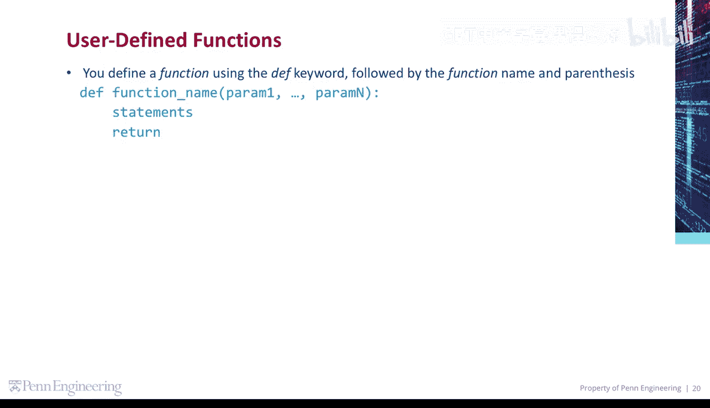
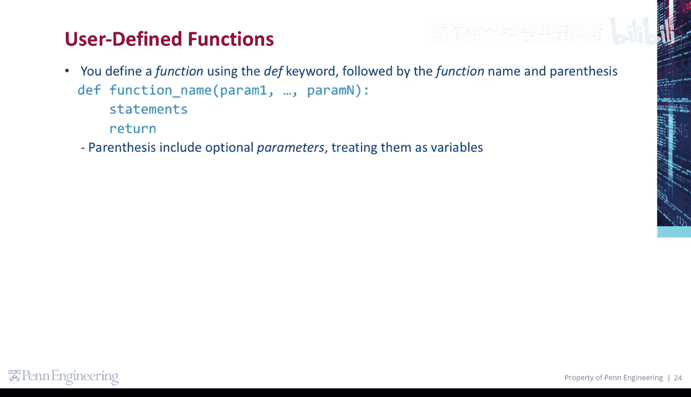
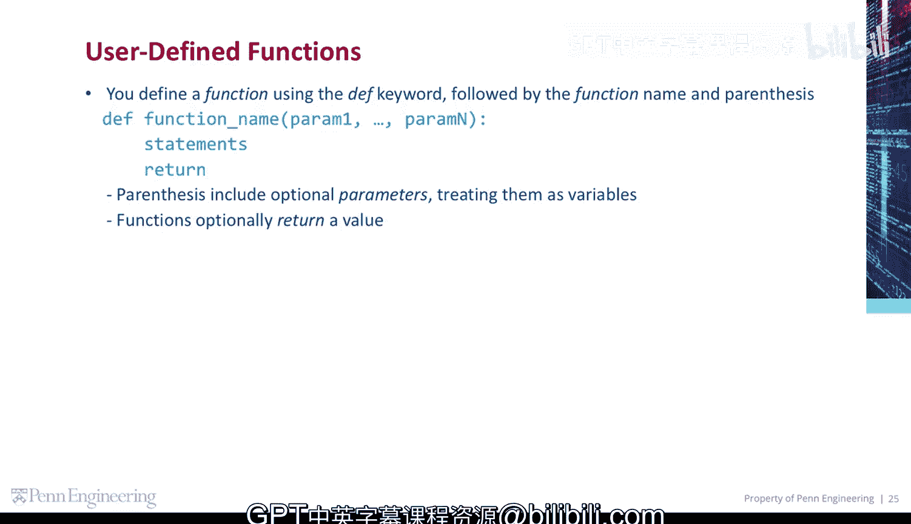
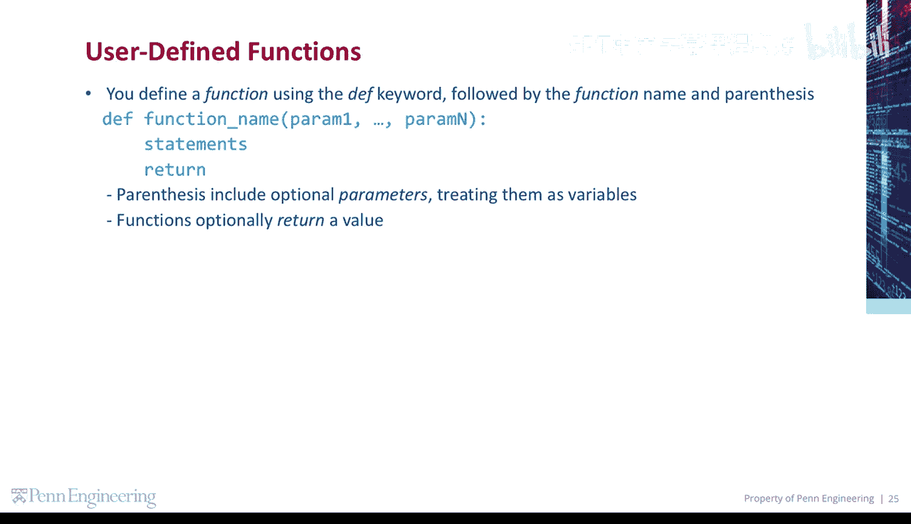

# 宾夕法尼亚大学《Python和Java编程入门1-2｜Introduction to Programming with Python and Java》中英字幕 p65 065_02_03_用户自定义函数.zh_en -BV13E421M7FF_p65-

Python allows you to create your own user defined functions。

 Here are some conventions name the function based on what it does， whitespace is important。

 and function body code blocks or groups of statements have to be indented by four spaces or a single tab。

😡。

Sometimes a function takes an input， these are called parameters。

 and when you call or use the function， you pass arguments to satisfy the parameters。

Sometimes a function produces an output。 This is called the function's return value。

 You define a function using the DEF keyword， followed by the function name and parentheses。

The parentheses include optional parameters， which the function treats as variables。

The function will include function code， followed by an optional return value。

