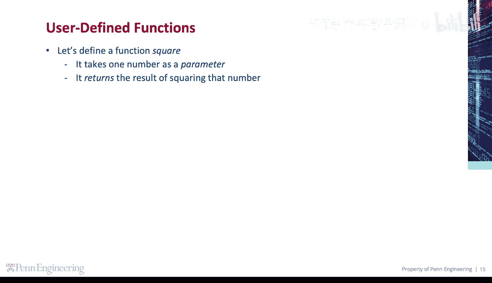
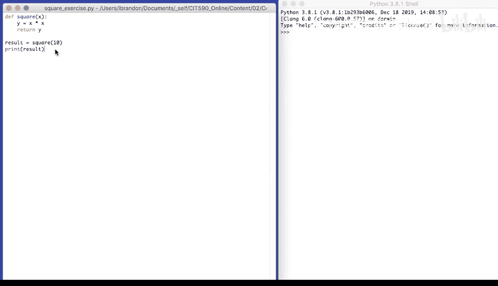

# 宾夕法尼亚大学《Python和Java编程入门1-2｜Introduction to Programming with Python and Java》中英字幕 p66 066_02_04_代码练习-平方计算.zh_en -BV13E421M7FF_p66-

Let's define a function square。 It takes one number as a parameter。

And returns the result of squaring that number。So， D， E F。Square。For a given x。

X is the input will set y to be x times x。 Y is x squared。

And then we're going to return Y from the function。Now， we're going to call square。

With an argument of 10。Store the result in a variable。And then， print the result。

So when we call square with 10。

We print the result， it's 100。