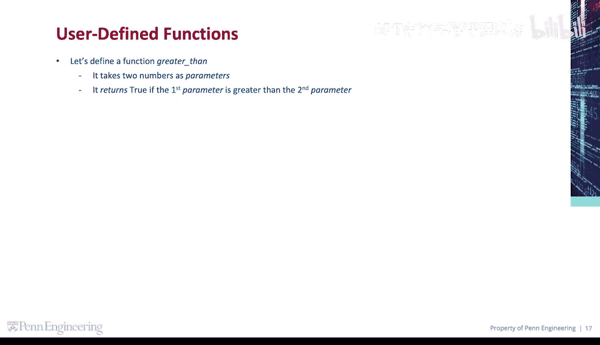
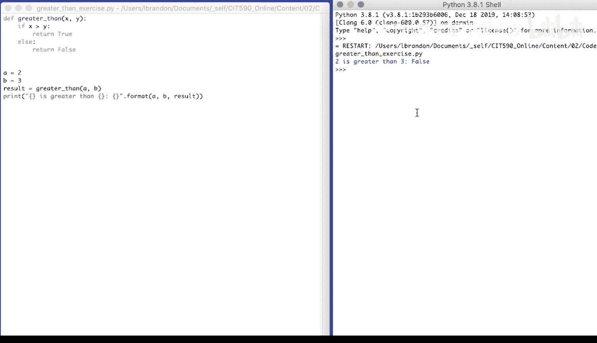

# Python编程入门：067：代码练习-比较大小 🔍

在本节课程中，我们将学习如何定义一个函数来比较两个数字的大小。我们将创建一个名为 `greater_than` 的函数，它接收两个数字作为参数，并返回一个布尔值，指示第一个参数是否大于第二个参数。

## 函数定义与逻辑



首先，我们定义函数 `greater_than`。它接收两个参数 `x` 和 `y`。在函数内部，我们使用条件语句来判断 `x` 是否大于 `y`。如果是，函数返回 `True`；否则，返回 `False`。

以下是函数的代码实现：

```python
def greater_than(x, y):
    if x > y:
        return True
    else:
        return False
```

## 函数调用与结果输出

定义好函数后，我们需要调用它来测试其功能。我们将使用两个变量 `a` 和 `b` 分别存储数字 `2` 和 `3`，然后将它们作为参数传递给 `greater_than` 函数。

以下是调用函数并输出结果的代码：

```python
a = 2
b = 3
result = greater_than(a, b)
print("{} is greater than {}: {}".format(a, b, result))
```

## 运行结果分析

运行上述代码后，控制台将输出比较结果。由于 `2` 不大于 `3`，所以输出为 `False`。



## 总结


在本节课中，我们一起学习了如何定义一个比较两个数字大小的函数。我们掌握了函数的基本结构、参数传递、条件判断以及结果的返回与输出。通过这个简单的练习，我们加深了对函数和条件语句的理解，为后续更复杂的编程任务打下了基础。