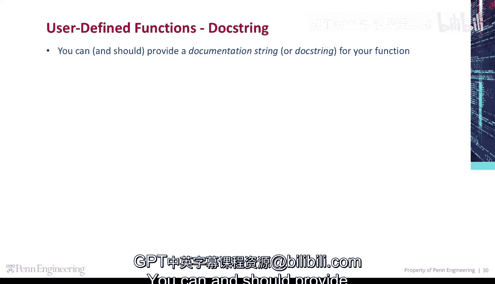
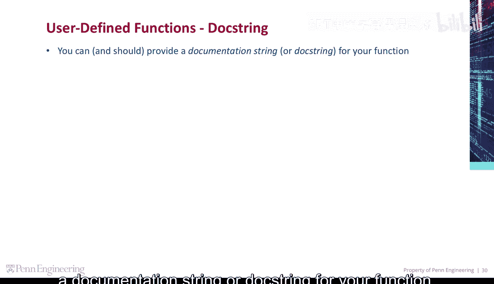
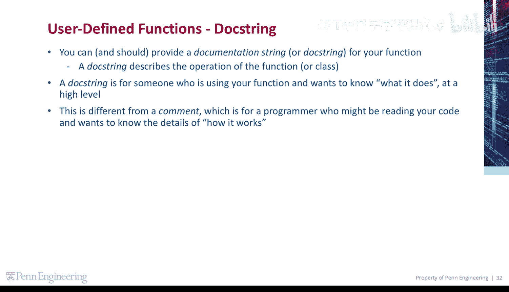
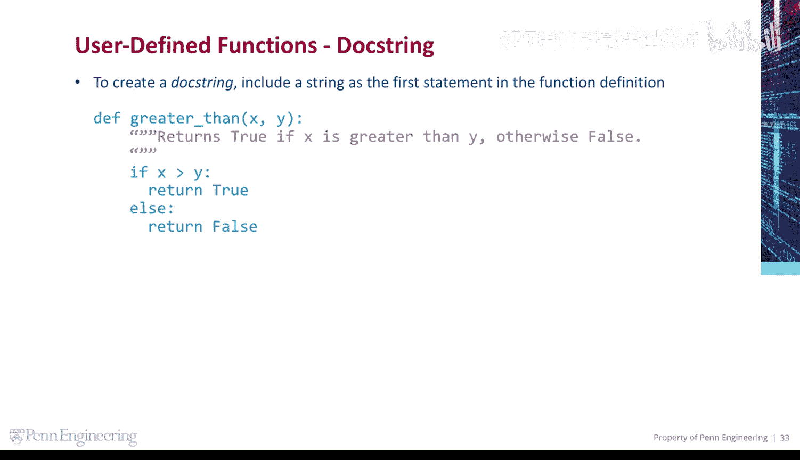
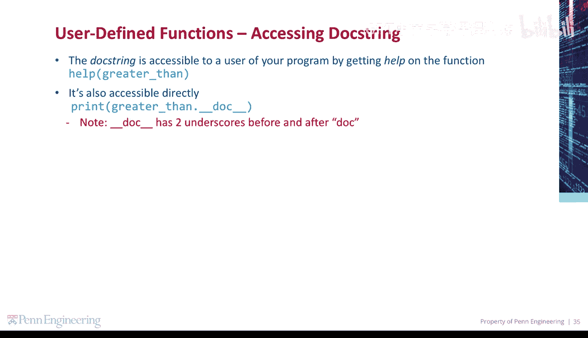
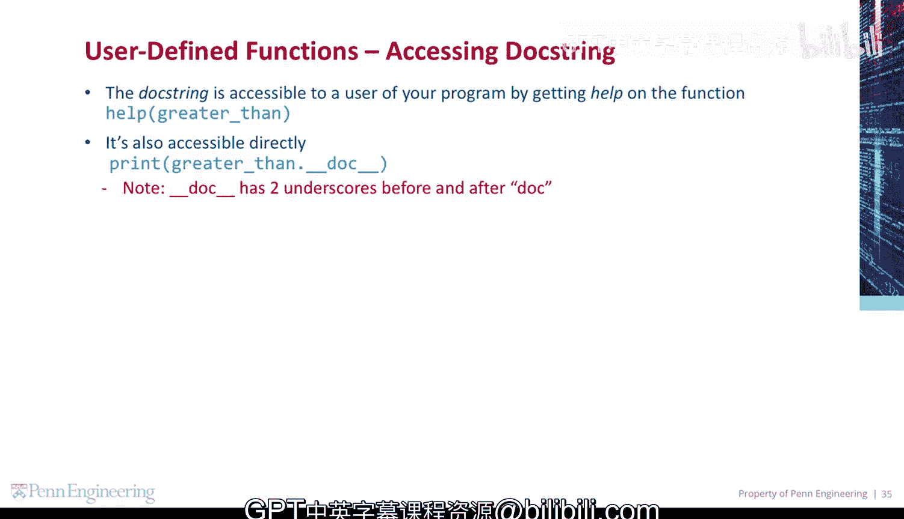
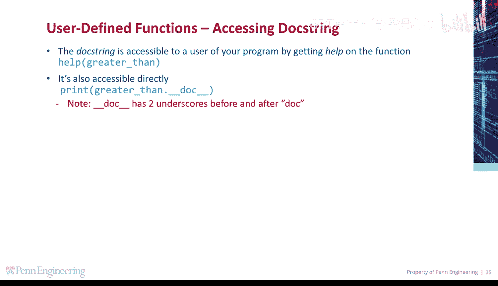

# 宾夕法尼亚大学《Python和Java编程入门1-2｜Introduction to Programming with Python and Java》中英字幕 p68 068_02_06_文档字符串.zh_en -BV13E421M7FF_p68-

You can and should provide a documentation string or dock string for your function。

A dock string describes the operation of the function or a class。

A dock string is for someone who is using your function and wants to know what it does at a high level。

This is different from a comment， which is for a programmer who might be reading your code and wants to know the details of how it works。

To create a dock string， include a string as the first statement in the function definition。

The Doc string is accessible to a user of your program by getting help on the function using the Help command。

😡，It's also accessible directly by referencing the special Doc variable Note。

 Doc has two underscores before and after Doc。

