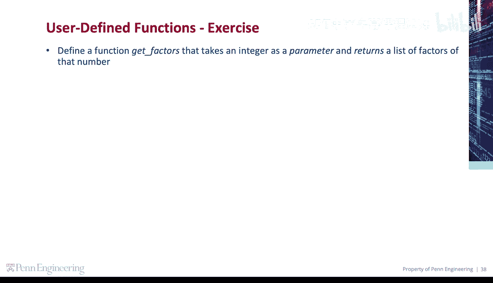
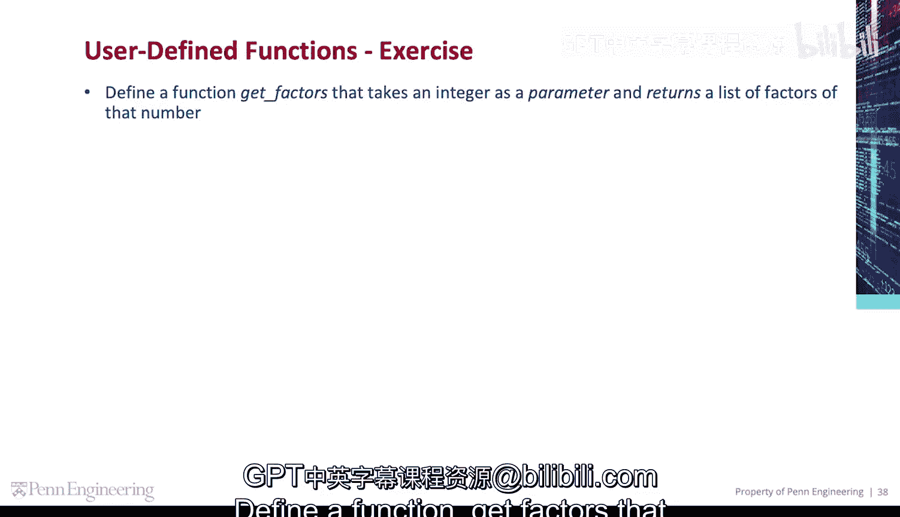
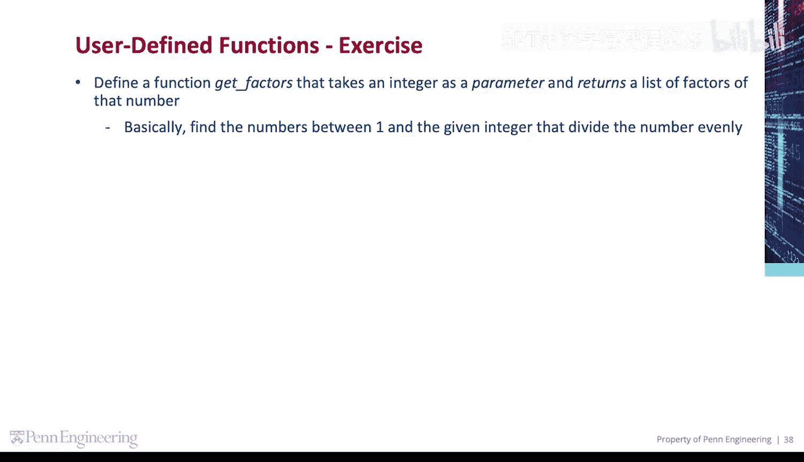
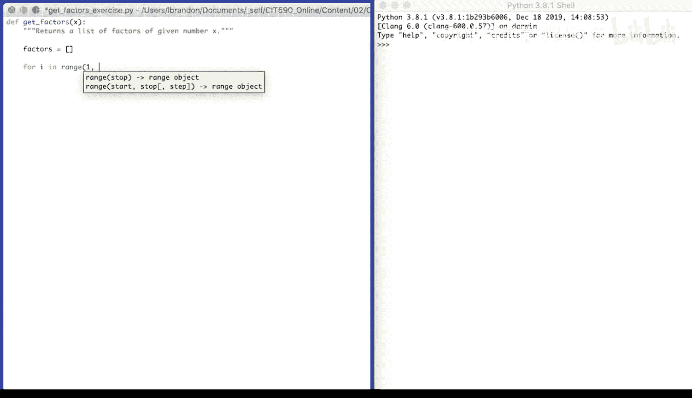
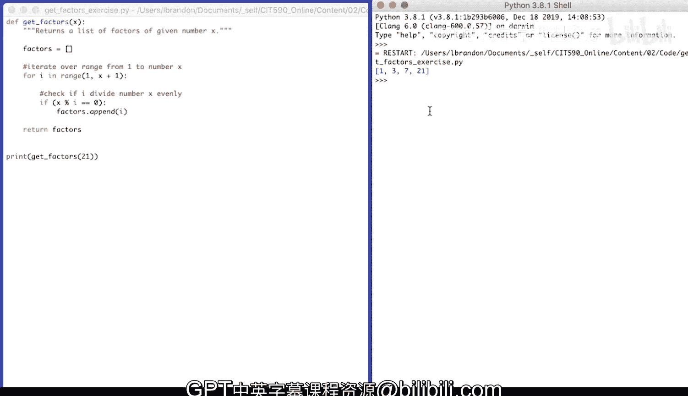

# 宾夕法尼亚大学《Python和Java编程入门1-2｜Introduction to Programming with Python and Java》中英字幕 p69 069_02_07_代码练习-获取因数.zh_en -BV13E421M7FF_p69-

To find a function， get factors that takes an integer as a parameter and returns a list of factors of that number。

 So basically， find the numbers between one and the given integer that divide that number evenly。

So let's define our function， D， E， F， get。Factors for a given number， we'll call that x。

Returns a list of factors。Of given number x。And then our function code， create an empty list。Factors。

That's going to contain the factors of the given x。

 Then we're going to iterate over a range for I in range from one to the number itself。

 So we'll do plus1。

X plus 1 will provide us with numbers between one and the number itself。We'll see if the number。Mod。

 I is 0。So does each number divide X evenly， if so。Add it to factors。And then， return。Factors。

Iterate over range from 1 to number x。Check if。😔，A。😔，Divividedes。Number X， evenly。

And we're going to call it get。Factors。Of a given number 21。And then print the result。

 Pri the factors。The factors of 21 are 1，3，7， and the number itself，21。

