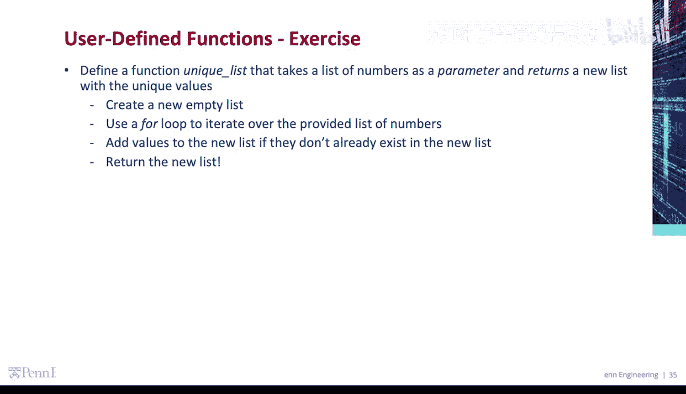
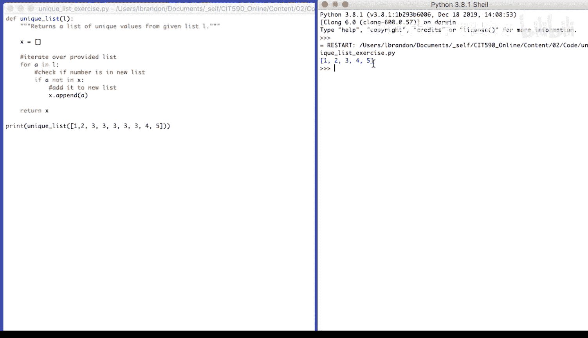

# 宾夕法尼亚大学《Python和Java编程入门1-2｜Introduction to Programming with Python and Java》中英字幕 p70 070_02_08_代码练习-唯一值列表.zh_en -BV13E421M7FF_p70-

To find a function， unique list that takes a list of numbers as a parameter and returns a new list with the unique values。

So inside of the function， we're going to create a new empty list。

Use a for loop to iterate over the provided list of numbers。

Add values to the new list if they don't already exist in the new list and then return the new list。

So let's define the function， unique list。For a given L， which is a list。Returns a list。Of unique。

Values from given。List L。Our function code。Create an empty list。Okay。

 X iterate over the provided list for a in L。And then check if that number is in our new list。

If a not in X， it's not in the list。Add it or append it to the list。X dot append。A。Finally。😔。

Return the new list。Now we're going to call the list and print the result， so。Unique。😔，List。😔。

And we have to provide unique list with a list of numbers。Square brackets，1，2。3，3，3，3，3。4，5。Again。

 we're going to iterate over provided。List。😔，Check if number is in new list。😔，Add it to new list。

We're going to run our code， run the function unique list with this provided list。

And we should get the unique values。1，2，3，4，5。

