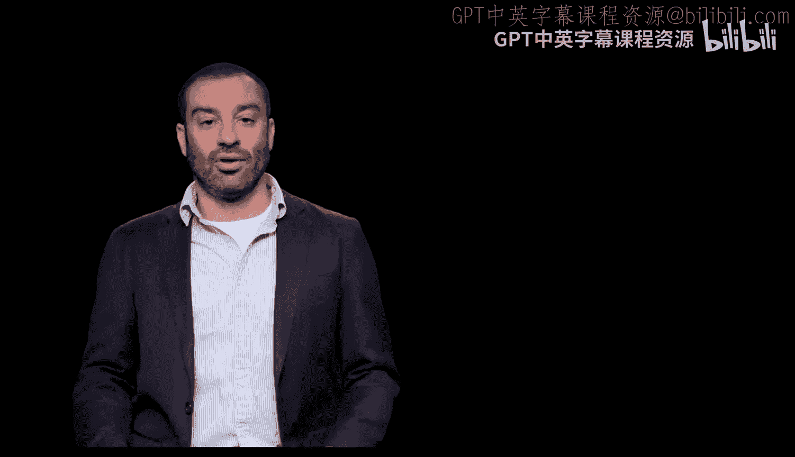
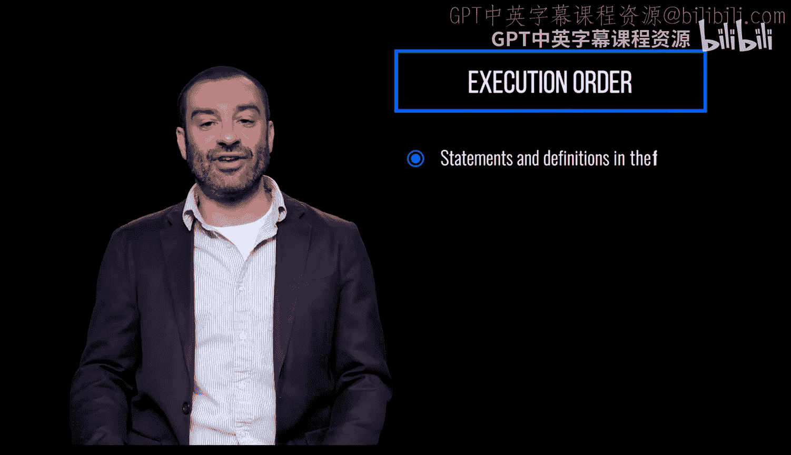
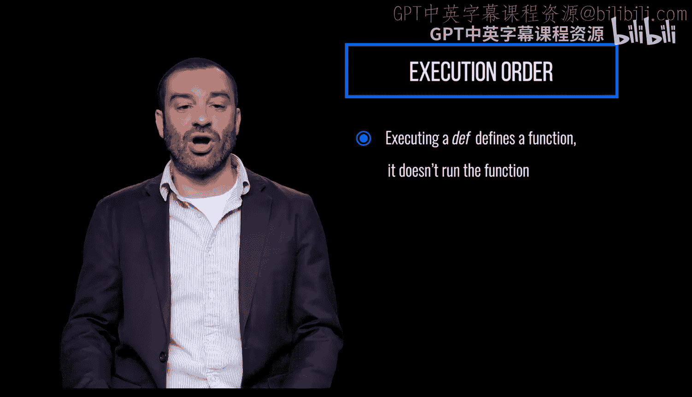
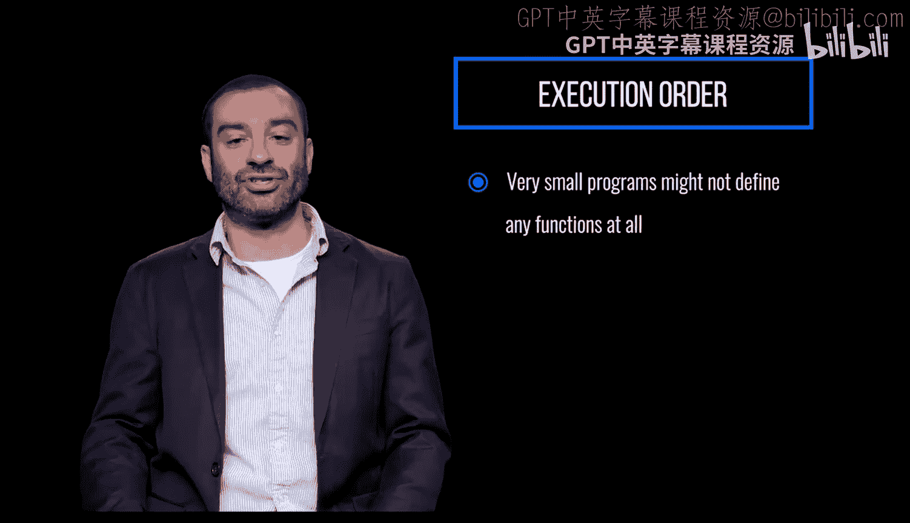
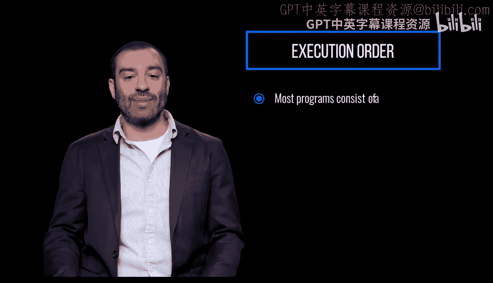
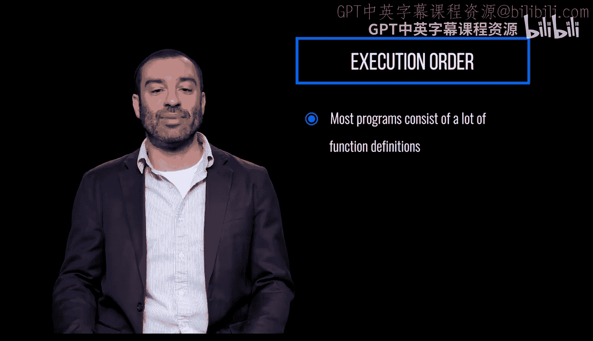
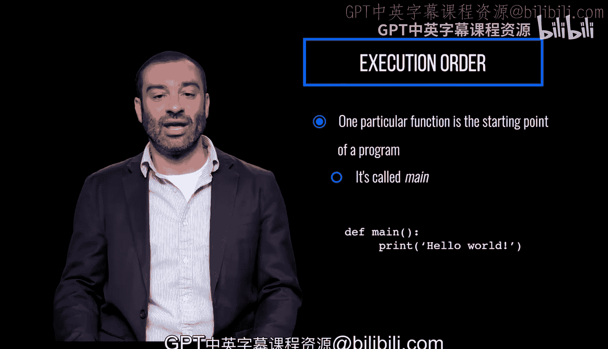

# 宾夕法尼亚大学《Python和Java编程入门1-2｜Introduction to Programming with Python and Java》中英字幕 p71 071_02_01_执行顺序.zh_en -BV13E421M7FF_p71-

When you load and run a Python module or file， the statements and definitions in the file are executed in the order in which they occur。

😡。

Executing a de defines a function。 It doesn't run the function。

Functions are only run when they're called。

A very small program might not define any functions at all。

 but just be a series of statements to be executed。

Most programs consist of a lot of function definitions， along with maybe a few top level statements。

 statements not in functions。

Usually one particular function is the starting point of a program By convention。

 it's called Maine and we'll see that this is actually mandatory in Java。😡。

