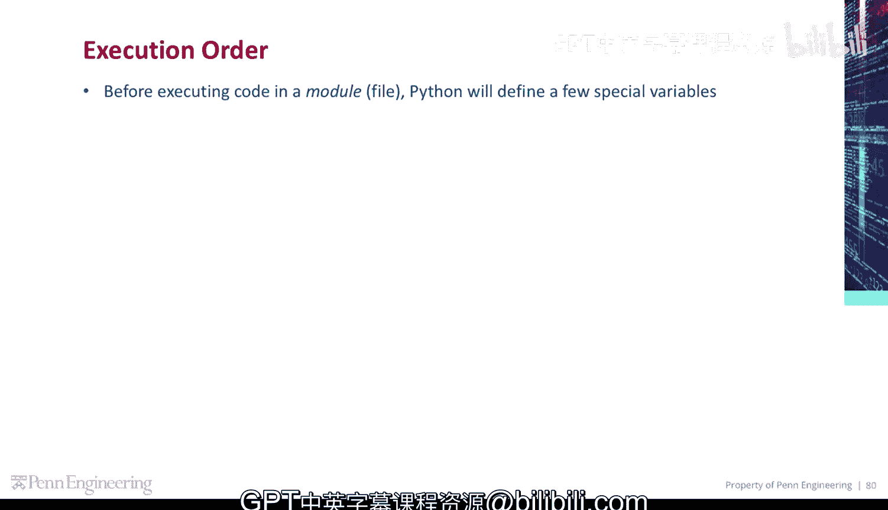
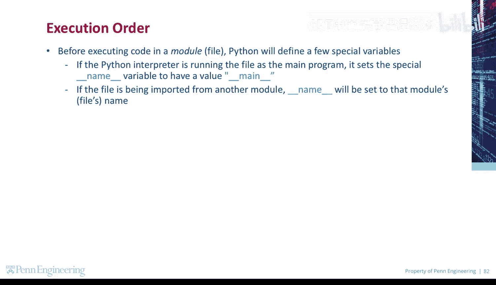
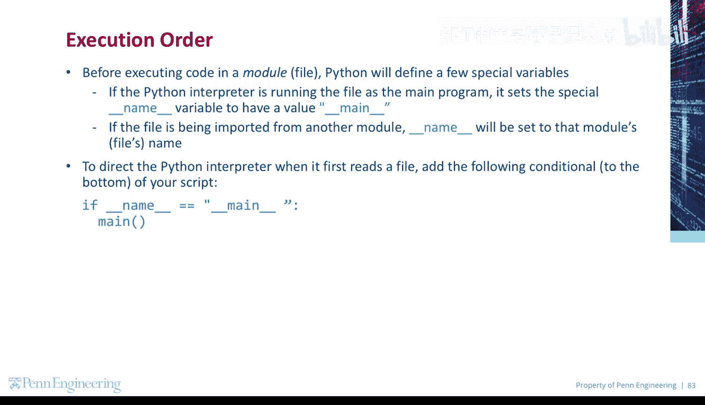
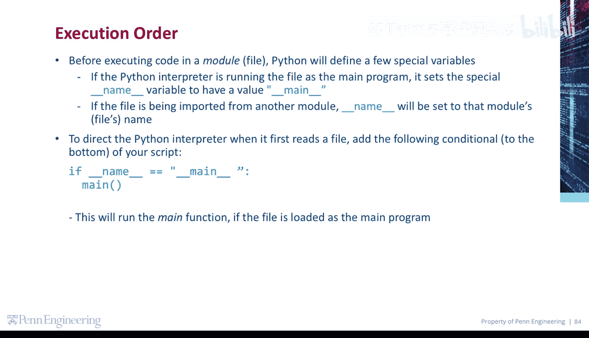
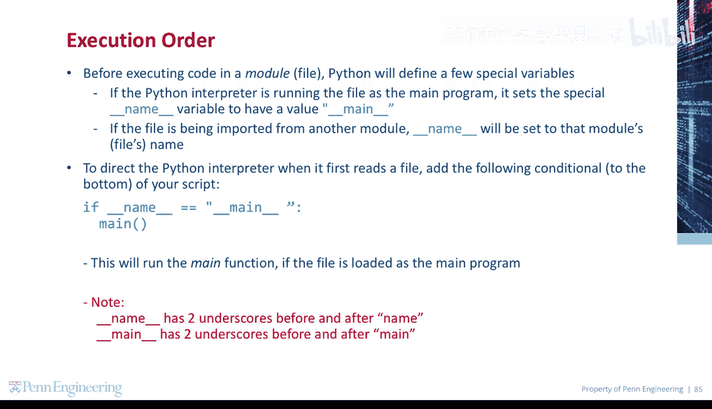

# 宾夕法尼亚大学《Python和Java编程入门1-2｜Introduction to Programming with Python and Java》中英字幕 p72 072_02_02_main函数.zh_en -BV13E421M7FF_p72-

Before executing code in a module or file， Python will define a few special variables。

 if the Python interpreter is running the file as the main program。

 it sets the special name variable to have a value of main。😡。

If the file is being imported from another module， name will be set to that module's or file's name。

😡。

To direct the Python interpreter when it first reads a file。

 add this conditional to the bottom of your script。

This will run the main function if the file is loaded as the main program。 Note。

 name has two underscores before and after name， and main has two underscores before and after main。

😡。

