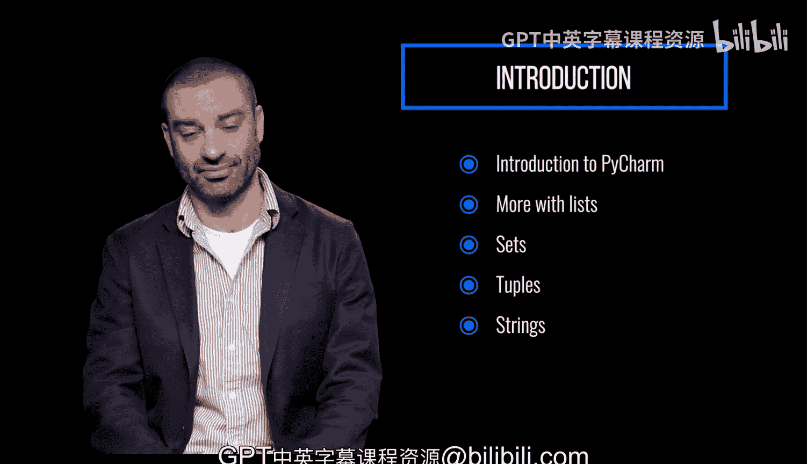

# 宾夕法尼亚大学《Python和Java编程入门1-2｜Introduction to Programming with Python and Java》中英字幕 p74 074_03_01_模块介绍_3.zh_en -BV13E421M7FF_p74-

In this module， we're going to start using Py Charm another IDE for writing and running Python code。

It has enhanced features that go way beyond the limited functionality of IDL。

 and it's also an industry standard。After revisiting lists。

 including more advanced usage of the commonly used sequence。

 we'll take a deep dive into two other very important data structures， sets and tus。

We'll learn how they can be leveraged to both store and manipulate information。

And while we already have some experience working with strings。

 this module will explore the intricacies and more powerful functionality of strings。

