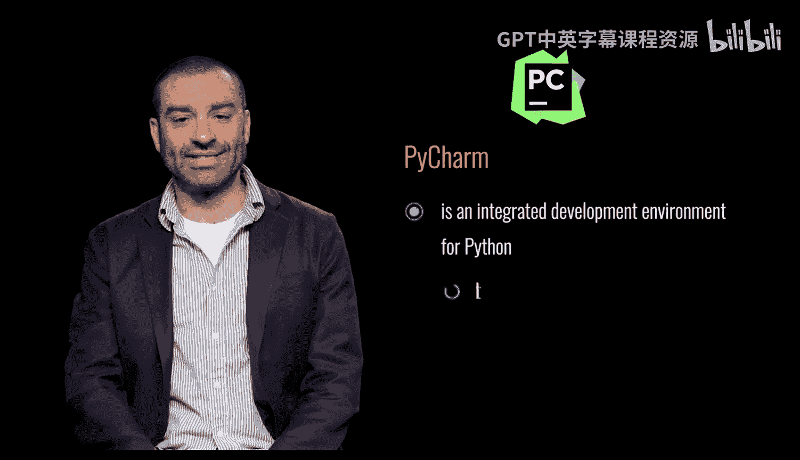
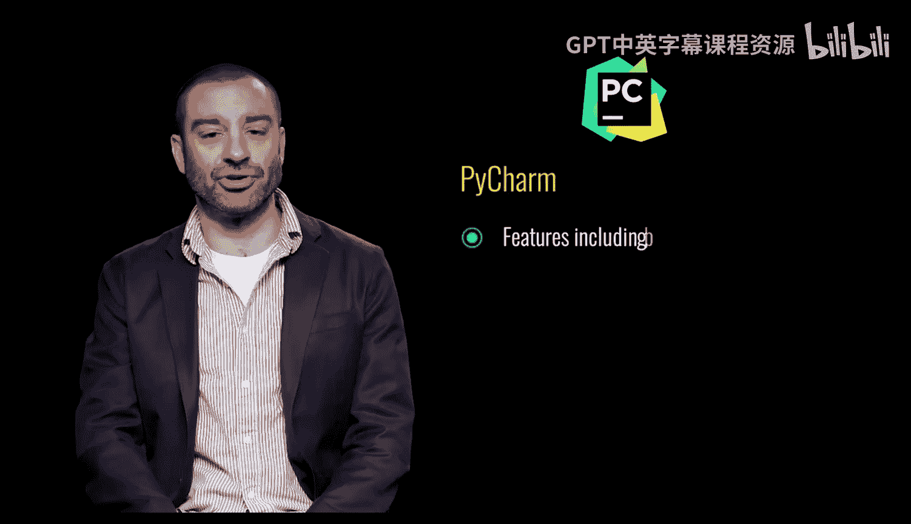
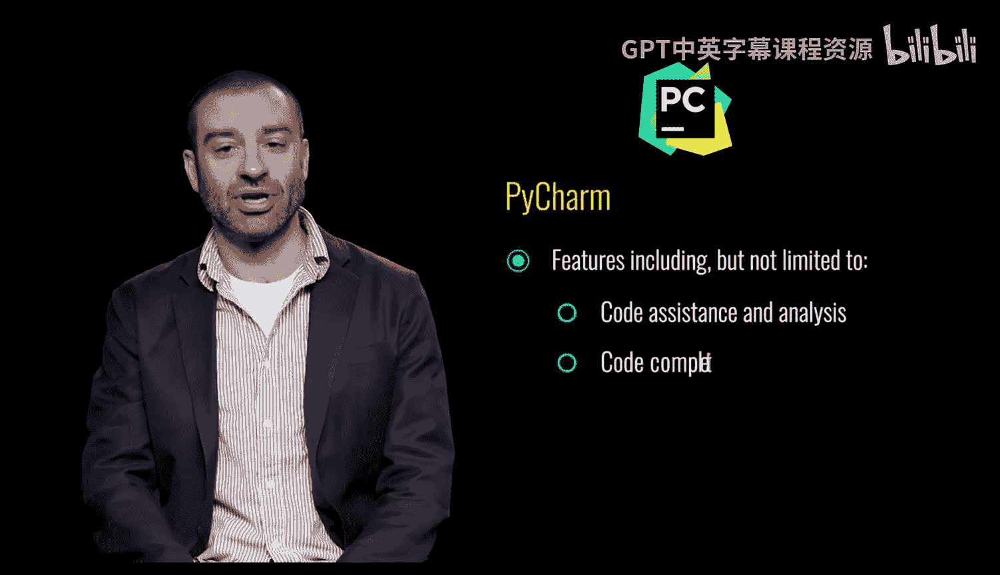
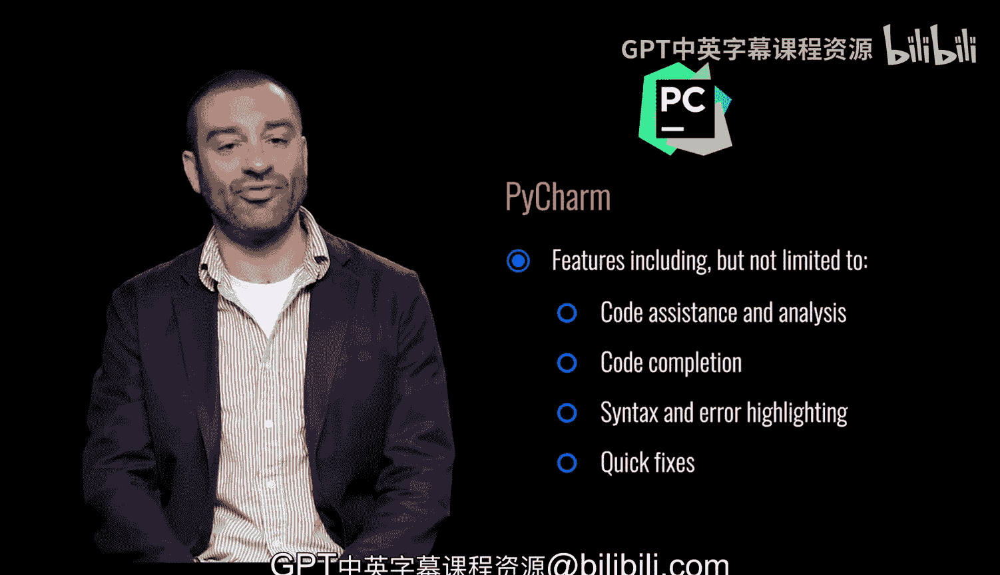

# Python和Java编程入门1-2：03：关于PyCharm 🐍

在本节课中，我们将要学习什么是PyCharm，并了解它作为Python集成开发环境（IDE）的核心功能。

## 什么是PyCharm？

PyCharm是一个专为Python设计的集成开发环境。它由一家名为JetBrains的公司开发。

上一节我们介绍了PyCharm的基本定义，本节中我们来看看它具体包含哪些强大的功能。

## PyCharm的核心功能

PyCharm拥有众多功能，包括但不限于代码辅助和分析。

以下是PyCharm提供的一些关键辅助功能：
*   代码补全
*   语法和错误高亮显示
*   快速代码修复

## 总结

本节课中我们一起学习了PyCharm。我们了解到PyCharm是JetBrains公司开发的Python集成开发环境，它通过代码补全、语法高亮和快速修复等功能，为开发者提供了强大的代码辅助与分析能力。