# 宾夕法尼亚大学《Python和Java编程入门1-2｜Introduction to Programming with Python and Java》中英字幕 p78 078_03_01_列表复习.zh_en -BV13E421M7FF_p78-

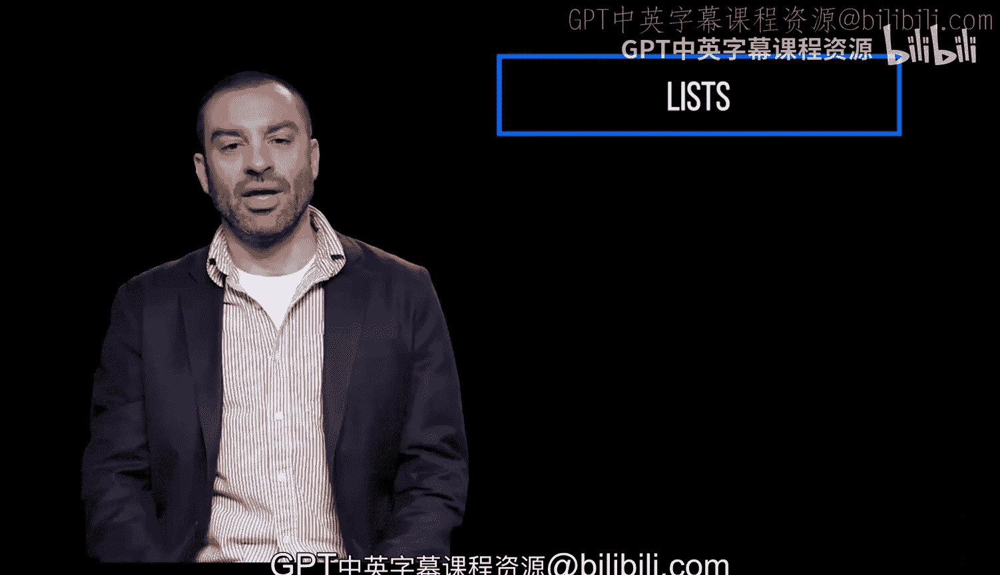

If you recall， lists are a type of data structure in Python。

 Ls are one of the most commonly used sequences， and they're mutable， which means once defined。

 the individual elements of a list can be changed。

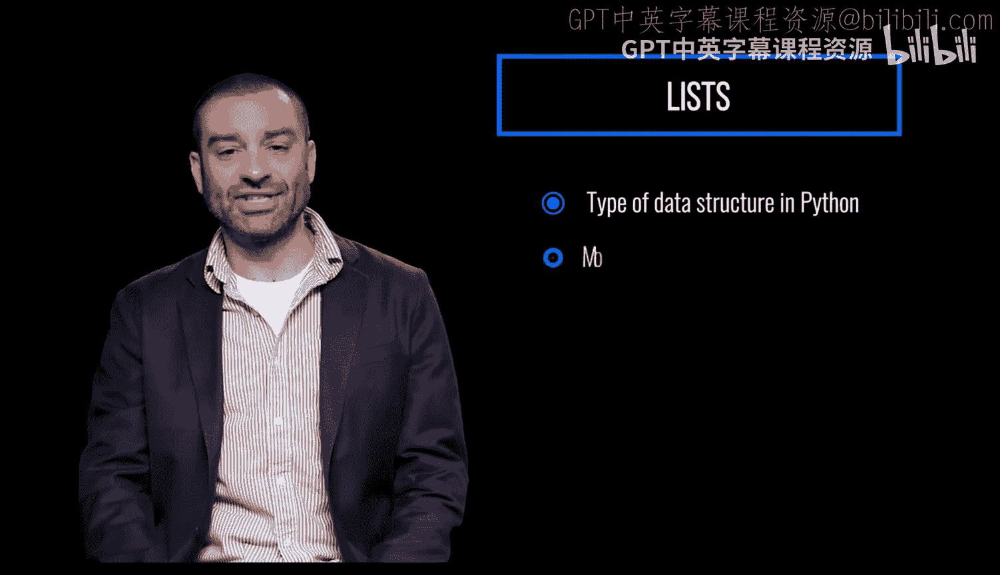

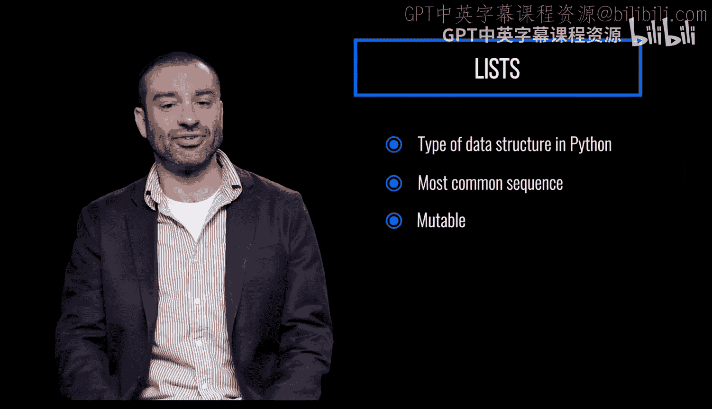

To create a list， specify comma separated values in between square brackets。

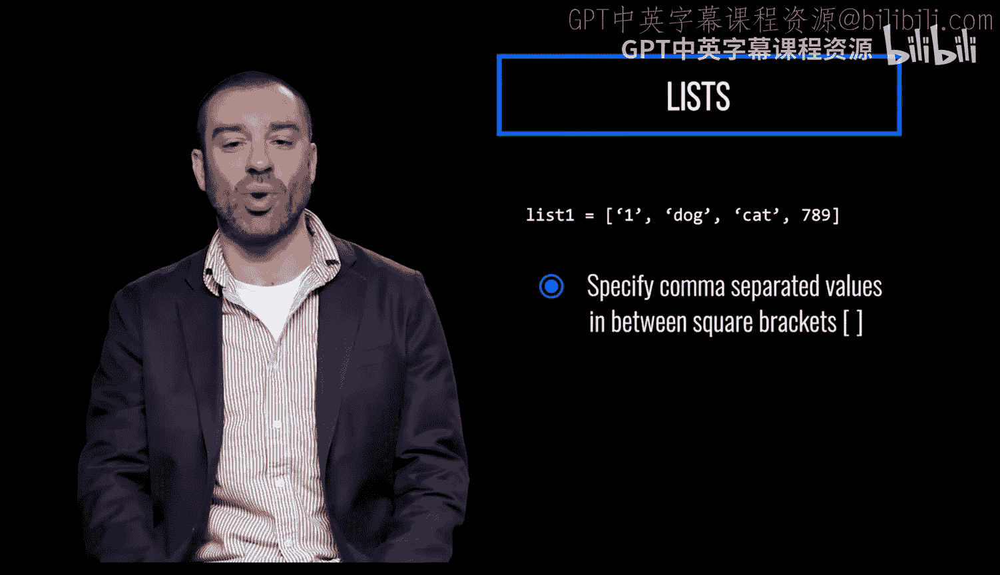

The values included in a list do not need to be all of the same type。

 This means you can mix and match data types within the same list。 For example。

 this list contains three strings and one integer。😡。

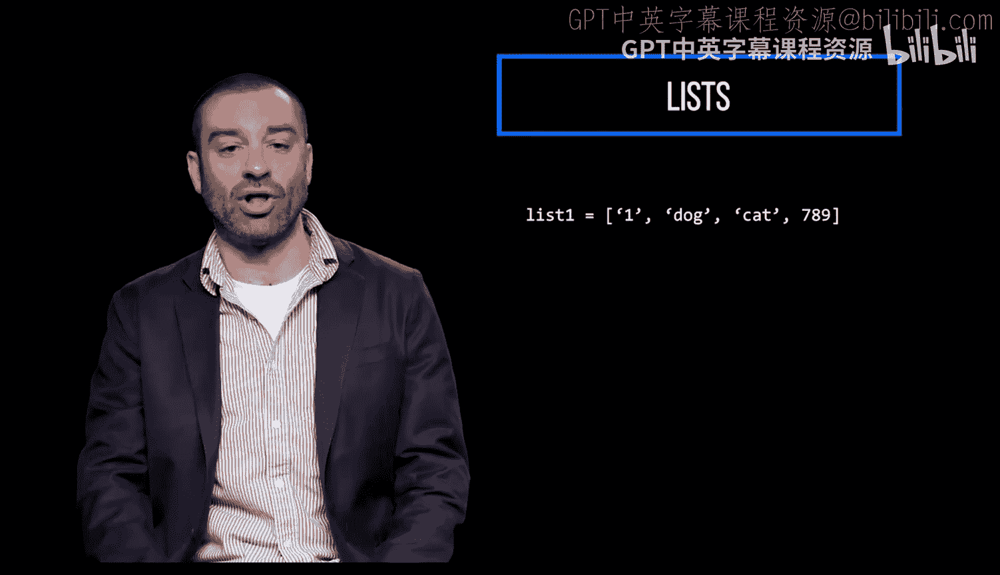

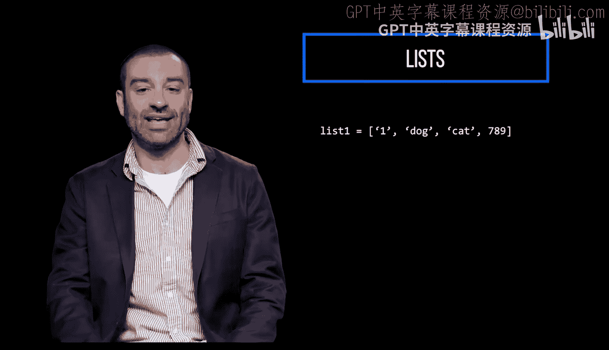

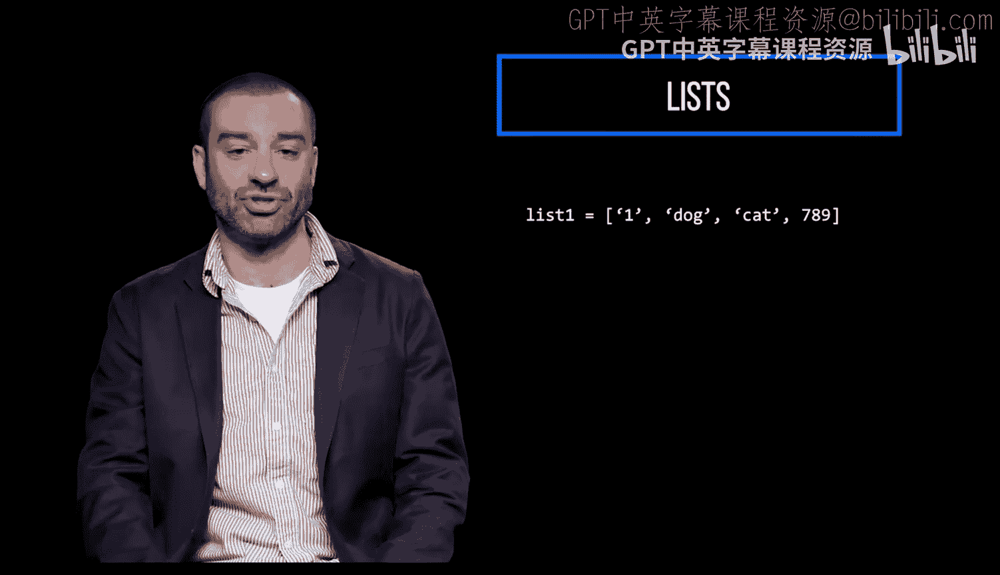

Each item in a list is assigned an index value， starting at zero。

Here， using In1 inside of brackets， we get the second item in the list。

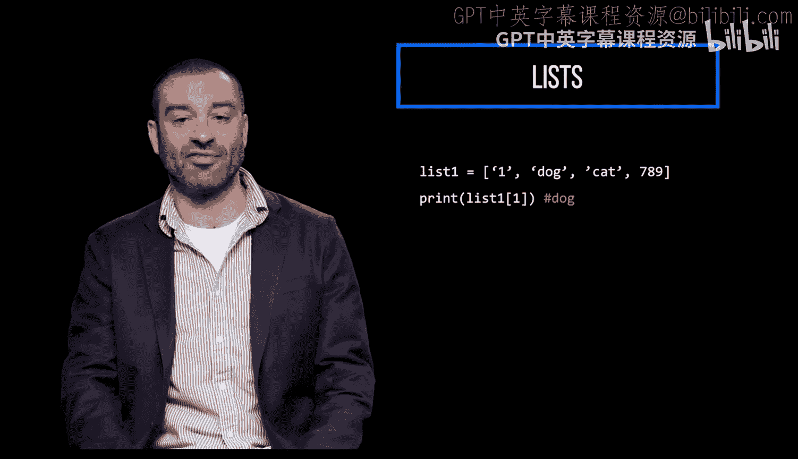

What if we try to print the fifth item in the list using indexex 4？

This item doesn't exist， so we'll get an index error because the index is out of range。

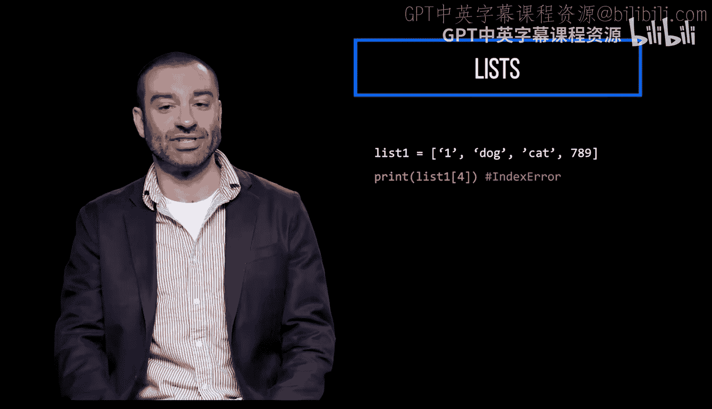

We can look up the index of a particular value in a list by using Python's built in listist index method。

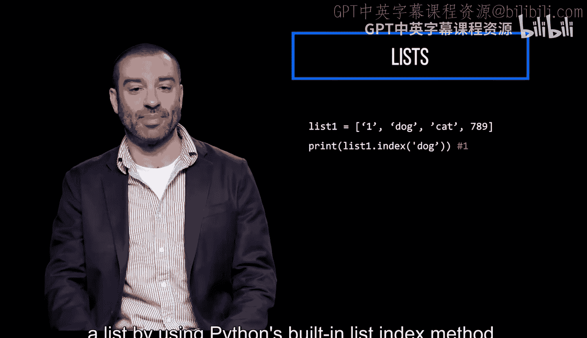

Here we get the index of the item dog in the list， which is one。

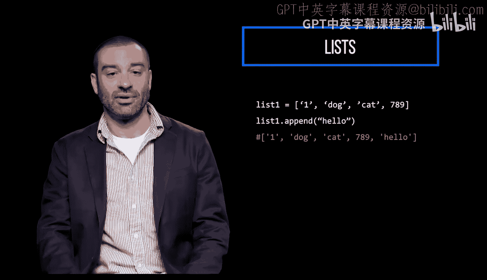

You can add items to a list using the append method。This adds an item to the end of a list。

Get the length of a list using Python's built in L function。

This returns the number of items in the list。

Remove items from a list by using the P method。

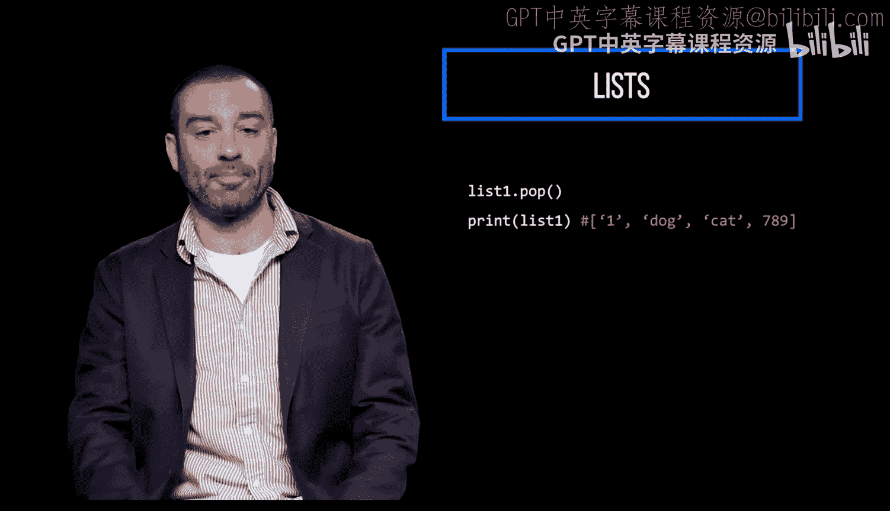

This removes the last item in the list。And this removes the second item in the list by specifying index1 in the P method。

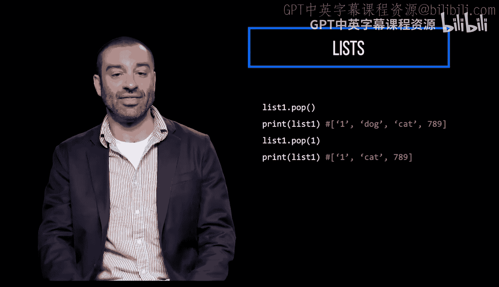

Insert an item at a specific location in a list。 This inserts an item at the third location in the list by specifying index 2 and the string to insert。

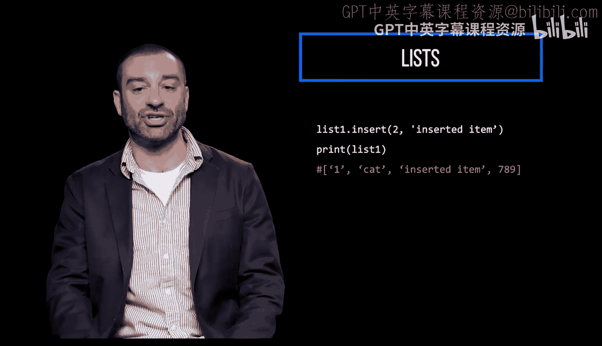

And this checks if a specific item is in a list。

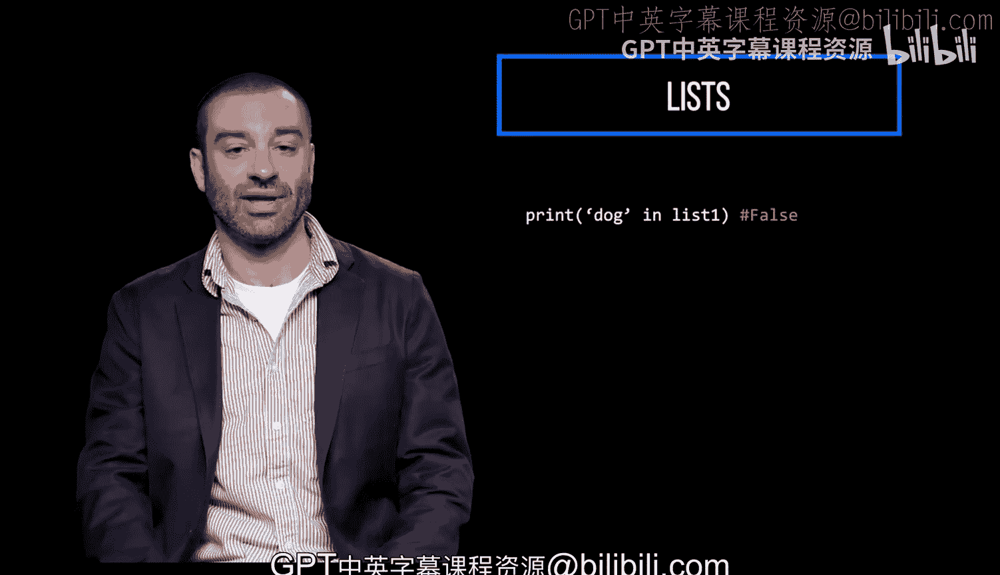