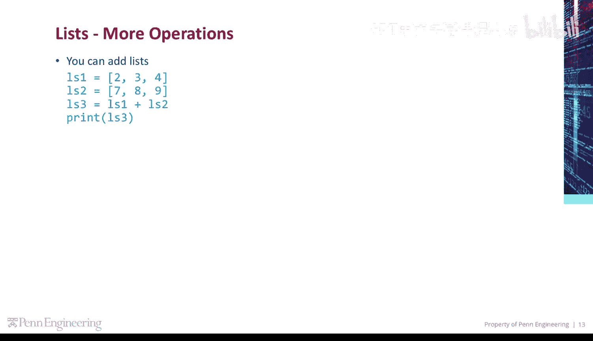
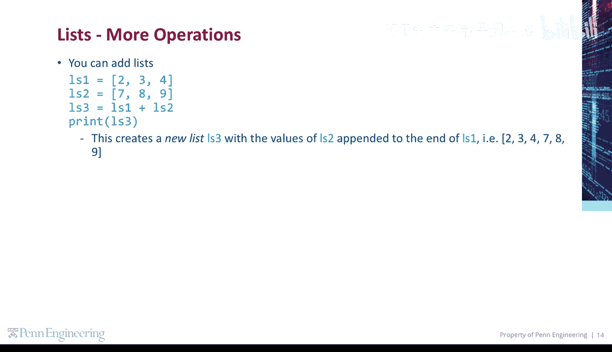
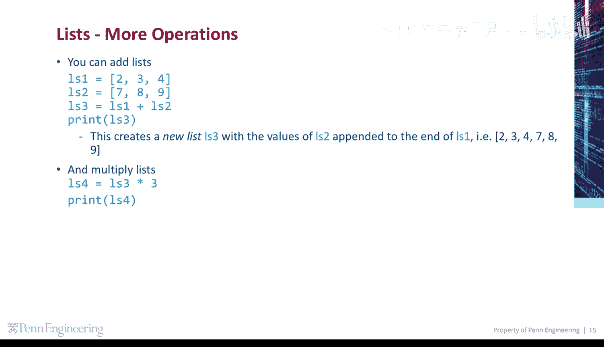
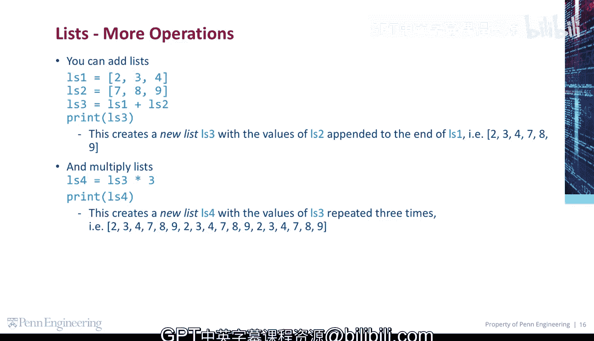

# 宾夕法尼亚大学《Python和Java编程入门1-2｜Introduction to Programming with Python and Java》中英字幕 p79 079_03_02_更多列表操作.zh_en -BV13E421M7FF_p79-

Other list operations， you can add lists。 This creates a new list Ls3 with the values of Ls2 appended to the end of Ls1。

 So Ls3 will be the list containing 2，3，4，7，8， and 9。

You can multiply lists。 This creates a new list LS4 with the values of LS3 repeated three times。

 so Ls4 will contain 2，3，4，7，8，9，2，3，4，7，8，9， and 2，3，4789。

