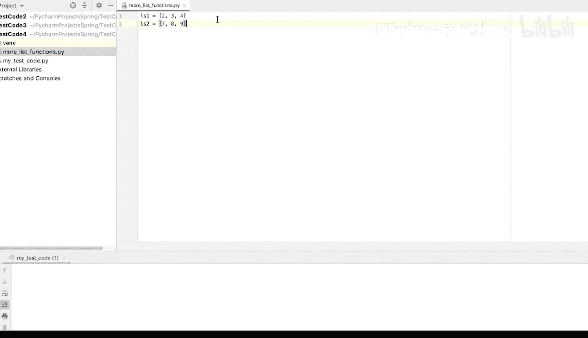
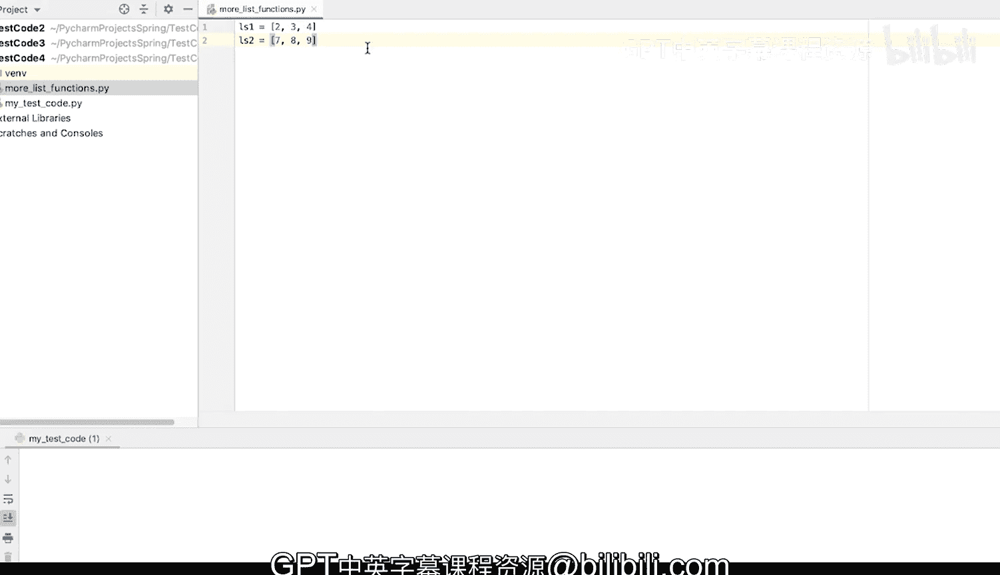
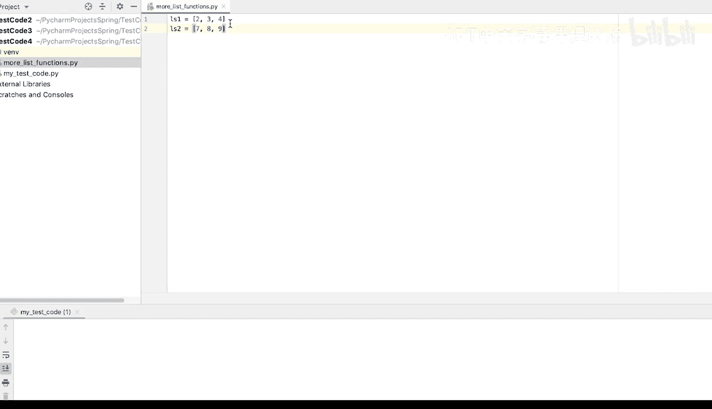
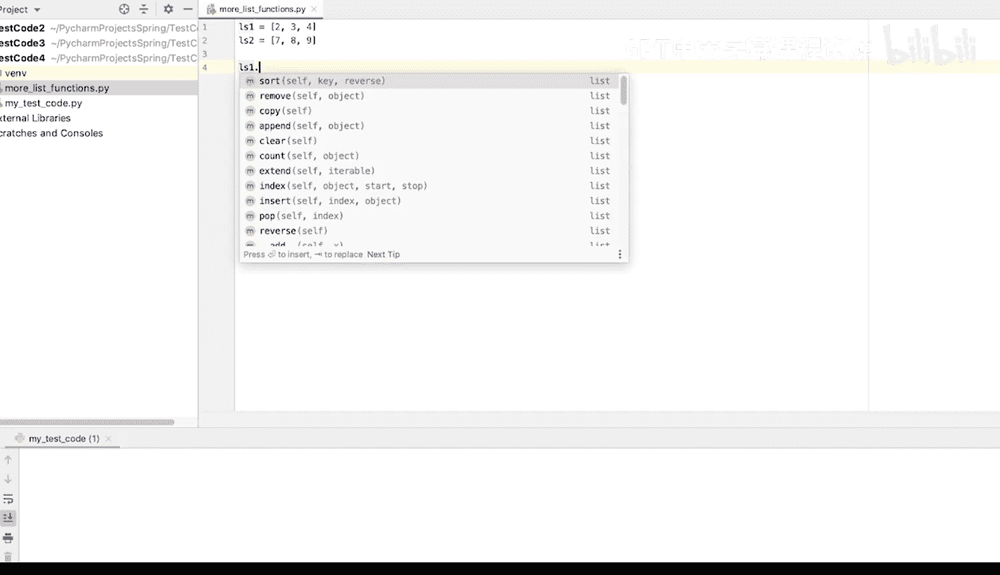
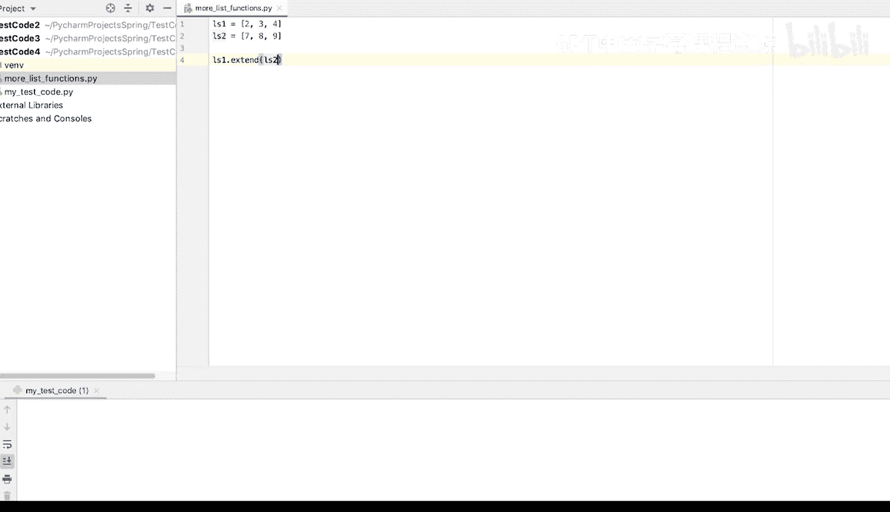
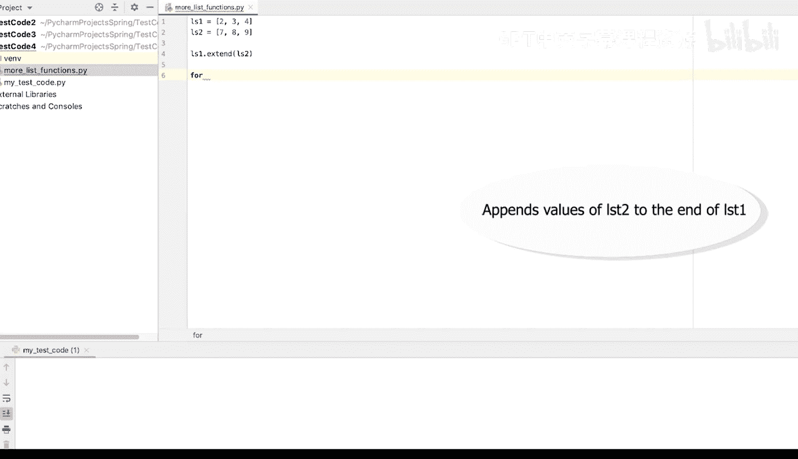
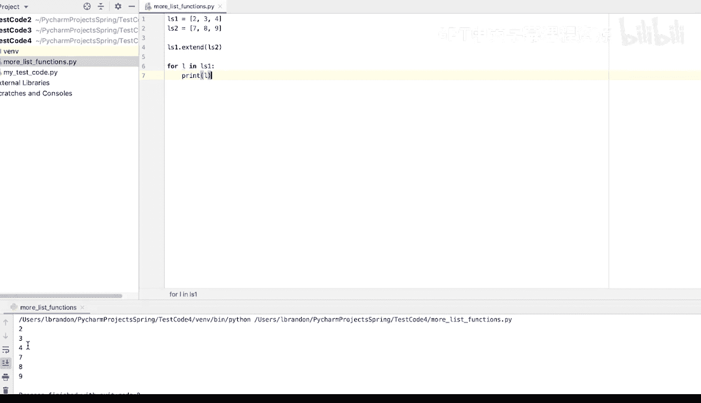
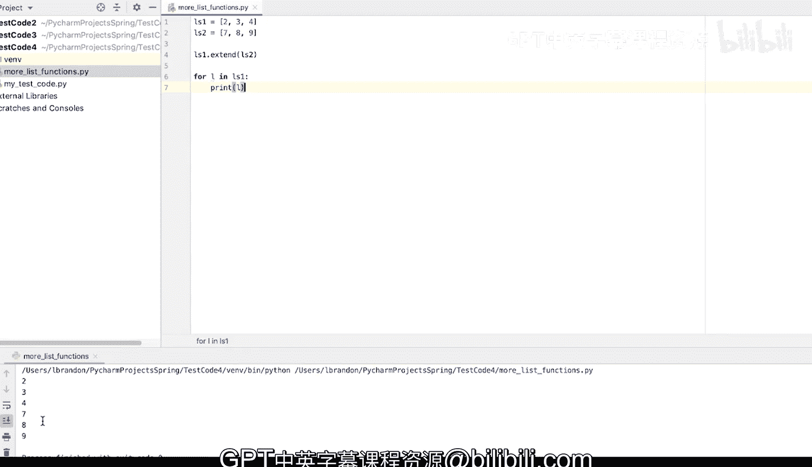

# Python和Java编程入门1-2：03：列表函数 📋



在本节课中，我们将要学习Python列表的一个重要内置函数——`extend()`。这个函数用于将一个列表中的所有元素添加到另一个列表的末尾，并直接修改原列表。

## 概述

上一节我们介绍了列表的基本操作，本节中我们来看看如何使用`extend()`函数来合并两个列表。与使用加号`+`连接列表不同，`extend()`函数会直接更新调用它的列表。

## `extend()`函数详解

你可以使用`extend()`函数来扩展列表。这里定义了两个列表：`ls1`是`[2, 3, 4]`，`ls2`是`[7, 8, 9]`。

接下来，我将输入`ls1.extend(ls2)`。这个操作类似于列表相加，但它会实际更新`ls1`，并将`ls2`中的值追加到`ls1`的末尾。





以下是代码示例：



```python
ls1 = [2, 3, 4]
ls2 = [7, 8, 9]
ls1.extend(ls2)
```



现在，我将遍历`ls1`来查看其中的元素。



以下是遍历并打印列表的代码：

```python
for l in ls1:
    print(l)
```

我们将看到`ls1`中的值：`2, 3, 4, 7, 8, 9`。所以，`ls2`中的值被追加到了`ls1`的末尾。



## 总结



本节课中我们一起学习了`extend()`函数。我们了解到，`list1.extend(list2)`会将`list2`中的所有元素添加到`list1`的尾部，并直接改变`list1`的内容。这是一种高效合并列表的方法。