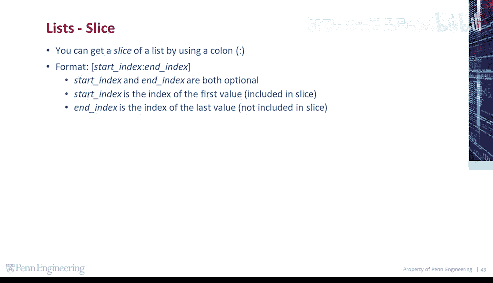
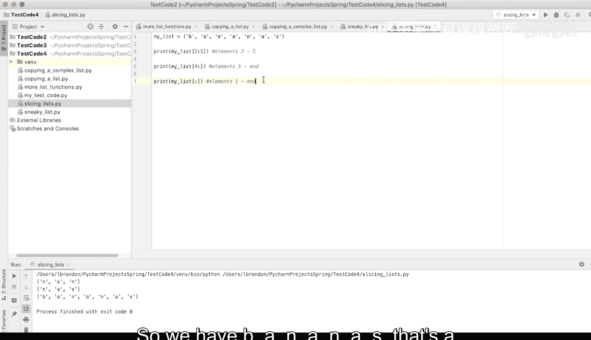
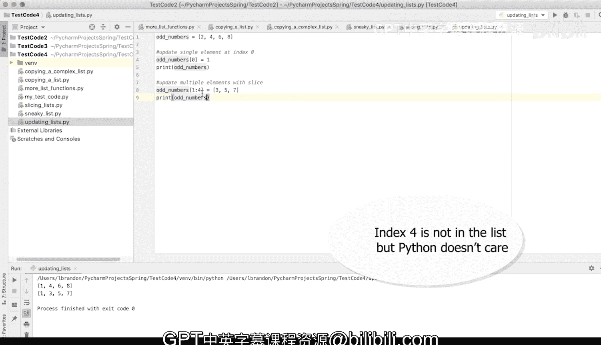

# 宾夕法尼亚大学《Python和Java编程入门1-2｜Introduction to Programming with Python and Java》中英字幕 p81 081_03_04_列表切片.zh_en -BV13E421M7FF_p81-

You can get a slice of a list by using a colon。 The syntax works like this inside of square brackets。

 you're going to have start index， colon and index。 Start index and end index are both optional。

 Start index is the index of the first value included in the slice。

 and end index is the index of the last value， not included in the slice。

Let's demonstrate this by creating a list。My list equals。😔，Bi。😔，A N， A N A S。A list of strings。

 in this case， a list of characters。Let's get a slice of the list。

 Let's get elements from index 2 to 4。 So print。My list in square brackets。

 the start index will be 2， and the n index will be 5。 So this is going to give us elements 3 to 5。

So， elements。3 to 5。 Let's print that。N A N， so we have。The third element， the fourth element。

 and the fifth element， index 2，3， and 4。 The5 is the n index， so it's not included。

Let's get elements from index 4 to the end。 So print。My list。Index 4 to the end。

Let's say we don't know the last index of the list。 Let's leave it out。 So the start index is 4。

 and the N index is nothing。 It's going to default to the end。 So this will be elements。5 to end。

In this case， we get N A S element 5。6 and 7。Let's get the elements from index 0 to end。

 So in this case， the entire list。Let's print。My list square brackets， the start index is 0。

 so we can actually leave that out。 That will default to 0。

 And the end index is just the end of the list or the last index in the list。

 So we can leave that out as well。 That will default to the last index。 This will be the elements。

From one to the end， the first element all the way to the end。So we have B A N， A N A S。

 that's a slice of the list with every element。

Now let's get the elements from index 0 to negative 4， counting from right to left。So， print。My list。

We're going to start at index 0。 So let's leave that out。 It'll default to 0。

 The n index is negative 4。 So it's going to wrap around。 It's going to wrap the list around。

 In this case， we're going to get。Elements。From 1 to 3。We'll see how that works。B， A N。

 the start index was 0。 So we have B。 then it counts backwards。 negative 4。 So negative 1。

 negative 2， negative 3， negative 4。 but it won't include that。 So we're left with index 0，1，2。

 or items 1，2，3。You can also get a copy of a list by getting a slice of the list。

 including every element。So let's define a variable， copy my list。That will be set， too。

My list square brackets。 We want a slice containing every element。 So we're going to start at 0。

 The start index will be 0。 We're going to leave it out。 It'll default to 0。

 The end index will be the last index of the list will leave it out。

 It'll default to the last index of the list。 This will end up being elements 1 to the end。

It will be a true copy of。My list。😔，Then we're going to test it。Copy my list is。My list。

 So are they references to the same list。References to same list。And then we'll print。

 copy my list equal to my list。 Do they have the same values。Same values。So false。

 they do not point to the same list。 It's a true copy， but true， they do contain the same values。

You can also update list elements by specifying an index or slice。 So let's define a list。

 odd numbers。That'll be a list containing the values 2，4，6， and 8。Since these are not odd numbers。

 we want to make some changes to this list。Let's start by updating a single element in the list。

So odd numbers。 Let's change the element at index 0 to be one， which is odd。Print。Od numbers。

Od numbers is now 1，4，6， and 8。So what we want to do is update 4，6， and8 all at once using a slice。

Update single element at index 0。Up the。Multiple elements with slice。

So odd numbers in square brackets， I'm going to specify index 1 to 4。

And I'm going to set those values to be 3，5 and 7。And then， we're going to print。Od numbers。

Od numbers is now 1，3，5 and 7。Index 4 doesn't actually exist in the list， but Python doesn't care。

