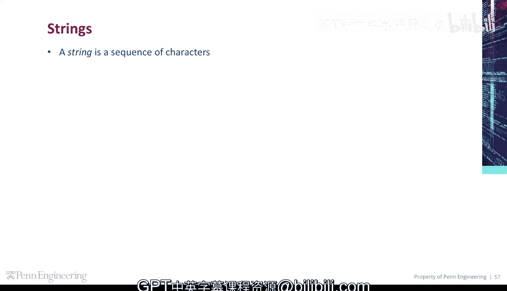
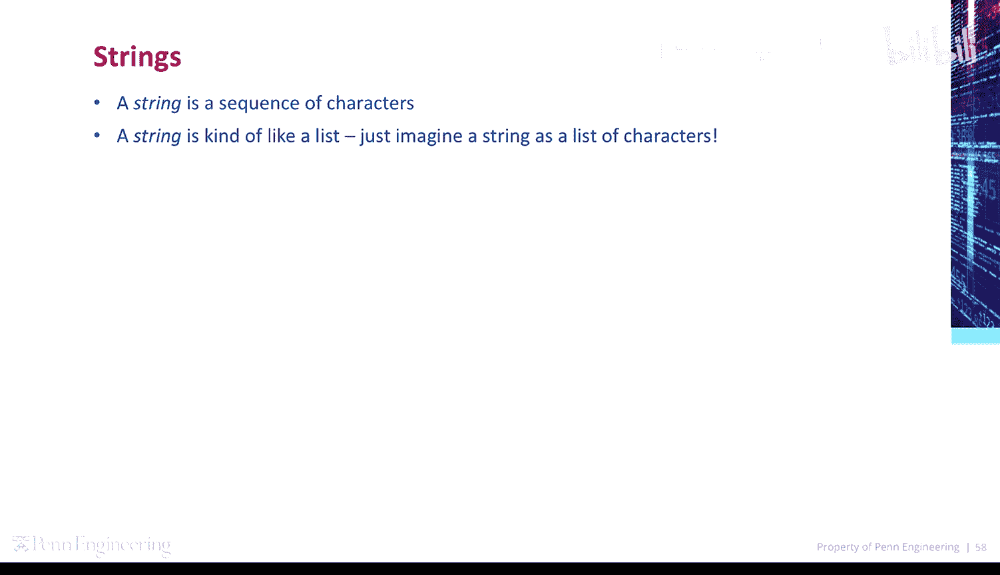
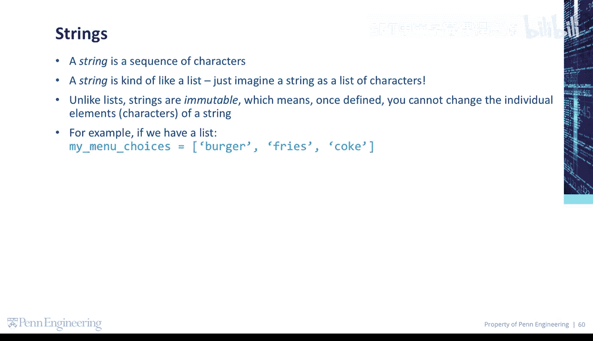
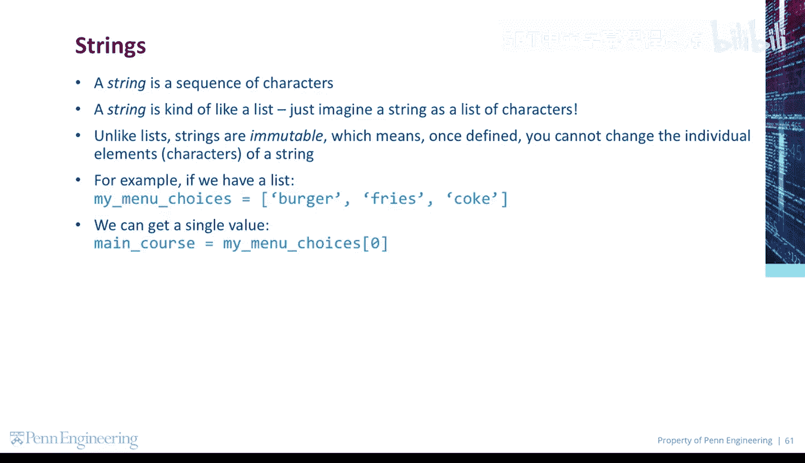
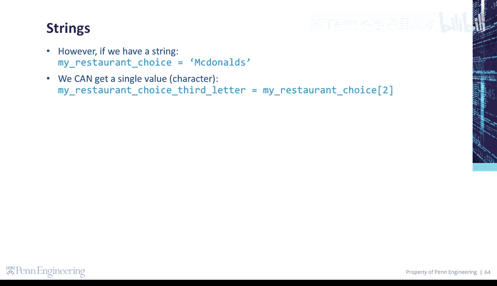
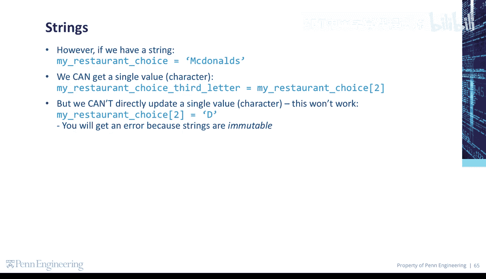

# 宾夕法尼亚大学《Python和Java编程入门1-2｜Introduction to Programming with Python and Java》中英字幕 p82 082_03_01_字符串与列表对比.zh_en -BV13E421M7FF_p82-

A string is a sequence of characters。 A string is kind of like a list。

 Just imagine a string as a list of characters。

Unlike lists， strings are immutable， which means once defined。

 you can't change the individual elements or characters of a string。For example。

 if we have a list my menu choices， we can get a single value using an index inside square brackets。

😡。

We can also update a single value in the list。However， if we have a string， my restaurant choice。

 we can get a single value or character using an index inside square brackets。

 but we cannot directly update a single value or character。

 This won't work and you'll get an error because strings are immutable。

