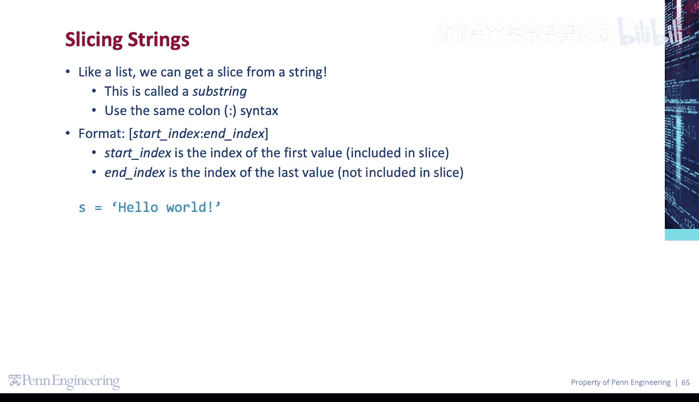
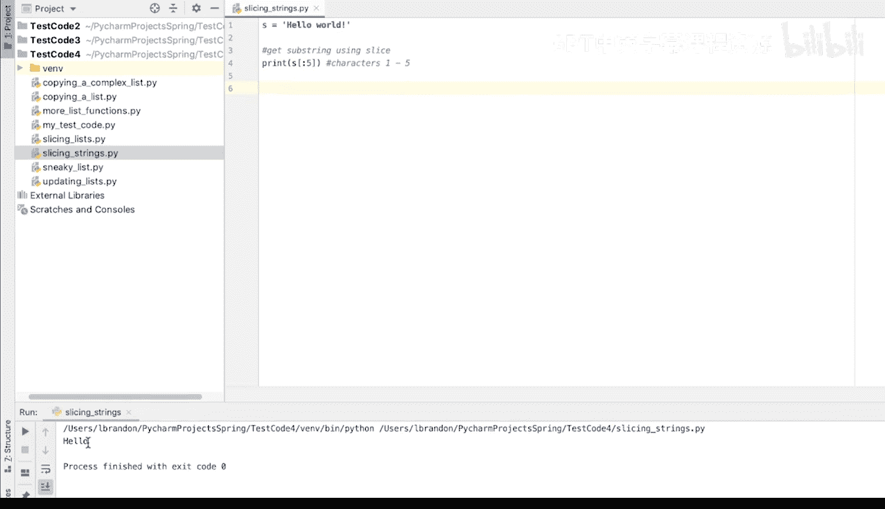

# 宾夕法尼亚大学《Python和Java编程入门1-2｜Introduction to Programming with Python and Java》中英字幕 p83 083_03_02_字符串切片.zh_en -BV13E421M7FF_p83-

Like a list， we can get a slice from a string。 This is called a substr。

 You can use the same colon syntax。 The format is start index， colon N index。

 The start index is the index of the first value included in the slice。

 and the end index is the index of the last value not included in the slice。

As an example， let's create a string。Now I want to get a portion of this string or a substring。

And I'm going to do that using a slice。So we're going to print S in square brackets。

 I want the first five characters。So the start index is going to be 0。 We're going to leave that out。

 It'll default to 0， and the end index will be 5。 This will give us the characters。1。To 5。

We'll run that。 And we're left with hello。

