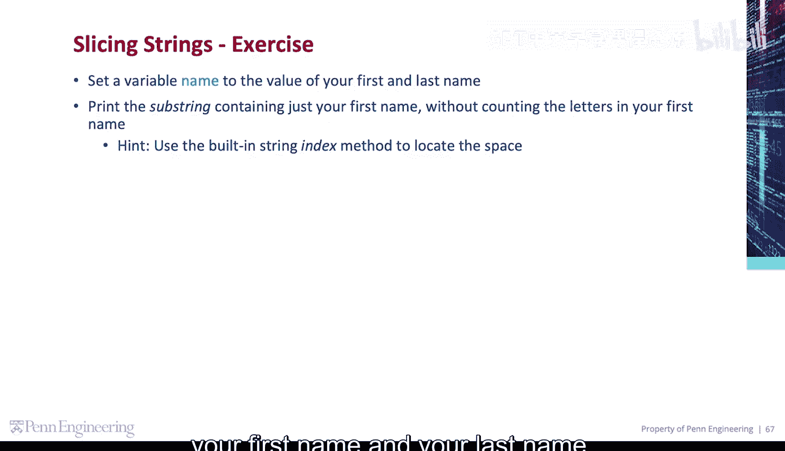
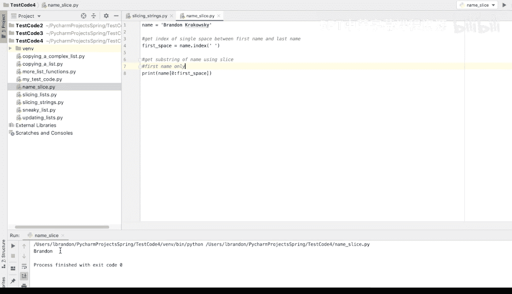

# Python编程入门：084_03_03：代码练习-姓名子字符串 👨‍💻

在本节课中，我们将学习如何使用Python的字符串索引和切片功能，从一个包含全名的字符串中提取出姓氏。我们将通过一个具体的练习来掌握这些概念。

---

## 概述

我们将创建一个变量来存储姓名，然后通过找到姓名中空格的位置，来提取出姓氏部分。核心在于使用字符串的`.index()`方法和切片操作。

---

## 练习步骤



### 1. 创建姓名变量

首先，我们需要创建一个变量来存储姓名。这个姓名应包含名和姓，中间用一个空格分隔。

```python
name = "Brrandon Krarkowski"
```

### 2. 定位空格索引

接下来，我们需要找到姓名中空格字符的索引位置。这个位置将作为我们切片的终点。

```python
first_space = name.index(" ")
```

这里，`name.index(" ")`会返回字符串中第一个空格字符的索引值。

### 3. 提取姓氏

现在，我们使用字符串切片来提取姓氏。切片从字符串的开头（索引0）开始，到我们刚刚找到的空格索引位置结束。

```python
first_name = name[0:first_space]
print(first_name)
```

运行以上代码，将只输出名字“Brrandon”。

---

## 总结



在本节课中，我们一起学习了如何从全名字符串中提取姓氏。我们首先创建了姓名变量，然后使用`.index()`方法找到空格的位置，最后通过字符串切片提取出姓氏部分。这个方法在处理文本数据时非常有用。