# 宾夕法尼亚大学《Python和Java编程入门1-2｜Introduction to Programming with Python and Java》中英字幕 p86 086_03_01_创建元组.zh_en -BV13E421M7FF_p86-

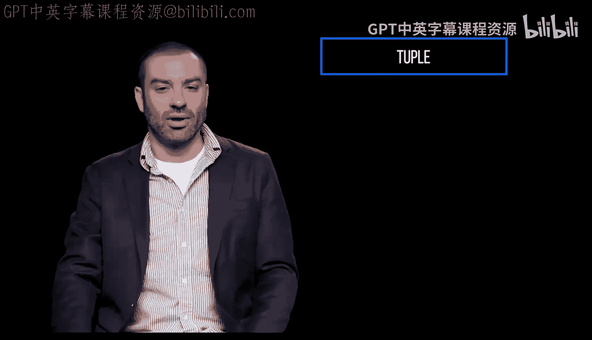

A tuple is an immutable sequence of values。 Once defined， you can't change the individual elements。

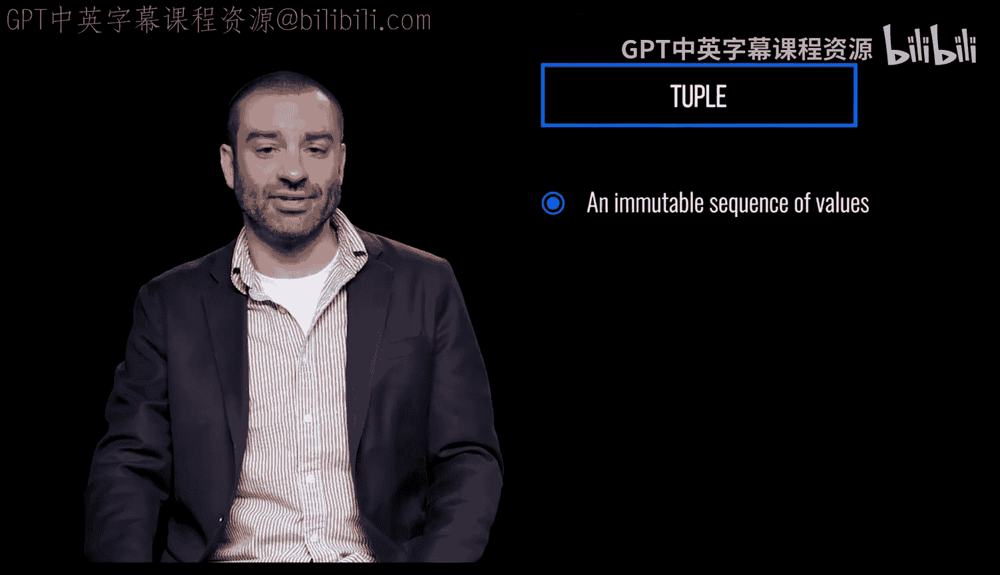

This is unlike lists which are mutable。

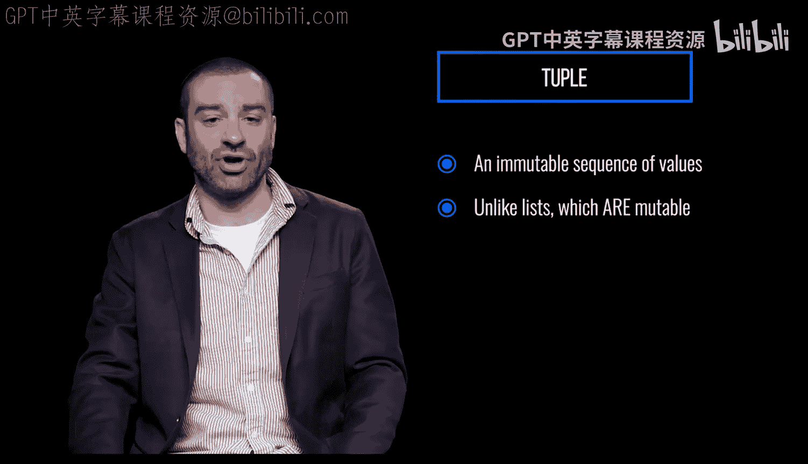

Like lists， the values included don't need to be all the same type。

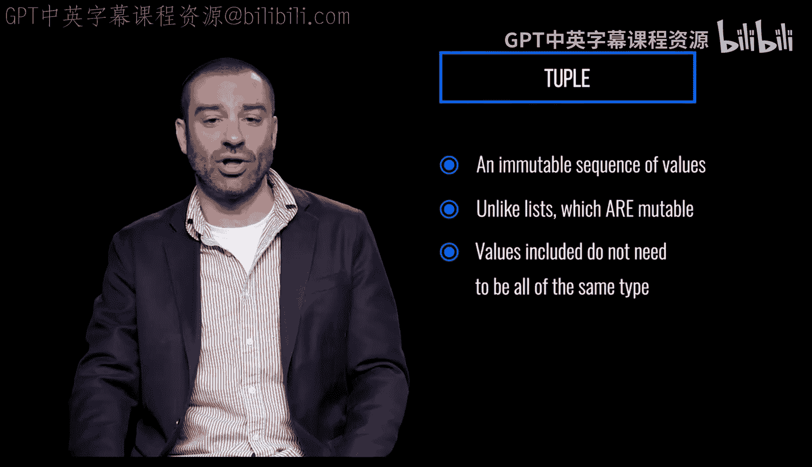

Creating a tuple is as simple as listing comma separated values enclosed in parentheses。

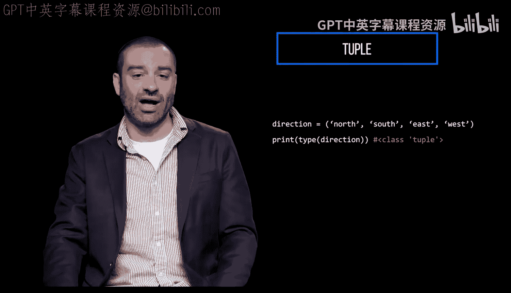

Here's a tuple with four values。 the type is tuple。

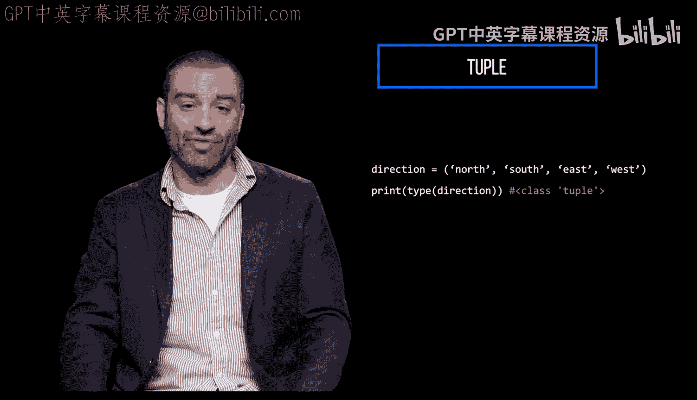

If you try to update a Tple， you'll get an error， so this won't work。

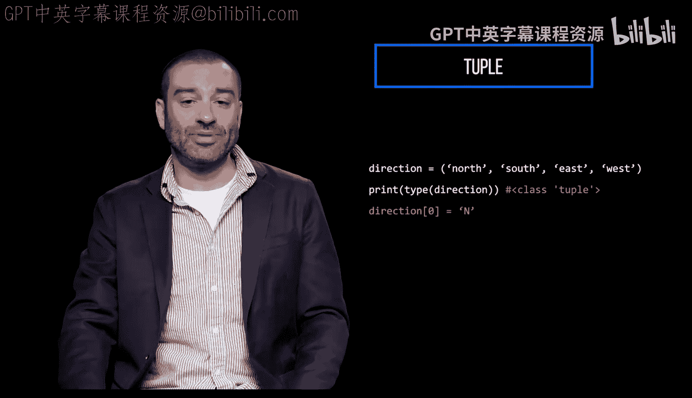

Neither will this。

You can actually create a tuple without the parentheses again， the type is tuple。

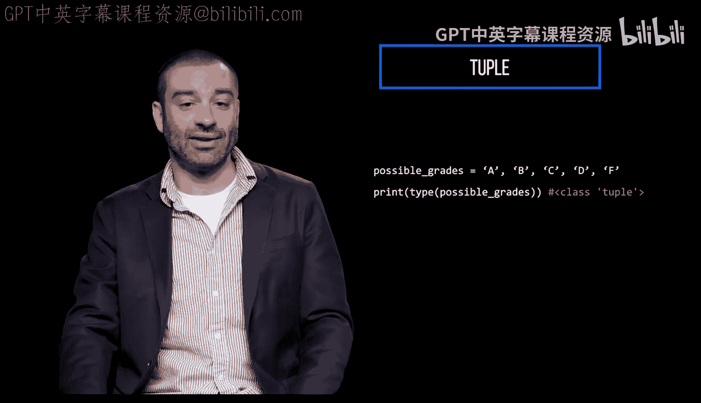

You can also create a tuple from a string or even a list with Python's built in Tupple function。

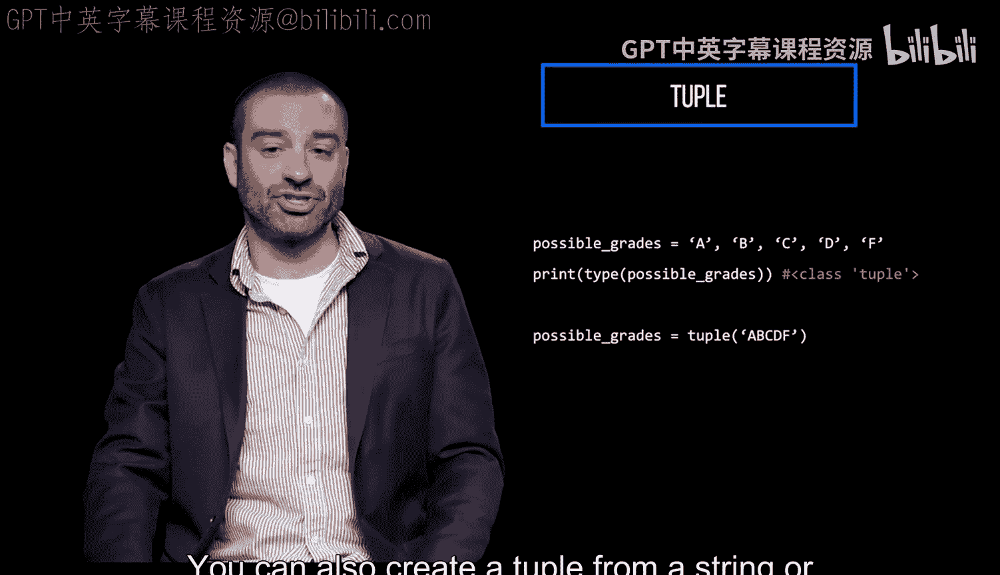

This converts the given string to a tuple， where each item is a single character。

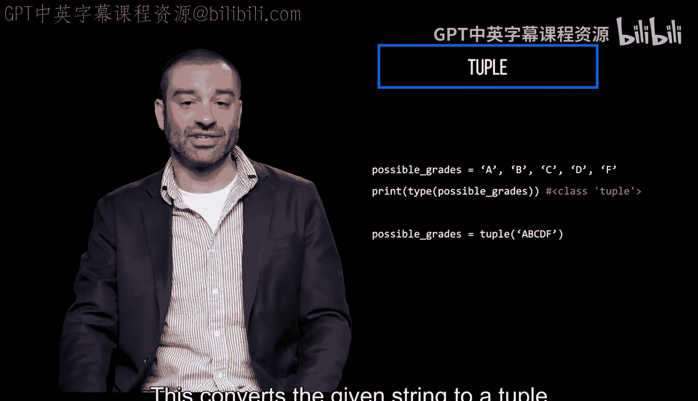

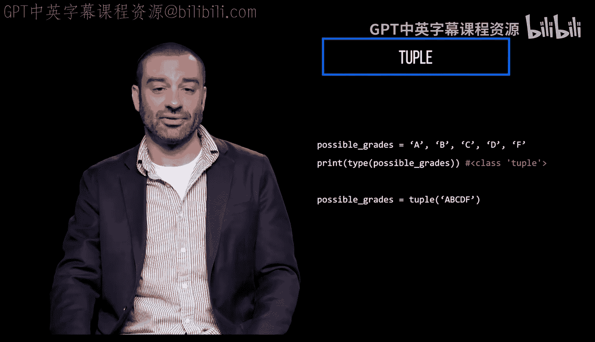

We'll see that tus are extremely useful if or when you want to return multiple things from a function at once。

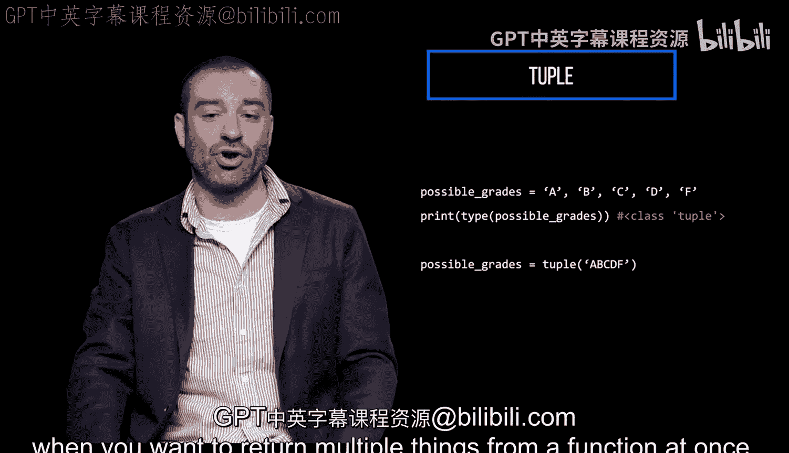