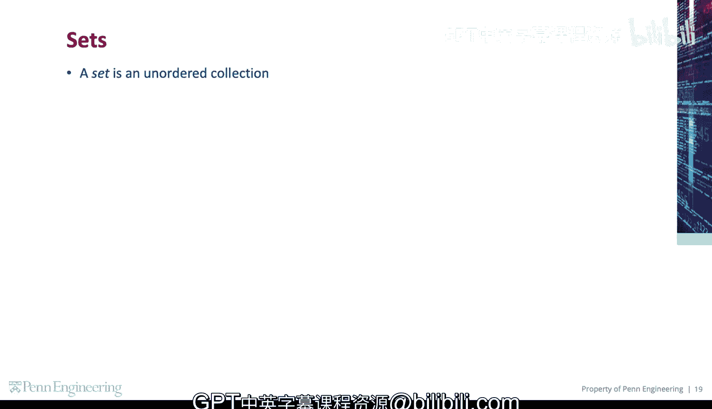
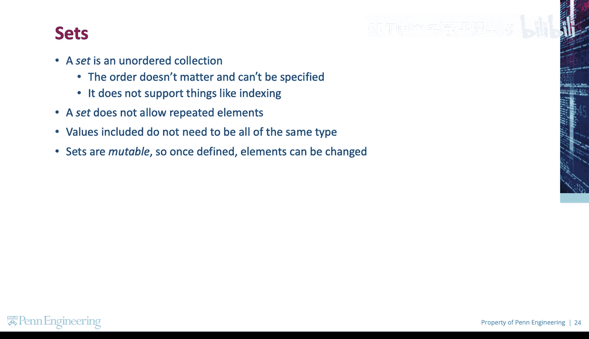
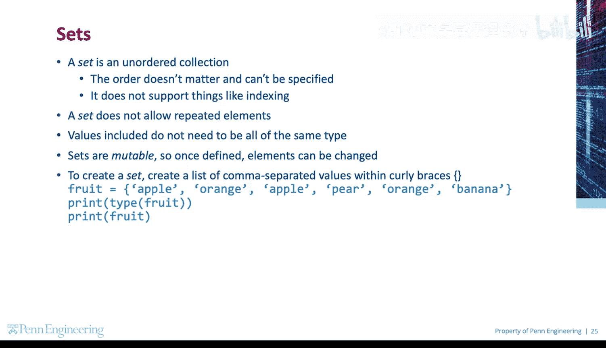
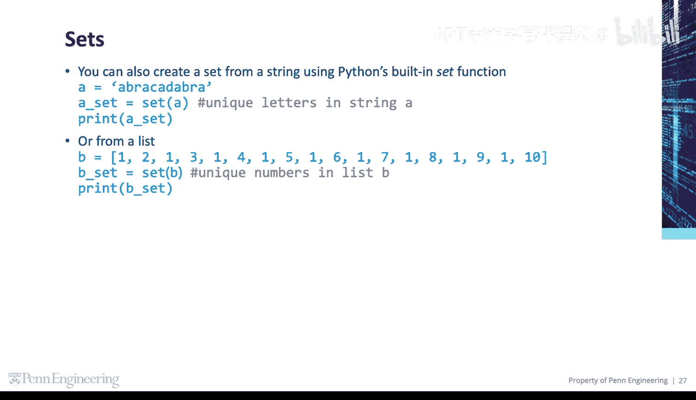
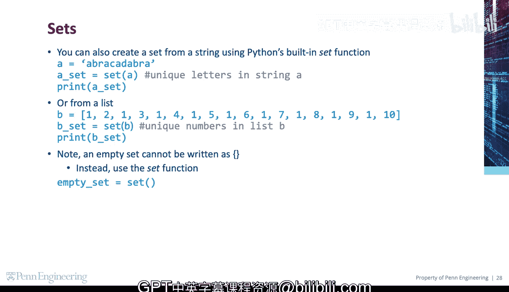
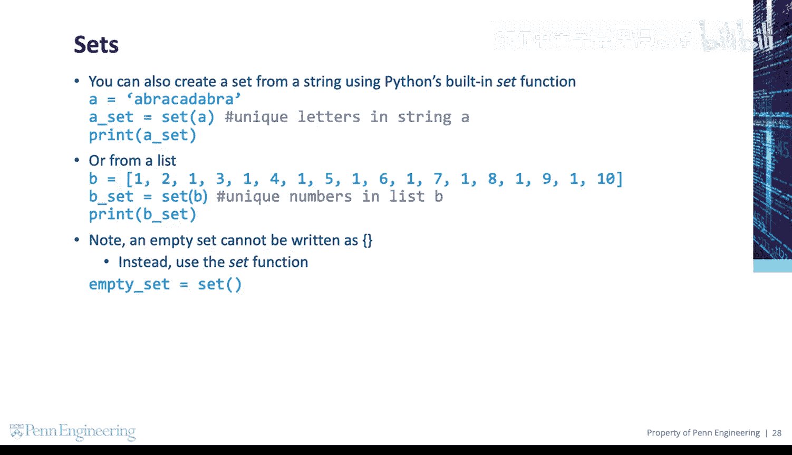

# 宾夕法尼亚大学《Python和Java编程入门1-2｜Introduction to Programming with Python and Java》中英字幕 p88 088_03_01_创建集合.zh_en -BV13E421M7FF_p88-

A set is an unordered collection。The order doesn't matter and can't be specified。

 and it does not support things like indexing。A set does not allow repeated elements。

 and the values included don't need to be all of the same type。Seets are mutable， so once defined。

 the elements can be changed。

To create a set， create a list of comma separated values within curly braces。

You can also create a set from a string using Python's built in set function。

This creates a set containing the unique letters in a string A。

Each character will be an element in the set。You can also create a set from a list。

This creates a set containing the unique numbers in List B。Each number will be an element in the set。

To create an empty set， for instance， to add items later， use the set function with no arguments。😡。

