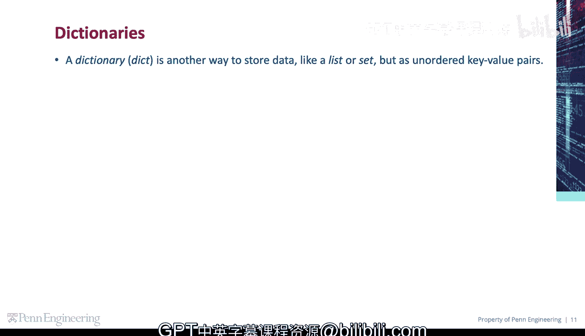
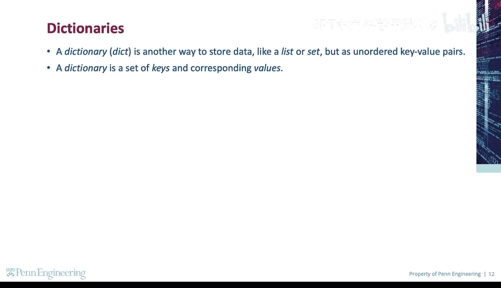
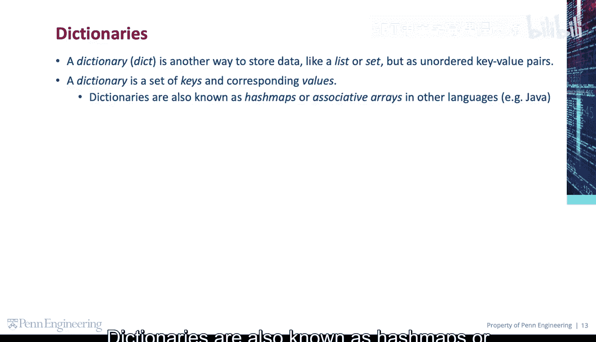
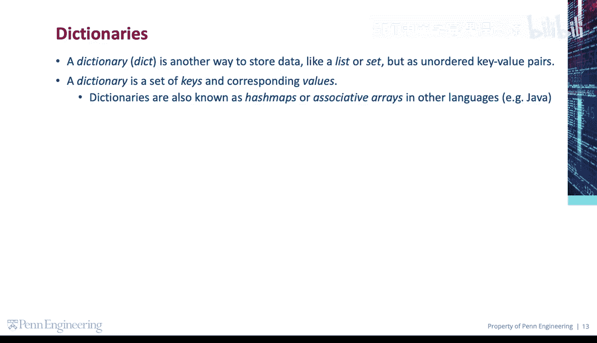
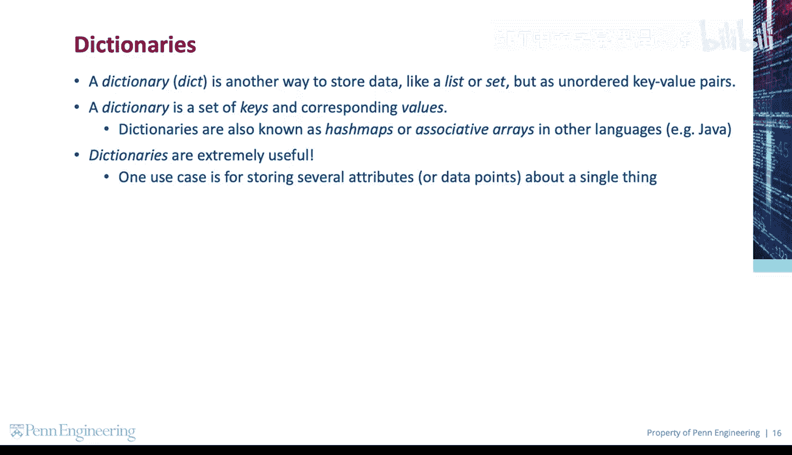
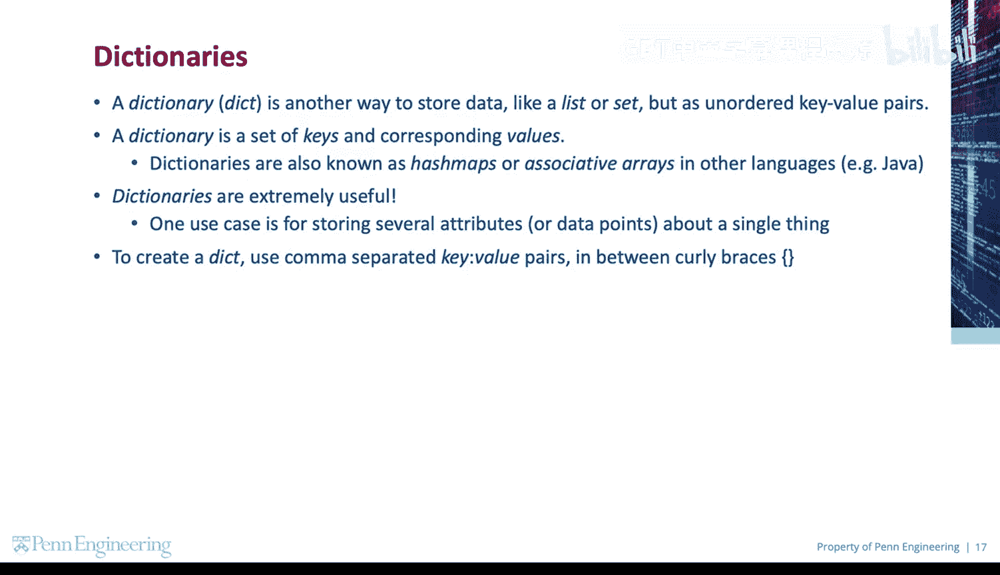
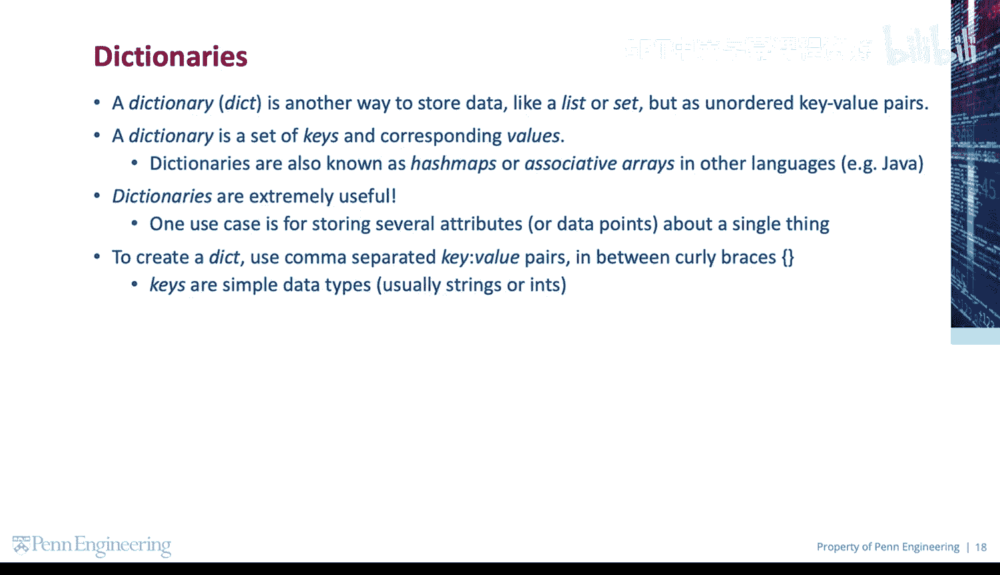
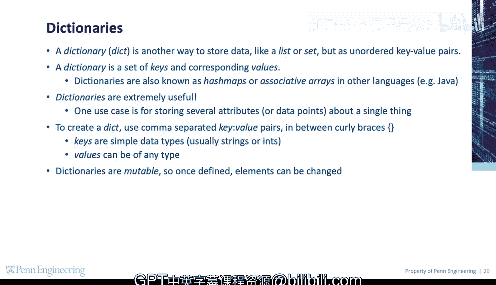

# Python和Java编程入门1-2：04：创建字典 📚


在本节课中，我们将要学习Python中一种新的数据结构——字典。我们将了解字典是什么，它与列表和集合有何不同，以及如何创建和使用它。

---

## 什么是字典？



上一节我们介绍了列表和集合，本节中我们来看看字典。字典是另一种存储数据的方式，但它以无序的键值对形式存储数据。

一个字典由一组键和其对应的值组成。在其他编程语言中，字典也被称为哈希映射或关联数组，例如在Java中。

字典非常有用。一个典型的应用场景是存储单个事物的多个属性或数据点。





---



## 如何创建字典？

要创建一个字典，需要使用花括号 `{}`，并在其中放置用逗号分隔的键值对。



以下是创建字典的基本语法：
```python
my_dict = {key1: value1, key2: value2, ...}
```

键通常是简单的数据类型，如字符串或整数，但值可以是任何类型的数据。


---



## 字典的特性

字典是可变的。这意味着一旦字典被定义，其中的元素可以被修改、添加或删除。



---

## 总结



本节课中我们一起学习了Python字典的基础知识。我们了解到字典是一种存储键值对的无序数据结构，它非常适用于存储具有多个属性的对象信息。我们还学习了使用花括号和键值对来创建字典的基本方法。