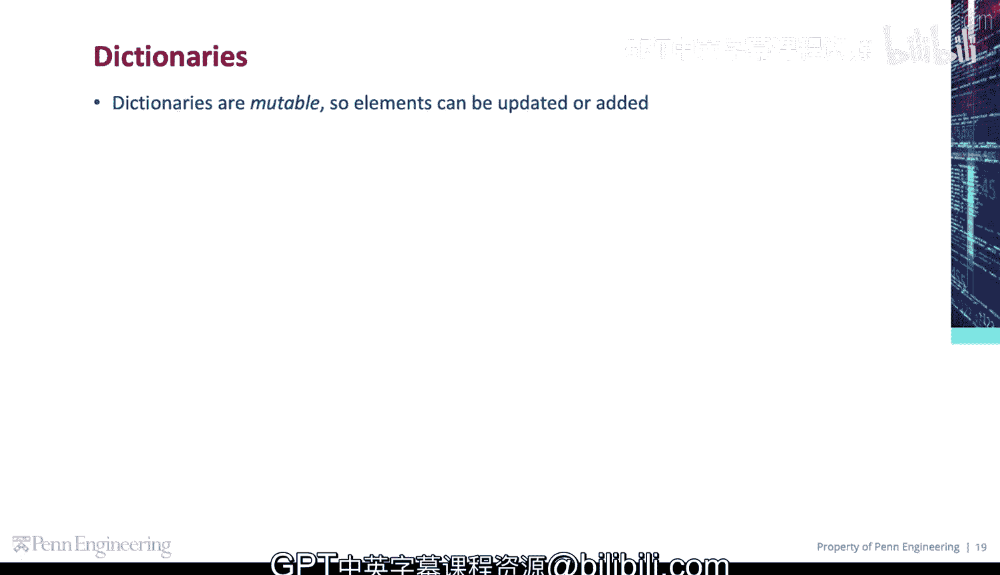
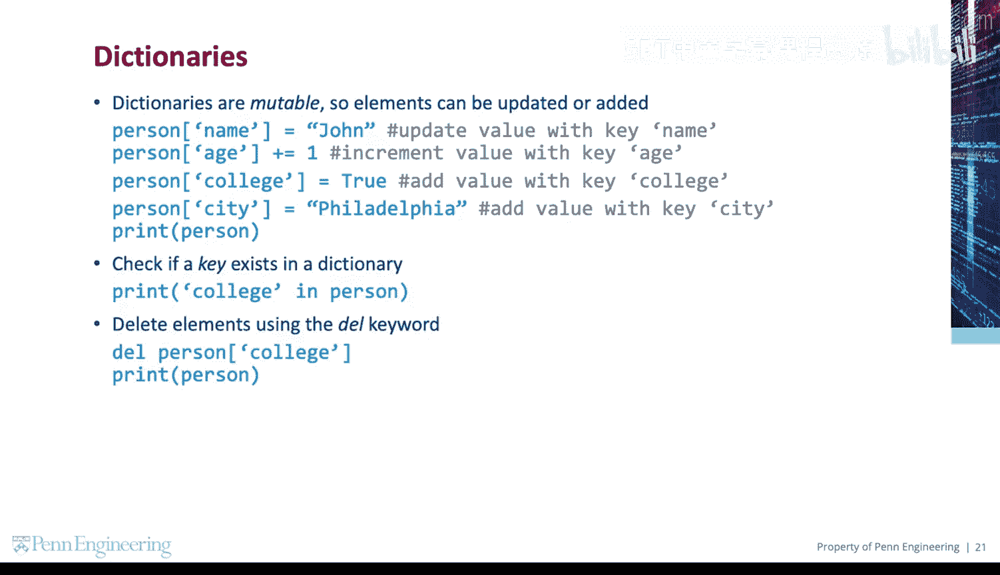
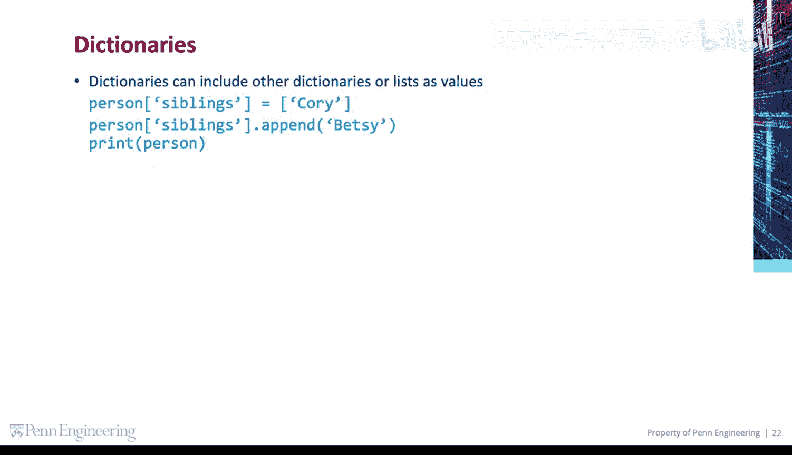
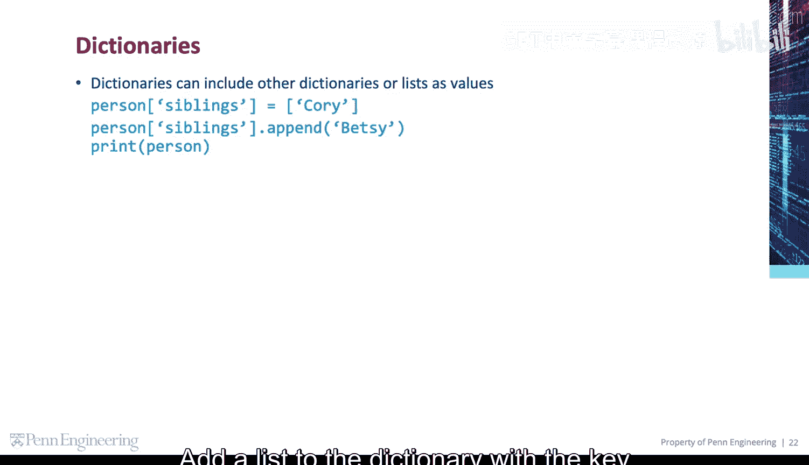
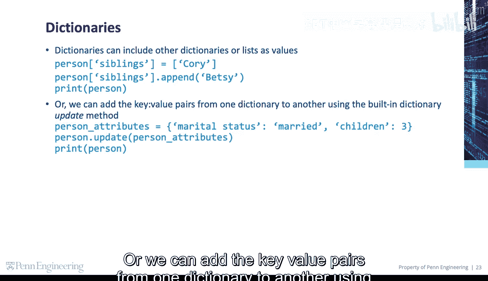
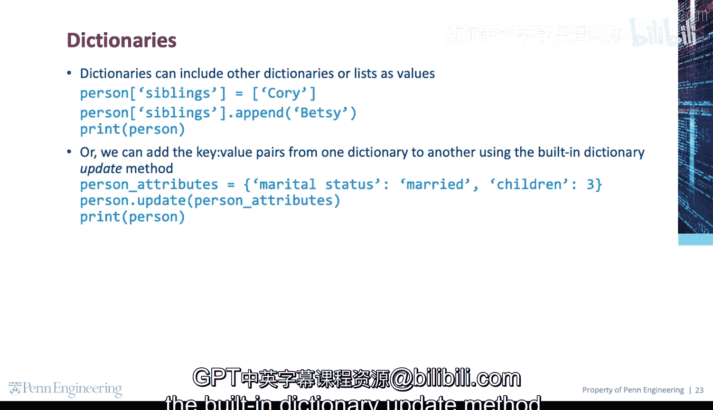

# 宾夕法尼亚大学《Python和Java编程入门1-2｜Introduction to Programming with Python and Java》中英字幕 p93 093_04_05_更新字典.zh_en -BV13E421M7FF_p93-

Dictionaries are mutable， so elements can be updated or added。Update the value with the key name。

Increment the value with the key age。Add a new value with the key college。

Add a new value with the key City。Check if a key exists in a dictionary。

Delete elements in a dictionary using the Dell keyword。

Dictionaries can include other dictionaries or lists as values。

 Add a list to the dictionary with the key siblings and even aend to that list。

Or we can add the key value pairs from one dictionary to another using the builtt in dictionary updated method。

