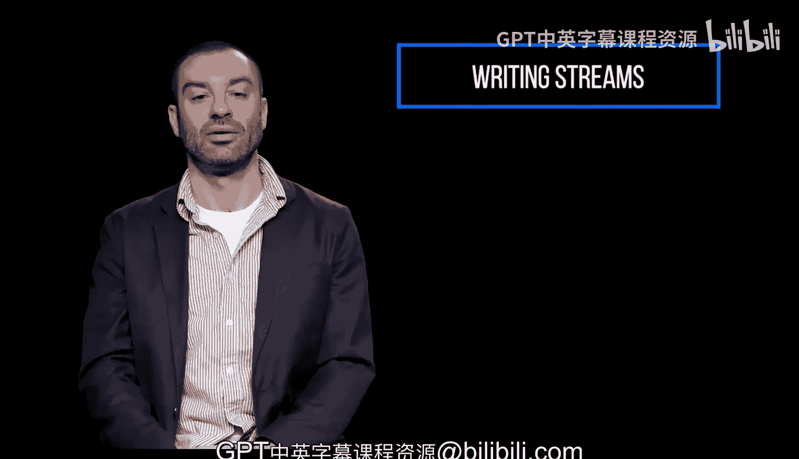
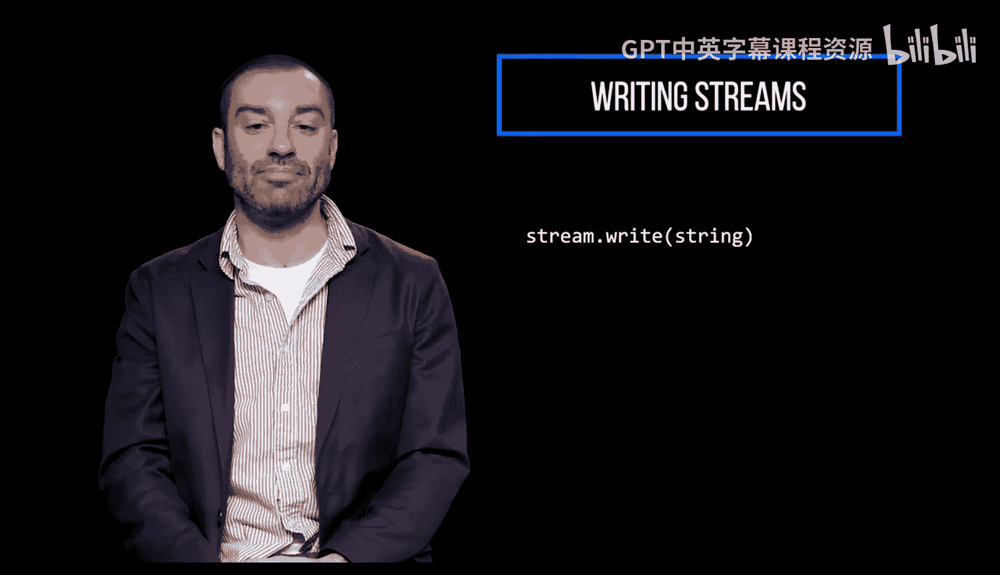
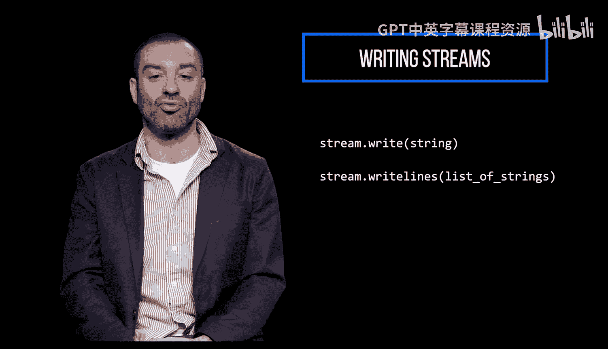
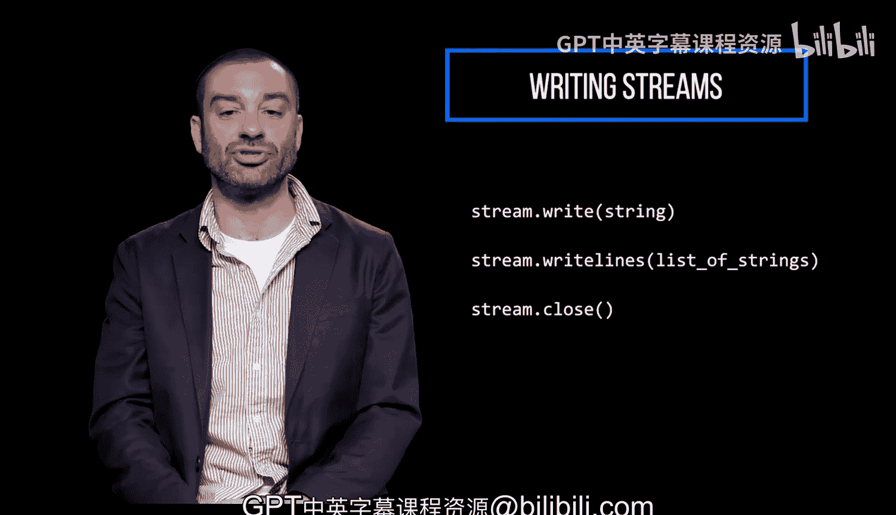

# 宾夕法尼亚大学《Python和Java编程入门1-2｜Introduction to Programming with Python and Java》中英字幕 p99 099_04_05_写入文件.zh_en -BV13E421M7FF_p99-

You can also use a stream to write lines to a file。

 The right method writes a single string to a file。

And the right lines method writes a list of strings to a file。 Again， with these right methods。

 you must remember to close the stream when you're done。

