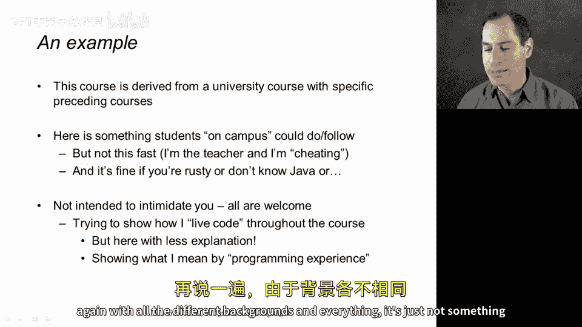
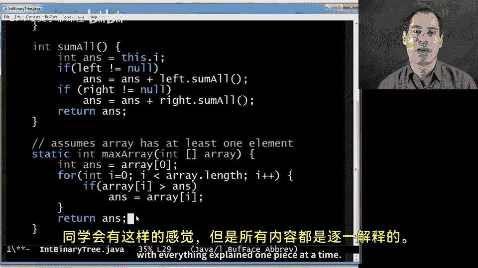

# 004：课程背景要求 🎯

在本节课中，我们将讨论学习本课程所需的背景知识。这是一个非常重要但难以一概而论的话题，因为每位学习者的背景各不相同。我们将明确课程定位，帮助你判断自己是否适合学习。

## 课程定位：承上启下

上一节我们介绍了课程的整体情况，本节中我们来看看具体需要哪些预备知识。本课程并非编程入门课，课程设计假设你已有其他语言的编程经验。然而，这也不是一门高级编程语言课程。它通常面向大学二年级学生，既不需要多年行业经验，也非高年级本科课程。因此，你需要有编程基础，但不必是专家。

## 必备的编程概念 📚

以下是学习本课程前你应该接触过的一些核心编程概念。这些概念是理解后续内容的基础。

*   **变量**：用于存储数据。
*   **函数/方法**：接收参数并返回结果的可执行代码块。
*   **条件分支**：例如 `if` 语句，用于在不同情况下执行不同操作。
*   **循环**：用于重复执行某段代码。
*   **数组**：一种基础的数据集合。
*   **递归**：通过函数调用自身来定义计算或数据结构。本课程将大量使用递归，如果你从未接触过，初期可能会感到吃力。
*   **接口与实现分离**：代码的使用者只需了解高级功能，而不应依赖具体的实现细节。这常被称为**抽象**或**模块化**。
*   **基础数据结构**：如链表和二叉树。
*   **动态分发/方法重写/子类化**：这些面向对象概念在课程后期才会用到，届时会进行复习。

如果你对以上大部分概念都有所了解，那么你的背景是合适的。

## 编程语言经验无关紧要 🌐

你可能会注意到，我并未强调需要哪种特定的编程语言经验，因为这并不重要。课程材料有时会以Java或C#背景为例进行对比，但这并非必须。如果你只熟悉Python或JavaScript，也完全没问题。关键在于理解上一节列出的概念。

课程中偶尔会有与Java或C（一种底层语言）对比的可选视频，但这些**始终是可选内容**。我们之所以能从零开始，特别是课程早期，恰恰是因为我们将使用ML语言，它的风格与你熟悉的语言可能截然不同。这种“陌生感”是好事，意味着你之前的经验具体是什么并不重要。但如果你完全没有编程经验，则可能难以跟上进度。

## 代码示例：感受所需水平 💻

现在，我想通过一个例子来展示我校学生在学习这门MOOC对应课程前所能编写或理解的代码水平。请注意，如果你不熟悉Java，可能无法完全理解代码细节，但你应该能感受到其编程模式。我在讲解时会边写代码边解释概念，即使语法陌生，你所做的事情应该看起来像编程。

以下是一个Java示例，它定义了一个整数二叉树数据结构，并包含一个求所有节点之和的递归方法。



```java
class Tree {
    int i;
    Tree left;
    Tree right;

    // 构造函数
    Tree(int i, Tree left, Tree right) {
        this.i = i;
        this.left = left;
        this.right = right;
    }

    // 递归求和方法
    int sumAll() {
        int ans = i; // 包含当前节点的值
        if (left != null) {
            ans += left.sumAll(); // 加上左子树的和
        }
        if (right != null) {
            ans += right.sumAll(); // 加上右子树的和
        }
        return ans;
    }
}
```

此外，这里还有一个在数组中查找最大值的方法示例：

```java
// 假设数组arr至少有一个元素
static int maxArray(int[] arr) {
    int ans = arr[0]; // 从第一个元素开始
    for (int i = 1; i < arr.length; i++) {
        if (arr[i] > ans) {
            ans = arr[i]; // 更新找到的最大值
        }
    }
    return ans;
}
```

这只是我在课堂上编码风格的一个例子。当我们正式开始学习ML语言时，我会放慢速度，详细解释每一个步骤。课程的讲授方式将与此类似，但会对每一部分进行逐一拆解和说明。

## 总结



本节课中我们一起学习了学习本课程所需的背景知识。我们明确了课程需要你具备基础编程概念（如变量、函数、递归、抽象等），但**不要求特定的编程语言经验**。课程将从ML语言的基础开始，即使你感觉陌生，只要有编程基础，就能跟上节奏。我们通过Java代码示例展示了预期的理解水平。准备好开始一段探索新编程范式的旅程了吗？