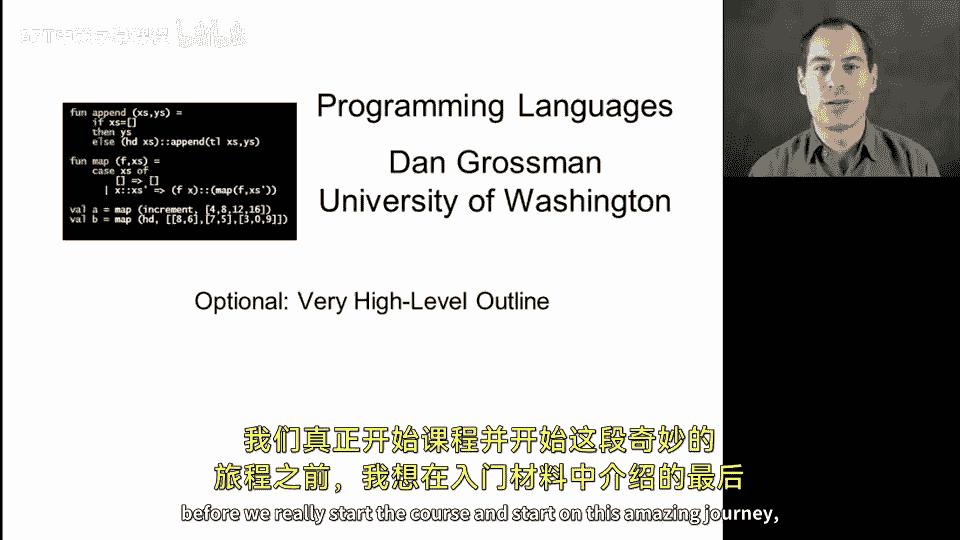
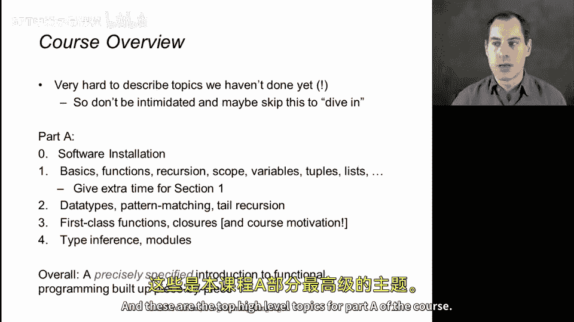
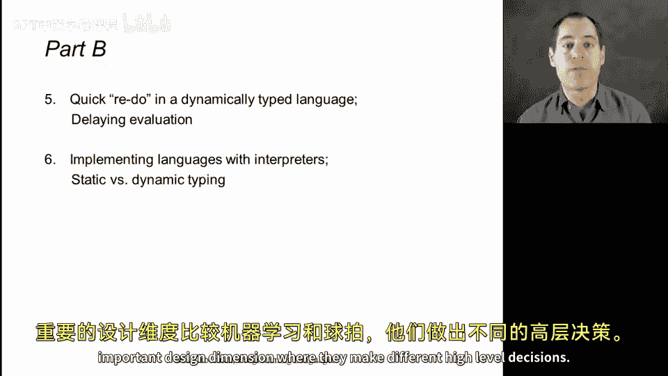
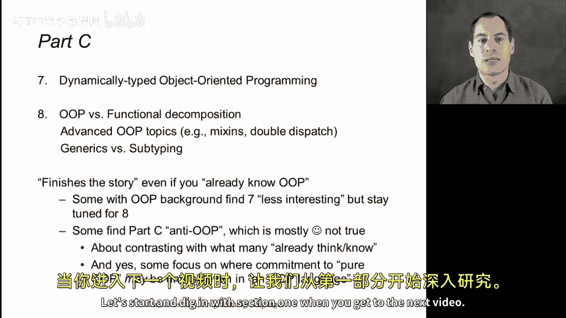

# 007：课程高阶概述 🗺️

在本节课中，我们将对课程的整体结构进行一个高阶概述。这有助于你了解我们将要学习的内容，并为你接下来的学习之旅提供一个清晰的路线图。

## 概述

在正式开始课程之前，我想先简要介绍我们即将踏上的旅程。本节内容是可选的，因为你可以直接开始学习，在实践中了解课程内容。同时，由于我们尚未学习相关术语，现在深入讨论课程细节可能会让你感到困惑。本课程的目的正是为了让你逐步学习这些概念。因此，如果你现在不理解某些术语，请不要担心，这正是你继续学习的理由。

接下来，让我们从宏观层面了解一下课程结构。本课程分为A、B、C三个部分，每个部分都包含多个单元，我们将循序渐进地学习编程语言的核心概念。

## 第一部分：A部分

上一节我们介绍了课程概述，本节中我们来看看A部分的具体内容。A部分将专注于在静态类型语言ML中学习函数式编程的基础知识。

以下是A部分的核心单元：

*   **单元1：基础**：我们将从基础开始，学习变量、作用域、数字和加法等概念。虽然你可能在其他编程语言中接触过这些，但我们将以一种更精确的方式学习。我们将逐步构建函数（类似于面向对象中的方法，但没有对象）、递归（这是我们编写迭代计算和其他计算的主要方式），以及使用元组和列表构建更大的数据结构。考虑到这是在一个新环境中学习，我们为这个单元安排了更多的时间。

*   **单元2：数据类型与模式匹配**：这是一个大多数同学可能从未见过的新概念。我们将学习一种新的方式来表示和访问复杂的数据结构，为不同类型的数据建模。模式匹配是遍历复合数据结构的绝佳方式。此外，我们还将学习尾递归，这是在现代语言中高效使用递归的关键。

*   **单元3：一等函数**：许多人认为这是函数式编程最重要的特性。我们将学习如何将函数作为值来传递、从函数中返回，甚至将其放入数据结构中。这是一个庞大且意义深远的主题。

*   **单元4：类型推断与模块**：在A部分的最后一个单元，我们将学习类型推断——编译器如何为我们推断类型，使得程序员无需手动标注。同时，我们还将学习ML的模块系统，它支持将类型、值和相关函数组织在一起，强制客户端无法误用抽象，这体现了接口与实现分离的思想。

总的来说，A部分将通过几个关键模块，为你提供一次精确、循序渐进的函数式编程入门。

## 第二部分：B部分

在掌握了静态类型函数式编程的基础后，B部分将带我们进入一个不同的领域。

以下是B部分的核心单元：

*   **单元5：动态类型语言**：我们首先会在动态类型语言Racket中，重新实现A部分的大部分内容。我们将探讨当程序在运行前很少被拒绝，而是依赖运行时失败时，编程方式会发生什么变化，以及其中的权衡取舍。

*   **单元6：语言实现与类型对比**：在这个单元，我们将通过实现一个解释器来实际构建一个编程语言。这将很好地展示编程语言及其实现的含义，并让你亲身体验实现一个支持一等函数的语言的过程。此外，我们还将对比静态类型与动态类型，在分别体验了ML和Racket之后，我们可以就这一重要的设计维度展开深入的讨论。

## 第三部分：C部分

最后，C部分将探讨面向对象编程，并与之前学到的函数式范式进行比较。

以下是C部分的核心单元：

*   **单元7：Ruby与面向对象基础**：我们将使用Ruby语言学习面向对象编程的基础。作为我们的第三门语言，你会发现我们可以学得很快。我们将重点关注Ruby如何比Racket更具动态性，以及它如何比Java、C#等语言更加“纯粹”地面向对象（在Ruby中，一切皆为对象，包括数字）。

*   **单元8：函数式与面向对象对比**：在课程的最后一个单元，我们将比较函数式编程与面向对象编程。我们会探讨一些更高级的面向对象主题，如混入和双重分派。这使得课程的最后一个作业颇具挑战性，因为我们将使用一些非平凡的面向对象惯用法来比较这些思想。

我强烈建议你完成C部分。有些人可能认为自己已经了解面向对象编程，只是为了学习函数式内容而来，因此想跳过C部分。但我鼓励你继续学习，正是为了进行这种比较和对照。需要指出的是，本课程会有意强调函数式视角，因为这是大家相对不熟悉的范式。课程的目标不是宣称某种方法总是优于另一种，而是为你提供大量的思考素材和新的视角。

## 总结

本节课中，我们一起学习了CSE341课程的高阶概述。我们了解到课程分为A（静态类型函数式）、B（动态类型与语言实现）、C（面向对象与范式对比）三个部分，每个部分都旨在循序渐进地拓宽我们对编程语言设计的理解。现在，概述结束，让我们在下一个视频中正式开始第一单元的学习。