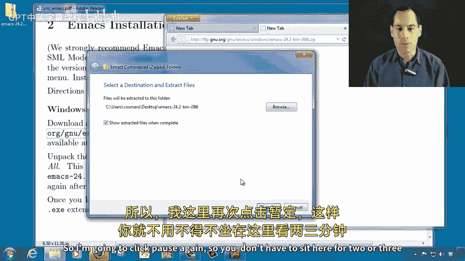
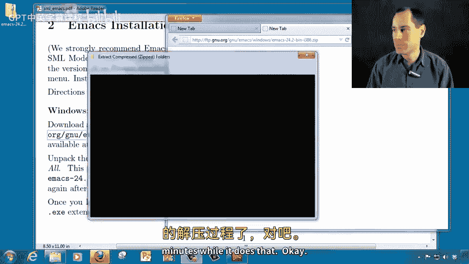
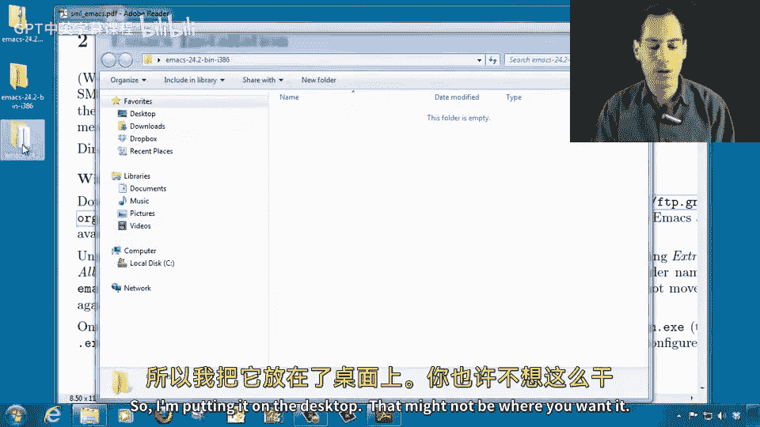

# 009：Windows系统安装指南

在本节课中，我们将学习如何在Windows操作系统上安装Emacs文本编辑器。整个过程包括下载安装包、解压文件、运行安装程序以及首次启动验证。

## 下载Emacs安装包

首先，我们需要获取Emacs的Windows版本安装文件。以下是具体步骤：

1.  打开包含安装说明的PDF文档，找到Emacs安装章节。
2.  复制或点击提供的下载链接。如果直接点击无效，请手动将链接地址复制到浏览器地址栏中。
3.  浏览器将开始下载一个约50MB的`.zip`压缩文件。请等待下载完成。

## 解压安装文件

下载完成后，我们需要找到并解压该文件。以下是操作流程：

1.  根据浏览器的设置，找到下载文件的位置（例如桌面）。
2.  右键点击下载的`.zip`文件。
3.  从右键菜单中选择“全部提取”或使用你喜欢的解压软件。
4.  在弹出的窗口中点击“提取”。解压过程可能需要几分钟时间。

## 准备安装目录

解压完成后，你会看到一个名为`Eax 242 bin I 386`的文件夹。接下来，我们需要将其放置到最终的安装位置。

1.  打开解压后生成的文件夹。
2.  将其中的主文件夹剪切出来。
3.  粘贴到你希望永久安装Emacs的目录（例如`C:\Program Files`或桌面）。**请确保选定后不再移动此文件夹。**

## 运行安装程序

现在，我们可以运行安装程序来完成设置了。

1.  进入你上一步放置的文件夹，打开其中的`bin`子文件夹。
2.  找到并运行名为`addd PMm`的程序（可能是`addpm.exe`或类似名称）。
3.  当系统询问是否要安装Emax时，选择“是”。
4.  安装程序会识别你已选择的目录，并快速完成安装。

## 首次启动与验证

安装完成后，让我们首次启动Emacs以验证安装成功。

1.  点击Windows“开始”菜单。
2.  在搜索框中输入“emax”。在Windows 7系统中，可以直接选择顶部出现的选项。
3.  或者，依次进入“所有程序” -> “Ganew Eax”文件夹，点击其中的Emacs程序。
4.  首次运行时，系统可能会询问是否运行此程序。这是安全的，可以取消勾选警告框，然后选择“运行”。

当你看到Emacs的编辑界面成功显示时，说明Emacs已经安装完成。

---

本节课中，我们一起学习了在Windows系统上安装Emacs的完整流程：从下载安装包、解压文件、配置安装目录到运行安装程序并最终成功启动。现在，你可以开始使用这款强大的文本编辑器了。