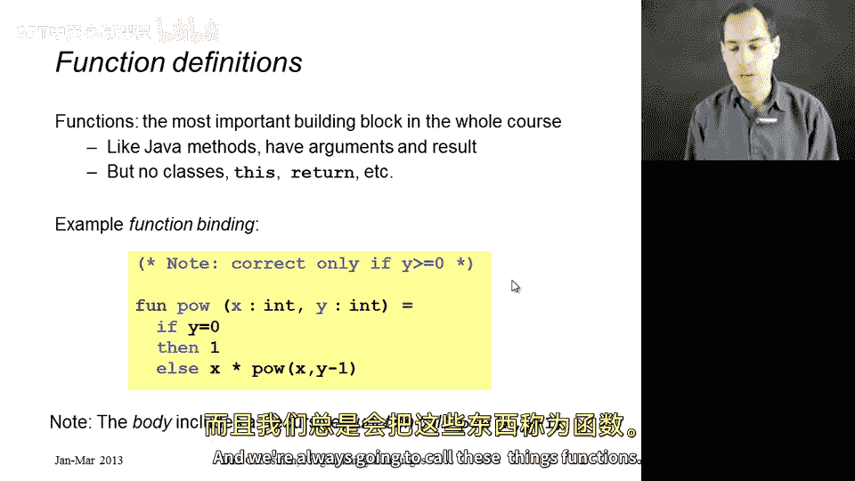
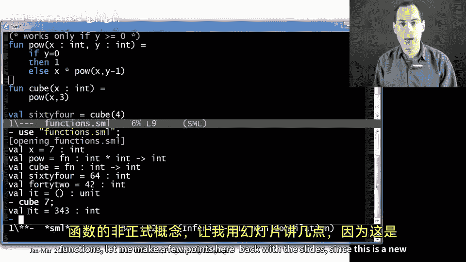
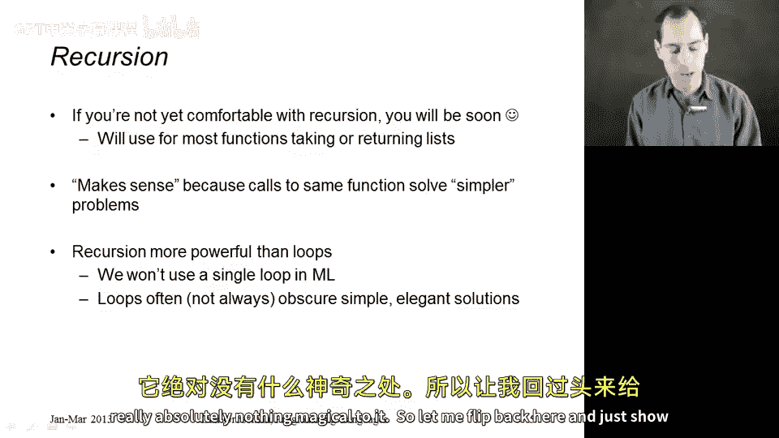
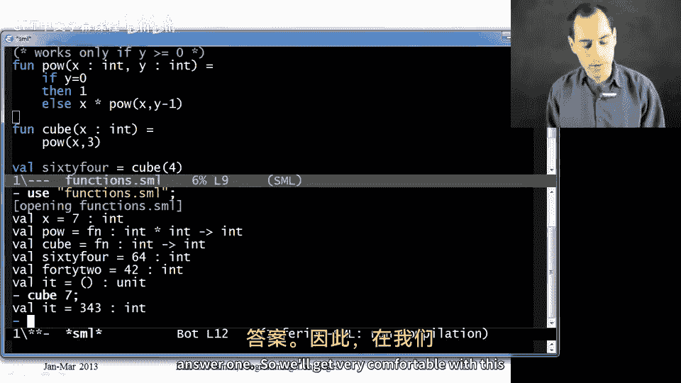
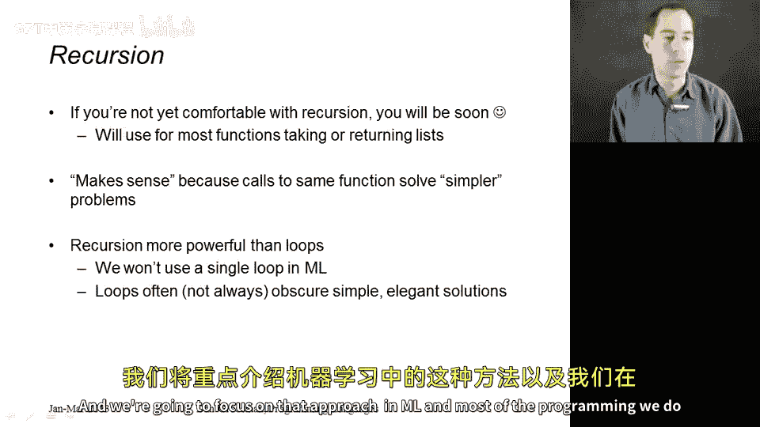

# 016：函数初步介绍 🧮

在本节课中，我们将开始学习函数。函数是一种新的绑定形式，因此我们将更新程序的定义，使其不仅包含变量绑定序列，还允许包含变量和函数。如果你之前没有听说过“函数”这个术语，它非常类似于面向对象语言中的方法。函数接收参数，计算结果并返回该结果。这就是它的全部功能。因此，在许多方面，函数比方法更简单。我们将始终称这些为函数。

## 第一个函数示例

上一节我们介绍了函数的基本概念，本节中我们来看看一个具体的例子。我将切换到 Emacs 环境，展示一个关于指数运算（求幂）的简单函数。

以下是定义该函数所需的大部分代码：



```sml
fun pow (x : int, y : int) =
    if y = 0
    then 1
    else x * pow(x, y-1)
```

这里，`fun` 是关键字，`pow` 是定义的函数名。参数 `x` 和 `y` 用逗号分隔，并通过冒号指定其类型为 `int`。等号后面是函数体。

函数体可以是任何我们想要的表达式。调用函数时，我们将计算这个表达式，其结果就是函数的返回值。对于指数运算，我使用了一个条件表达式：如果 `y` 等于 0，则结果为 1；否则，结果为 `x` 乘以 `pow(x, y-1)` 的调用结果。只要 `y` 大于或等于 0，这个函数就能正常工作。这里不处理 `y` 为负数的情况，这只是一个示例。

## 在程序中使用函数

这是一个完整的程序，可以包含在绑定序列中。我可以在它之前有一个变量绑定，之后也可以有另一个函数绑定。

例如，定义一个计算参数立方的函数：

```sml
fun cube (x : int) = pow(x, 3)
```

`cube` 的函数体本身是一个函数调用，它调用 `pow` 函数，参数是 `cube` 的参数 `x` 和常数 3。

我可以这样使用这些函数：

```sml
val sixty_four = cube(4)
```

实际上括号不是必须的，但加上它们看起来更像其他语言的风格。

或者，可以使用更复杂的嵌套表达式：

```sml
val result = pow(2, 2+2)
```

这里会先计算 `2+2` 得到 4，然后将 4 作为第二个参数传递给 `pow`。你甚至可以进行嵌套调用，例如 `pow(2, pow(2, 2))`。

## 在 REPL 中测试

想要测试时，可以像往常一样转到 REPL。输入 `use "functions.sml";` 可以加载文件并看到所有的绑定。

你会注意到，`pow` 和 `cube` 的打印输出与变量绑定不同，它们只显示“这是一个函数”。REPL 不会打印函数体，只会显示它是一个函数及其类型。

对于 `pow`，其类型显示为 `int * int -> int`。在 ML 中，函数类型的写法是：参数类型用 `*` 分隔（`int * int`），然后是箭头 `->`，最后是结果类型（`int`）。我们不需要显式写出结果类型，ML 通过查看函数体（例如上面的条件表达式）推断出：如果 `x` 和 `y` 是 `int` 类型，那么条件表达式的结果也必须是 `int` 类型，因此该函数在接收两个 `int` 参数时会返回一个 `int`。



类似地，`cube` 的类型是 `int -> int`。`sixty_four` 和 `result` 则像往常一样显示值。

现在可以在 REPL 中尝试调用函数，例如输入 `cube 7;` 会得到结果 `343`。

## 关于函数的要点

以上是函数的非正式概念。由于这是我们正在学习的新内容，让我用幻灯片强调几个要点。

首先，`pow` 的函数体内部可以调用 `pow` 自身。这就是我们实现递归算法的方式，正如示例中所做的那样。这表明在函数体内部，可以调用函数本身。

开始编写代码时，需要注意一些潜在的陷阱，我们会遇到新的错误消息来源。特别是，如果忘记在变量名和类型之间写冒号，或者像在其他语言中那样尝试写 `int x` 而不是 `x : int`，都会导致语法错误。

另外需要指出的是，我们在 REPL 中看到的函数类型 `int * int -> int` 中的 `*` 与乘法运算符 `*` 不同。这只是字符的重用：在表达式中，`*` 表示乘法；在类型中（至少目前看来），它只是用来分隔多个参数的类型。

最后，就像变量绑定一样，函数绑定可以使用文件中更早的绑定，但不能使用文件中更晚的绑定。这是 ML 的规则。因此，如果你想用一个函数（如 `pow`）来定义另一个函数（如 `cube`），那么必须把 `cube` 放在 `pow` 之后。

这引出了一个有趣的问题：如果有两个或三个函数需要相互调用，就没有一个合适的顺序来放置它们。在未来的课程中，我会展示 ML 为这种相互递归的情况提供的特殊支持。

## 递归的说明

如果你对递归还不熟悉，希望至少之前见过它。你很快会在第一次作业中接触到它，几乎你写的每个函数都将是递归的，我们将看到更多例子。所以，如果 `pow` 的算法看起来有点神奇，请不要惊慌，它其实一点也不神奇。



让我切换回来，再次展示这个 `pow` 函数。我们之所以能在 `pow` 的定义中使用 `pow`，这并不循环。我们所做的是，用“求某数的 y-1 次幂”来定义“求某数的 y 次幂”。这是一个完全合理的定义：递归调用是在解决一个更简单的问题。

如果这个更简单的问题是 `y` 等于 0，那么我们根本不使用递归，直接返回答案 1。随着学习的深入，我们会非常熟悉这个概念。

在 ML 中，我们将始终使用递归来处理这类事情。如果你习惯用 `while` 循环或 `for` 循环来编写像求幂这样的功能，我们不会使用它们。循环常常掩盖了更简单、更优雅的算法，而递归更强大。虽然循环在许多编程语言中更方便或更高效，但我保证，任何能用循环完成的事情，都能用递归完成。在 ML 以及本课程的大部分编程中，我们将专注于递归方法。

## 总结





本节课中，我们一起学习了函数的基本概念。我们了解到函数是一种接收参数并返回结果的绑定形式。通过 `fun` 关键字定义函数，可以指定参数名和类型。函数体是一个表达式，其计算结果即为返回值。函数可以递归调用自身，这是实现许多算法的基础。我们还在 REPL 中测试了函数，并理解了 ML 如何推断函数类型。最后，我们讨论了递归的重要性，并指出在 ML 编程中将主要依赖递归而非循环。