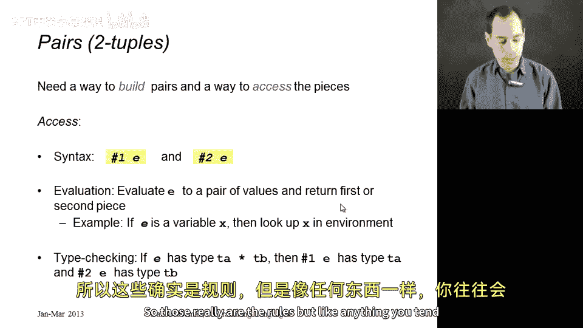
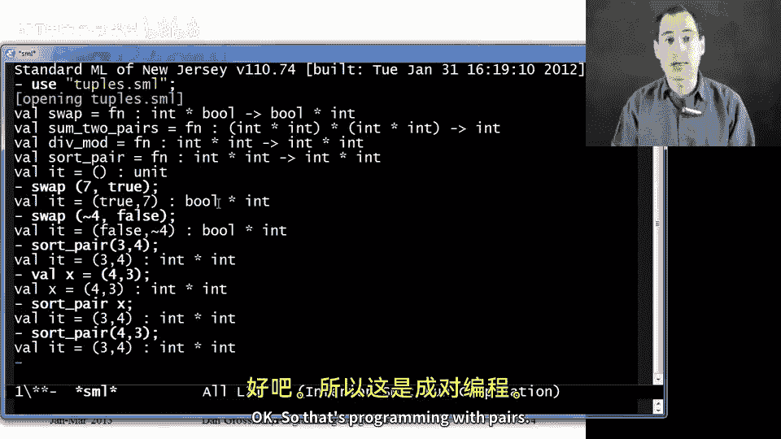
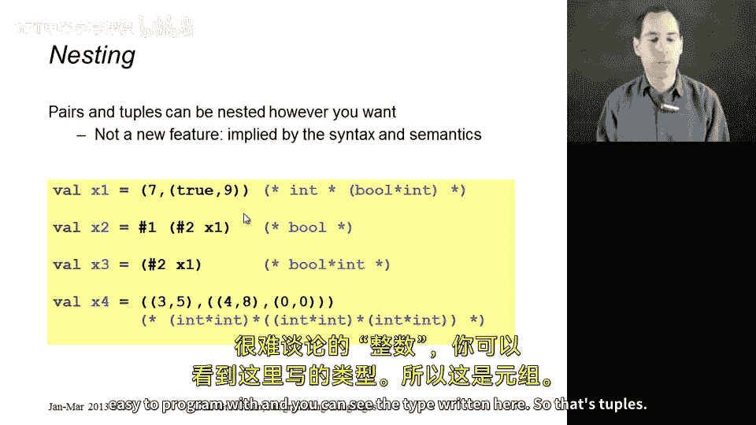

# 018：元组与复合数据

在本节课中，我们将学习如何构建由多个部分组成的复合数据。我们将从最简单的形式——**对（pairs）**开始，然后扩展到更通用的**元组（tuples）**。你将学会如何创建和访问这些数据结构，并理解它们在类型系统中的作用。

## 构建与访问对（Pairs）

上一节我们介绍了基本数据类型，本节中我们来看看如何将多个数据组合成一个整体。对（pair）是包含两个部分的数据结构，每个部分可以是不同类型。

### 构建对
构建对的语法是：将两个表达式用逗号分隔，并放在括号内。例如，`(e1, e2)`。

**求值规则**：首先求值 `e1` 得到值 `v1`，然后求值 `e2` 得到值 `v2`，最终结果是一个包含 `v1` 和 `v2` 的对值。

**类型规则**：如果 `e1` 的类型是 `ta`，`e2` 的类型是 `tb`，那么整个表达式的类型是 `ta * tb`。

### 访问对
访问对的组成部分使用 `#1` 和 `#2` 操作符。

**求值规则**：首先求值表达式 `e` 得到一个对值，然后 `#1 e` 返回其第一部分，`#2 e` 返回其第二部分。

**类型规则**：表达式 `e` 必须具有对类型 `ta * tb`。那么 `#1 e` 的类型是 `ta`，`#2 e` 的类型是 `tb`。

## 编写使用对的函数

理解规则的最佳方式是实践。以下是几个使用对的函数示例。

### 交换函数
此函数接受一个 `int * bool` 类型的对，并返回一个交换了顺序的 `bool * int` 对。



```ml
fun swap (pr : int * bool) =
    (#2 pr, #1 pr)
```

### 求和函数
此函数接受两个 `int * int` 类型的对，返回四个整数的和。

```ml
fun sum_two_pairs (pr1 : int * int, pr2 : int * int) =
    (#1 pr1) + (#2 pr1) + (#1 pr2) + (#2 pr2)
(* 类型: (int * int) * (int * int) -> int *)
```

### 商与余数函数
此函数接受两个整数，返回一个包含商和余数的对。

```ml
fun div_mod (x : int, y : int) =
    (x div y, x mod y)
(* 类型: int * int -> int * int *)
```

### 排序对函数
此函数接受一个 `int * int` 对，返回一个按升序排列的对。

```ml
fun sort_pair (pr : int * int) =
    if (#1 pr) < (#2 pr)
    then pr
    else (#2 pr, #1 pr)
(* 类型: int * int -> int * int *)
```

## 从对到元组（Tuples）

对是元组的一种特例。元组可以包含任意数量的部分，称为 **n元组**。

### 构建元组
构建元组的语法与对类似，只需用逗号分隔多个表达式：`(e1, e2, ..., en)`。



**类型规则**：如果每个表达式 `ei` 的类型是 `ti`，那么整个元组的类型是 `t1 * t2 * ... * tn`。

### 访问元组
访问元组使用 `#1`, `#2`, `#3`, ... 操作符，分别对应第一、第二、第三...部分。

## 嵌套元组

元组可以嵌套，形成更复杂的数据结构。以下是一些嵌套元组的例子：

```ml
val x1 = (7, (true, 9))
(* 类型: int * (bool * int) *)

val x2 = #1 (#2 x1)
(* x2 求值为 true *)

val x3 = #2 x1
(* x3 求值为 (true, 9)，类型为 bool * int *)

val complex_tuple = ((1,2), ((3,4), (5,6)))
(* 类型: (int * int) * ((int * int) * (int * int)) *)
```



本节课中我们一起学习了如何创建和使用**对**与**元组**这两种复合数据类型。我们掌握了构建和访问它们的语法与规则，并通过编写函数进行了实践。我们还了解了元组可以嵌套，从而构建出复杂的数据结构。这些概念是后续学习列表和其他数据结构的重要基础。