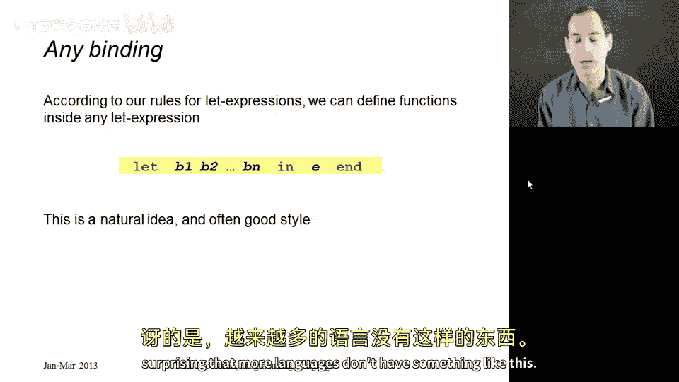
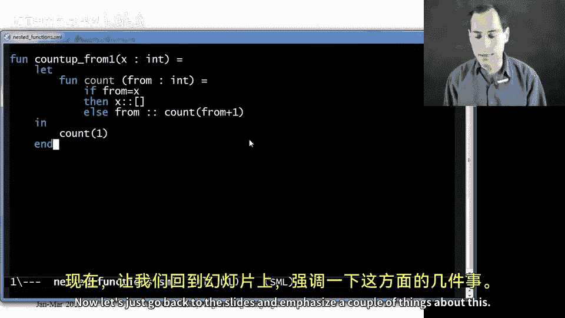
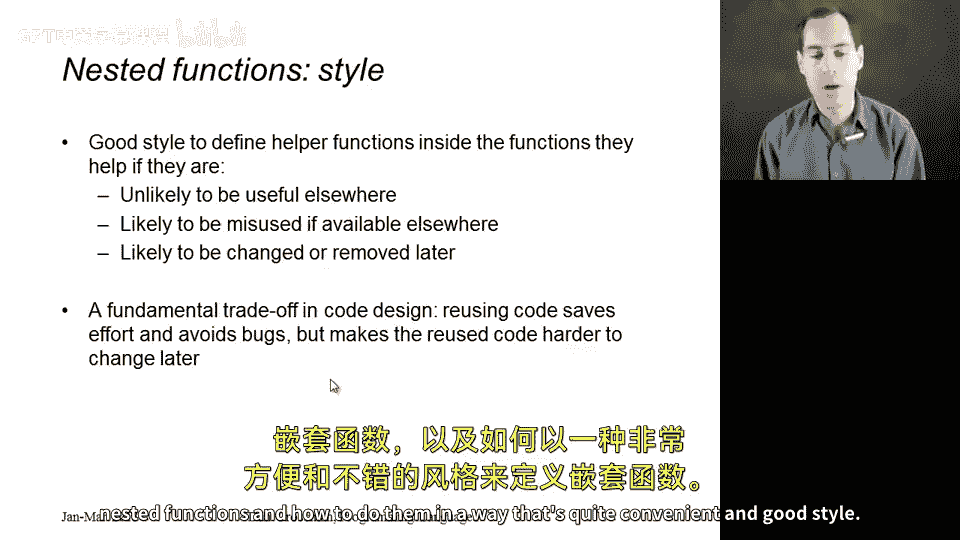

# 022：嵌套函数 🧩

在本节课中，我们将学习如何在其他函数内部定义函数，探讨何时这样做是良好的编程风格，以及如何以符合良好风格的方式实现。我们将看到，实现嵌套函数并不需要学习新的语言结构，只需利用我们已经掌握的 `let` 表达式即可。

---

## 概述



嵌套函数是指在一个函数内部定义的另一个函数。在 ML 语言中，这可以通过 `let` 表达式轻松实现，因为函数本身就是一种绑定。这样做的好处是可以将辅助函数的作用域限制在需要它的主函数内部，从而提高代码的封装性和可维护性。

## 从独立辅助函数开始

为了更好地理解嵌套函数，我们先来看一个不使用嵌套函数的例子。假设我们需要一个函数 `count_up_from_one`，它接收一个整数 `x` 并返回从 1 到 `x` 的整数列表。

为了实现这个功能，我们首先定义一个独立的辅助函数 `count`，它接收两个参数 `from` 和 `to`，并返回它们之间（包含两端）的整数列表。

以下是 `count` 函数的代码：

```sml
fun count (from, to) =
    if from = to
    then [to]
    else from :: count(from+1, to)
```

接着，我们利用这个辅助函数来定义主函数 `count_up_from_one`：

```sml
fun count_up_from_one x = count(1, x)
```

这样，当我们调用 `count_up_from_one 7` 时，就会得到列表 `[1,2,3,4,5,6,7]`。

## 使用 `let` 表达式实现嵌套

上一节我们介绍了独立的辅助函数。然而，如果 `count` 函数只被 `count_up_from_one` 使用，那么将其暴露在全局作用域中并不是最佳实践。本节中，我们来看看如何使用 `let` 表达式将 `count` 函数嵌套在 `count_up_from_one` 内部，使其成为私有函数。

修改后的代码如下：

```sml
fun count_up_from_one x =
    let
        fun count (from, to) =
            if from = to
            then [to]
            else from :: count(from+1, to)
    in
        count(1, x)
    end
```

在这个版本中，`count` 函数被定义在 `let` 表达式内部，因此它只在 `count_up_from_one` 的函数体内可见。在外部环境中尝试调用 `count` 函数会导致错误，这正符合我们的预期。

## 优化：利用外部作用域的变量



我们注意到，在嵌套的 `count` 函数中，参数 `to` 的值始终等于外部函数 `count_up_from_one` 的参数 `x`。既然 `x` 已经在作用域内，我们就没有必要再将 `to` 作为参数传递给 `count` 函数。

以下是优化后的版本，我们移除了 `count` 函数中多余的 `to` 参数，并直接使用外部变量 `x`：

```sml
fun count_up_from_one x =
    let
        fun count from =
            if from = x
            then [x]
            else from :: count(from+1)
    in
        count 1
    end
```

这个版本更加简洁，因为它避免了传递不必要的参数。`count` 函数通过闭包机制，可以直接访问其定义时所在作用域中的变量 `x`。

## 嵌套函数的风格指南

何时应该使用嵌套函数？这涉及到软件设计中的一个基本权衡。

以下是使用嵌套函数的主要优点：
*   **限制作用域**：确保辅助函数只在需要它的地方被使用，防止误用。
*   **提高封装性**：隐藏实现细节，使主函数的接口更清晰。
*   **便于维护**：修改嵌套函数时，只需检查其有限的调用点，降低了代码维护的复杂度。

然而，嵌套函数并非总是最佳选择：
*   **降低可复用性**：如果一个函数可能在程序的其他部分也有用，那么将其定义在更广的作用域（如模块级别）会更合适。
*   **设计权衡**：目标是在“限制作用域以保证安全”和“扩大作用域以促进复用”之间找到平衡。

## 总结



本节课中我们一起学习了 ML 语言中嵌套函数的定义和使用。关键点在于，我们可以利用已有的 `let` 表达式在函数内部定义其他函数。我们探讨了如何通过这种方式将辅助函数私有化，以及如何通过闭包直接使用外部作用域的变量来简化函数签名。最后，我们讨论了在什么情况下使用嵌套函数是良好的编程风格，即当辅助函数用途单一且不需要被外部代码复用时。掌握这一技巧有助于你编写出更模块化、更易维护的代码。