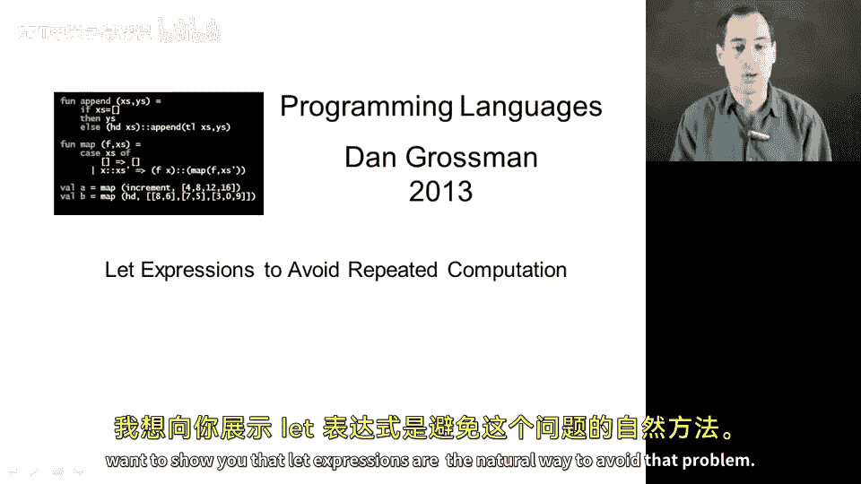
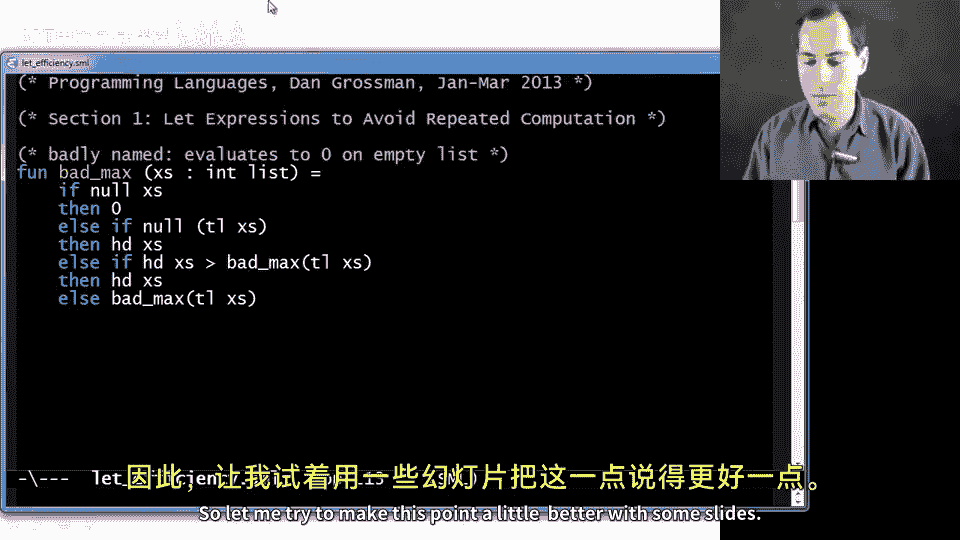
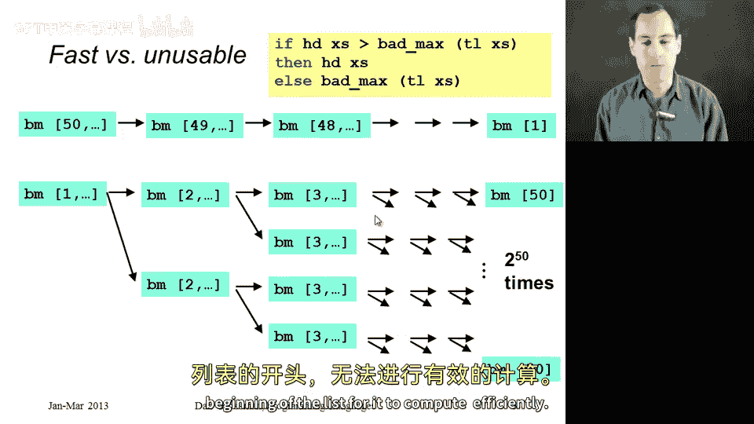
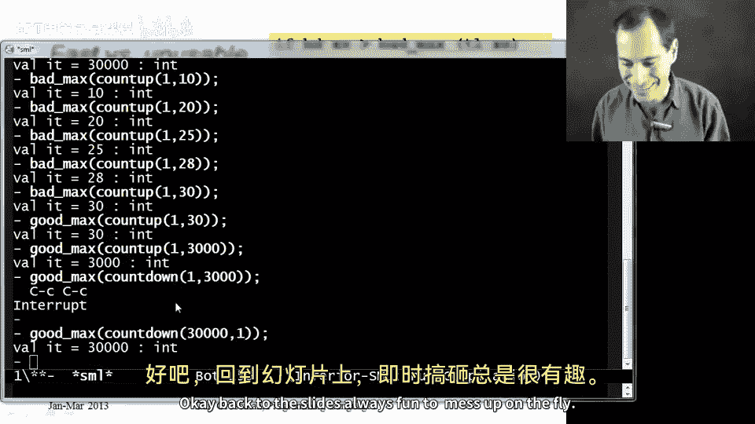
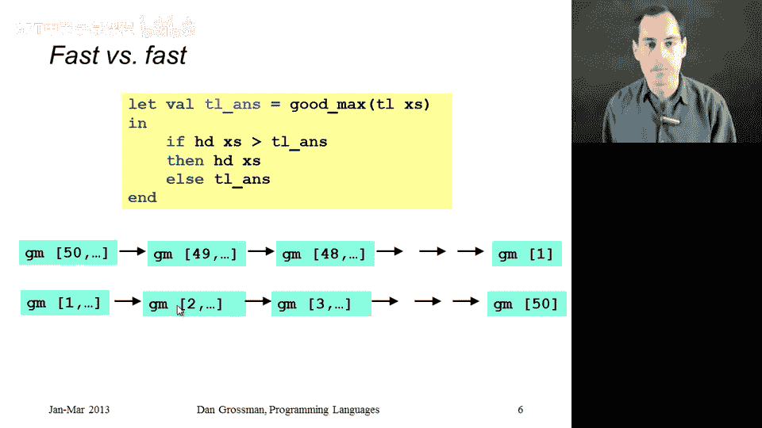

# 023：let 表达式与递归效率 🚀



在本节课中，我们将学习如何避免在递归函数中重复计算，并理解 `let` 表达式如何帮助我们解决这个问题。我们将通过一个具体的例子来展示低效递归的后果，并演示如何使用 `let` 表达式来优化代码。

## 概述

递归是函数式编程的核心概念之一，但如果不小心处理，递归可能导致严重的性能问题。本节中，我们将分析一个名为 `bad_max` 的低效递归函数，并展示如何通过 `let` 表达式将其优化为 `good_max` 函数。

---

## 低效递归示例：bad_max 函数

首先，我们来看一个低效的递归函数 `bad_max`。该函数的目标是找出整数列表中的最大值。虽然函数逻辑正确，但其递归方式导致了严重的性能问题。

```ml
fun bad_max (xs : int list) =
    if null xs
    then 0
    else if null (tl xs)
    then hd xs
    else if hd xs > bad_max(tl xs)
    then hd xs
    else bad_max(tl xs)
```

### 函数逻辑分析

以下是 `bad_max` 函数的逻辑步骤：

1.  如果列表为空，返回 0（这是一个临时处理，实际应抛出异常）。
2.  如果列表只有一个元素，返回该元素。
3.  否则，比较列表头部与尾部列表的最大值，返回较大者。

### 性能问题

尽管 `bad_max` 函数逻辑正确，但其在递归过程中重复计算了 `bad_max(tl xs)`，这导致了指数级的计算量增长。具体来说，每次递归调用都会产生两个新的递归调用，从而形成二叉树状的调用结构。

---

## 性能对比：countdown 与 countup

为了更直观地展示性能问题，我们使用两个辅助函数 `countdown` 和 `countup` 来生成列表。

### countdown 列表

当列表元素按降序排列时（如 `[50, 49, 48, ...]`），`bad_max` 的性能尚可接受，因为最大值在列表开头，递归调用次数约为列表长度。

### countup 列表



当列表元素按升序排列时（如 `[1, 2, 3, ...]`），`bad_max` 的性能急剧下降。因为最大值在列表末尾，每次递归都需要重复计算尾部列表的最大值，导致调用次数呈指数增长。

例如，对于一个长度为 50 的列表，`bad_max` 的调用次数约为 **2^50** 次，这是一个天文数字，即使对于现代计算机也需要数年时间才能完成。

---

## 优化方案：使用 let 表达式

为了避免重复计算，我们可以使用 `let` 表达式将递归结果存储在变量中。这样，每次递归只需计算一次尾部列表的最大值，从而将指数级复杂度降为线性复杂度。



### 优化后的函数：good_max

以下是使用 `let` 表达式优化后的 `good_max` 函数：

```ml
fun good_max (xs : int list) =
    if null xs
    then 0
    else if null (tl xs)
    then hd xs
    else
        let val tail_ans = good_max(tl xs)
        in
            if hd xs > tail_ans
            then hd xs
            else tail_ans
        end
```

### 优化原理

在 `good_max` 函数中，我们使用 `let` 表达式将 `good_max(tl xs)` 的结果存储在变量 `tail_ans` 中。这样，在比较头部元素与尾部最大值时，我们无需重复计算 `good_max(tl xs)`，从而大幅提升了性能。

---

## 性能对比总结

通过对比 `bad_max` 和 `good_max` 的性能，我们可以得出以下结论：



1.  **bad_max**：在升序列表等情况下，递归调用次数呈指数增长，导致性能极差。
2.  **good_max**：通过 `let` 表达式避免重复计算，递归调用次数与列表长度成线性关系，性能显著提升。

### 实际测试结果

-   对于长度为 30 的升序列表，`bad_max` 需要数秒才能完成，而 `good_max` 几乎瞬间完成。
-   对于更长的列表（如 3000 个元素），`bad_max` 可能永远无法完成，而 `good_max` 仍然高效运行。

---

## 总结

在本节课中，我们一起学习了如何避免递归函数中的重复计算问题。通过分析 `bad_max` 函数的低效递归，我们认识到重复计算会导致指数级的性能下降。接着，我们使用 `let` 表达式优化了递归函数，将其转化为高效的 `good_max` 函数。

关键点总结：

1.  **避免重复计算**：在递归函数中，重复计算同一子问题会导致严重的性能问题。
2.  **使用 let 表达式**：通过 `let` 表达式将递归结果存储在变量中，可以避免重复计算，将指数级复杂度降为线性复杂度。
3.  **性能对比**：优化后的递归函数在处理大规模数据时，性能显著提升。



通过本节课的学习，你应该能够识别并优化递归函数中的重复计算问题，从而编写出更高效的代码。