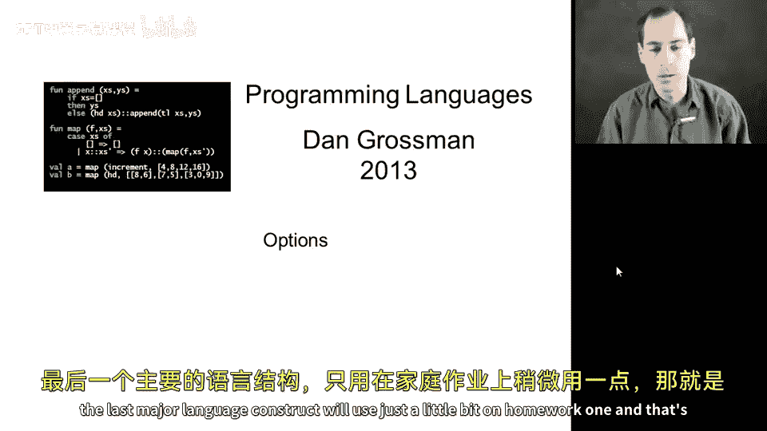
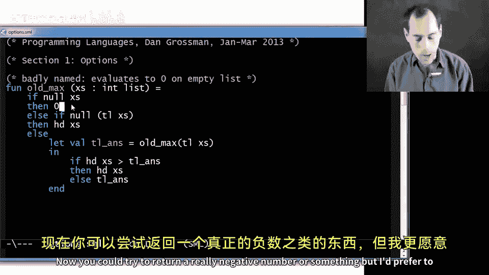
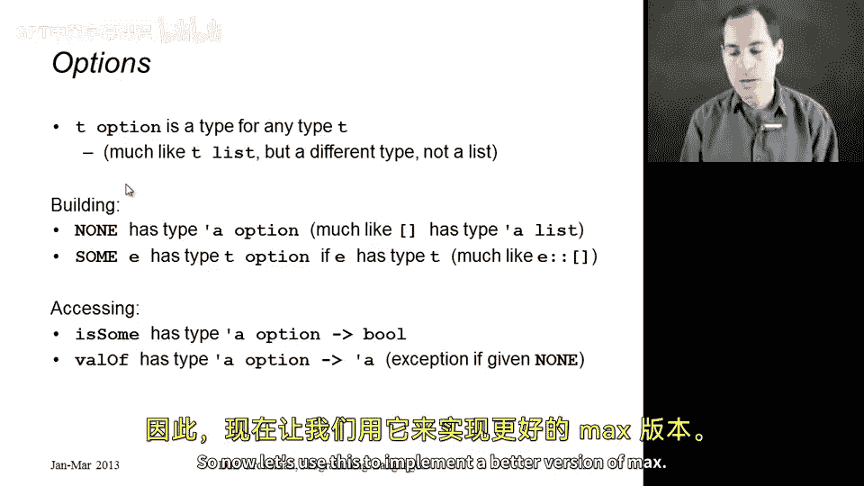
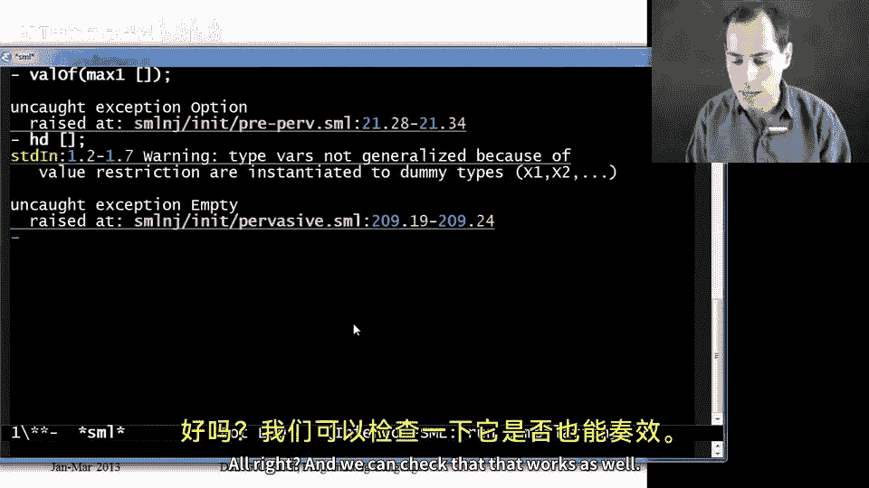

# 024：Option类型 🧩

在本节课中，我们将学习ML语言中的最后一个主要语言结构——Option类型。我们首先会回顾一个旧版本的求列表最大值的函数，分析其设计缺陷，然后引入Option类型作为更优雅的解决方案。我们将学习如何构建和访问Option值，并最终用它重写一个更健壮的`max`函数。

## 从旧版`max`函数说起





上一节我们介绍了递归和列表处理。本节中我们来看看一个具体的例子：计算整数列表的最大值。我们之前见过一个`max`函数，它接收一个`int list`并返回一个`int`。这个函数在递归和效率方面都很好，但它处理空列表的方式存在问题：空列表没有最大值，但旧函数却返回了0。这是一个笨拙的变通方法。返回一个极小的负数也不是理想的解决方案。我们更希望表达“不应该计算空列表的最大值”这一意图。

那么，我们该怎么办呢？有几种可能的尝试：
*   我们可以将其视为运行时异常并抛出，就像除以零或取空列表的头部一样。我们会在后续课程学习异常。
*   另一种方法是，利用我们已有的结构，修改`max`函数，让它不返回`int`，而是返回`int list`。如果传入空列表，就返回空列表；如果传入非空列表，就返回一个包含最大值的单元素列表。这种方法可行，但风格不佳。

返回“零个或一个”结果在编程中非常常见，因此ML专门为此设计了一种不同的类型和一组语言结构。使用这种结构是更好的风格，能让函数的调用者清晰地理解其行为。而列表可以包含任意数量的元素，不适合表达“零或一”的场景。这时，你应该使用**Option**类型。

## 理解Option类型 📦

理解Option类型很简单。我喜欢通过类比列表来解释它。

就像我们可以为任何类型`T`写`T list`一样，我们现在也可以为任何类型`T`写`T option`。这是两种不同的类型，Option不是列表，列表也不是Option，这只是为了便于教学而作的类比。

与列表类似，我们有构建Option和访问其内容的方法。

以下是构建Option的两种方式：
*   你可以写`NONE`（全大写），这会构建一个不包含任何值的Option，类似于`[]`构建一个空列表。
*   你可以写`SOME`（全大写）后跟一个表达式`E`。求值方式是：先对`E`求值得到一个值，如果该值的类型是`T`，那么结果就是一个`T option`，类似于创建一个单元素列表。

例如，`SOME 3`就是一个`int option`。你不能把它当作`int`来使用，因为它不是`int`，而是一个“包含`int`的东西”。

当你有一个Option值时，你需要使用以下两个内置函数（实际上是库函数）来访问它：
*   第一个函数叫`isSome`。它接收一个Option，如果它是`SOME`则返回`true`，如果是`NONE`则返回`false`。这很像列表的`null`函数，但逻辑是反的：我们在非空（即单元素）情况下返回`true`。
*   第二个结构是`valOf`。它接收一个Option，并取出`SOME`里面包裹的值。如果传给`valOf`的参数是`NONE`，它会引发一个异常；如果参数是`SOME`，你就会得到里面包裹的值。

以上就是Option的全部内容。



## 使用Option实现更好的`max`函数 🔧

现在，让我们用Option来实现一个更好的`max`函数版本。我将展示两种实现方式。

### 版本一：`max1`

这是第一种方式，我称之为`max1`。这个函数接收一个`int list`并返回一个`int option`。

```sml
fun max1 (xs: int list) =
    if null xs
    then NONE
    else
        let val tail_ans = max1(tl xs)
        in if isSome tail_ans andalso valOf tail_ans > hd xs
           then tail_ans
           else SOME (hd xs)
        end
```

代码解释：
1.  如果参数列表`xs`为空，则函数求值为`NONE`。
2.  否则，递归地计算尾部的最大值，并将结果（一个`int option`）存储在`tail_ans`中。
3.  由于`tail_ans`是`int option`，我们只能用`isSome`和`valOf`来访问它。
4.  我们检查：如果`tail_ans`是`SOME`**并且**它的值大于列表的头部，那么尾部最大值就是整体最大值，直接返回`tail_ans`。
5.  否则（要么`tail_ans`是`NONE`——因为`tl xs`是空列表，要么列表头部大于尾部最大值），我们都希望返回一个由列表头部构建的Option，即`SOME (hd xs)`。

顺便说一下，代码中的`andalso`是首次出现，它是一个计算两个布尔值“逻辑与”的操作符，我们将在下一节详细解释。

这个`max1`函数运行良好。如果我们调用`max1 [3,7,5]`，会得到`SOME 7`。注意，你不能直接对这个结果加1，因为它不是`int`，而是`int option`。你必须先使用`valOf (max1 [3,7,5])`取出里面的值，然后才能加1。如果调用`max1 []`，会得到`NONE`，此时尝试`valOf`会引发运行时异常，就像对空列表取`hd`会引发异常一样。

### 版本二：`max2`

虽然`max1`没问题，但我不太喜欢的一点是：每次递归返回后，我都要检查结果是`SOME`还是`NONE`。而`NONE`的情况只发生在最初的空列表上。在后续递归调用中，结果总是`SOME`，但我们仍在反复检查。我们可以避免这一点。

以下是第二个版本`max2`，实现上更清晰一些：

```sml
fun max2 (xs: int list) =
    if null xs
    then NONE
    else
        let fun max_nonempty (xs: int list) =
                if null (tl xs)
                then hd xs
                else
                    let val tail_ans = max_nonempty(tl xs)
                    in if hd xs > tail_ans
                       then hd xs
                       else tail_ans
                    end
        in SOME (max_nonempty xs)
        end
```

代码解释：
1.  如果传入空列表，直接返回`NONE`。
2.  否则，我们定义一个递归辅助函数`max_nonempty`，它专门处理**非空**列表，并返回一个`int`。
3.  `max_nonempty`函数假设其参数非空。如果列表只有一个元素（即`tl xs`为空），则返回该元素。否则，递归计算尾部的最大值，然后与头部比较，返回较大的那个。
4.  由于我们只在确定`xs`非空后才调用`max_nonempty`（在`else`分支里，以及递归调用中），并且`max_nonempty`在单元素列表时直接返回而不进行递归，因此它永远不会对空列表调用，也就不会引发异常。
5.  最后，`max2`函数使用`SOME`将`max_nonempty xs`得到的`int`包装起来，返回一个`int option`。

我们可以验证`max2 [3,7,5]`返回`SOME 7`，而`max2 []`返回`NONE`。`max1`和`max2`都能工作，我稍微更偏爱`max2`，但两者都是良好的风格。

## 总结



本节课中，我们一起学习了ML中的Option类型。我们首先分析了旧版`max`函数在处理空列表时的缺陷，进而引入了用于表示“可能有值，可能无值”的Option类型。我们学习了如何使用`NONE`和`SOME`构建Option值，以及如何使用`isSome`和`valOf`来安全地访问其中的值。最后，我们运用这些知识，实现了两个使用Option类型的、更健壮的`max`函数版本。Option类型与列表类似，但它专门用于表示“零个或一个”元素的情况，使得代码意图更清晰，设计更优雅。