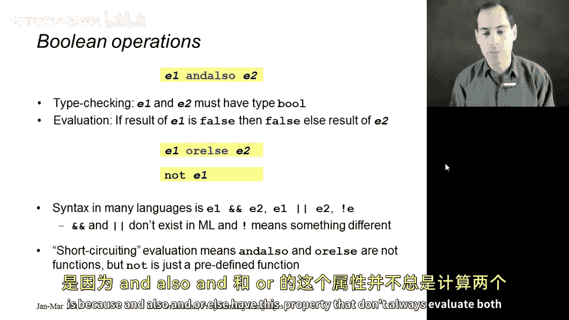
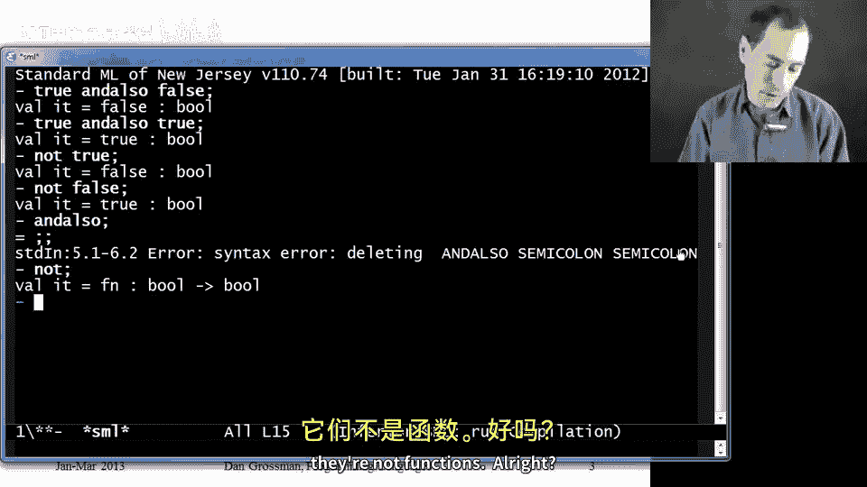
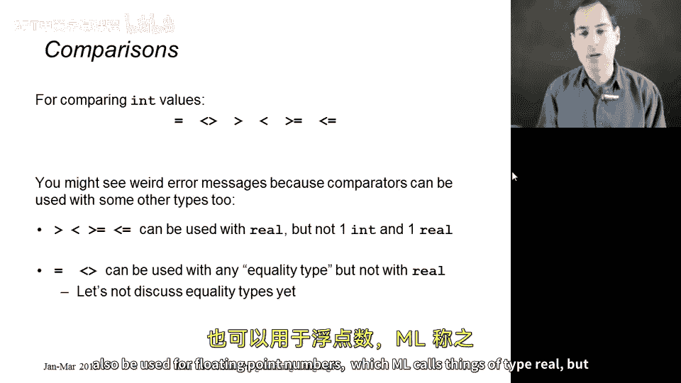
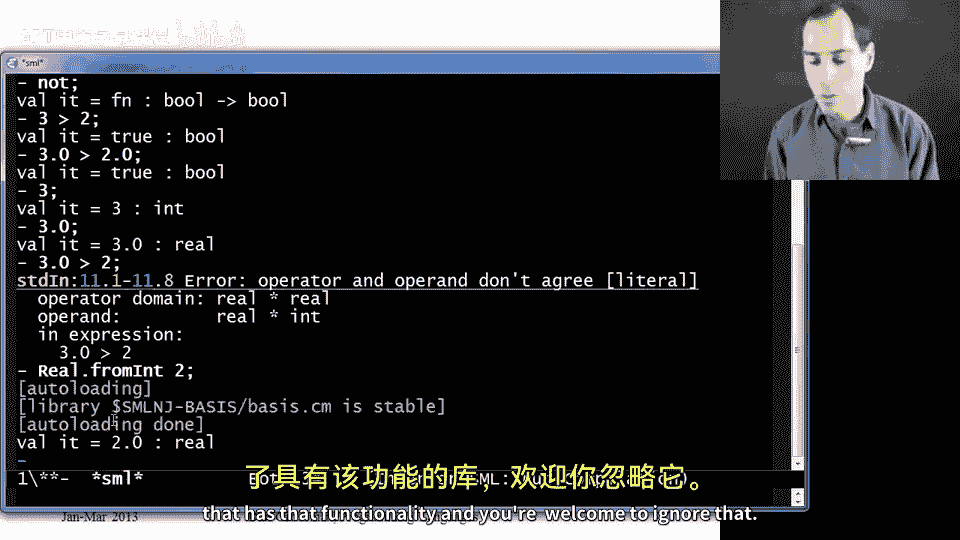
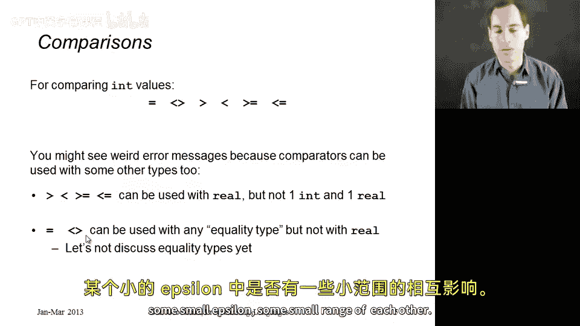

# 025：布尔运算与比较运算符

在本节课中，我们将学习如何组合布尔表达式以及如何比较数字。我们将介绍 `andalso`、`orelse` 和 `not` 运算符，并详细讲解数字的比较运算符。这些内容是编程中的基础，对于编写条件判断和逻辑运算至关重要。

## 布尔运算

上一节我们介绍了基本的表达式和类型，本节中我们来看看如何组合布尔表达式。ML 语言使用特定的关键字进行逻辑运算，这与许多现代编程语言不同。

以下是 ML 中的三个主要布尔运算符：

*   **`E1 andalso E2`**：这是逻辑“与”运算。其求值规则是：先求值 `E1`，如果结果为 `false`，则整个表达式的结果为 `false`，且不会求值 `E2`；如果 `E1` 为 `true`，则继续求值 `E2`，其结果即为整个表达式的结果。
*   **`E1 orelse E2`**：这是逻辑“或”运算。其求值规则是：先求值 `E1`，如果结果为 `true`，则整个表达式的结果为 `true`，且不会求值 `E2`；如果 `E1` 为 `false`，则继续求值 `E2`，其结果即为整个表达式的结果。
*   **`not E1`**：这是逻辑“非”运算。其求值规则是：求值 `E1`，如果结果为 `true`，则返回 `false`；如果结果为 `false`，则返回 `true`。



需要注意的是，`andalso` 和 `orelse` 是**关键字**，而不是函数。因为它们具有“短路求值”的特性（即不一定求值所有子表达式），所以不能像函数那样被单独调用。而 `not` 是一个**函数**，因为它总是需要求值其参数。

```sml
(* 示例 *)
true andalso false; (* 结果为 false *)
true andalso true;  (* 结果为 true *)
not true;           (* 结果为 false *)
not false;          (* 结果为 true *)
andalso;            (* 语法错误，因为它是关键字，需要左右操作数 *)
not;                (* 有效，因为它是一个函数 *)
```

## 与条件表达式的等价关系



从语言功能的角度看，`if-then-else` 表达式已经足够强大，可以表达所有逻辑运算。以下是它们的等价写法：

*   `E1 andalso E2` 等价于 `if E1 then E2 else false`
*   `E1 orelse E2` 等价于 `if E1 then true else E2`
*   `not E1` 等价于 `if E1 then false else true`

然而，直接使用 `andalso`、`orelse` 和 `not` 是更好的编程风格，因为它们更清晰地表达了代码的意图。

此外，请避免编写 `if E then true else false` 这样的冗余代码。这个表达式的含义就是 `E` 本身，因此直接写 `E` 即可。

## 比较运算符

接下来，我们看看如何比较数字。ML 提供了标准的比较运算符，但在类型系统上有一些特别之处。

以下是 ML 中的比较运算符：



*   **`=`**：等于（用于整数、字符串等可比较相等性的类型）
*   **`<>`**：不等于（ML 中使用 `<>` 而非 `!=`）
*   **`>`**：大于（可用于 `int` 和 `real` 类型）
*   **`<`**：小于（可用于 `int` 和 `real` 类型）
*   **`>=`**：大于等于（可用于 `int` 和 `real` 类型）
*   **`<=`**：小于等于（可用于 `int` 和 `real` 类型）

有两个重要的注意事项：

1.  **类型必须一致**：比较运算符要求两边的操作数类型相同。你不能直接比较一个 `int` 和一个 `real`。如果需要比较，必须先将 `int` 转换为 `real`，可以使用库函数 `Real.fromInt`。
    ```sml
    3 > 2;                 (* 正确：比较两个 int *)
    3.0 > 2.0;             (* 正确：比较两个 real *)
    3 > 2.0;               (* 类型错误！ *)
    Real.fromInt(3) > 2.0; (* 正确：先将 3 转为 real *)
    ```
2.  **实数（real）的相等性比较**：在 ML 中，**不能**使用 `=` 或 `<>` 来比较两个 `real` 类型的值。这是因为浮点数存在精度误差，直接判断相等在数学和编程上通常都是不正确的做法。正确的做法是检查两个浮点数之差的绝对值是否小于一个很小的阈值（epsilon）。





本节课中我们一起学习了 ML 语言中的布尔运算和比较运算符。我们了解了 `andalso`、`orelse` 和 `not` 的用法及其短路求值特性，认识了它们与 `if-then-else` 的等价关系。同时，我们也掌握了数字比较运算符的使用，并特别注意了 ML 类型系统对操作数类型一致性的要求，以及实数不能直接进行相等性比较这一重要规则。掌握这些基础知识是进行后续复杂逻辑编程的关键。