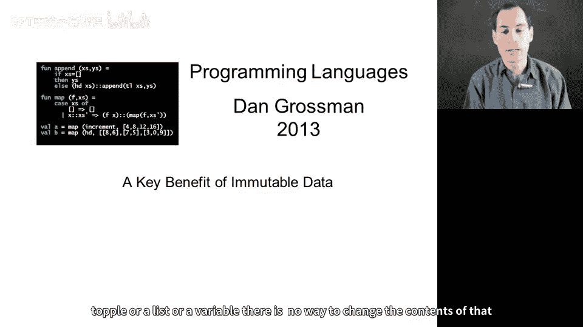
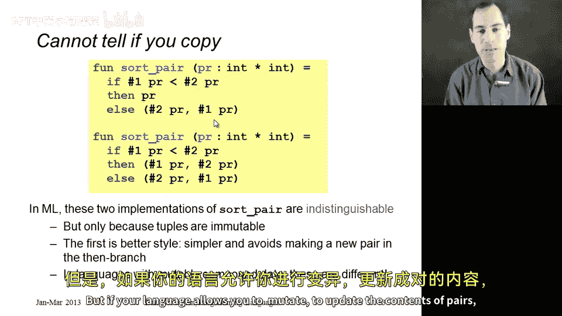
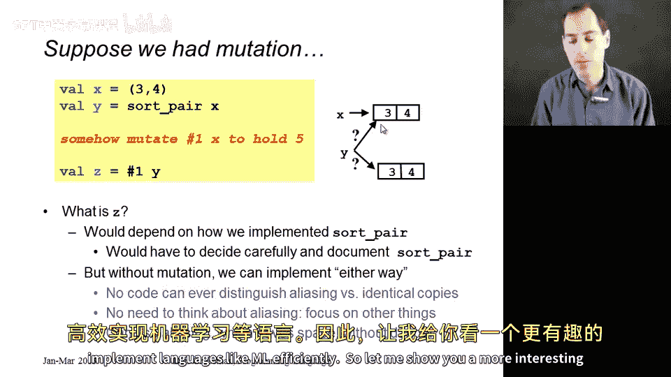
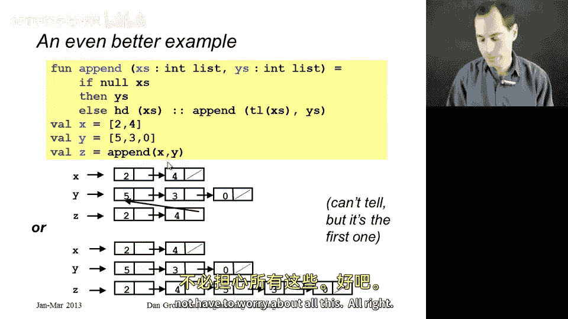

# 026：不可变性的优势 🛡️



在本节课中，我们将探讨 ML 语言中一个核心且极具价值的特性：数据的不可变性。我们将了解为什么大多数数据（如元组、列表、变量）一旦创建，其内容就无法被改变，以及这种“缺失”的特性如何成为 ML 语言的一大优势。

## 概述

在之前的课程中，我们已经学习了完成作业所需的所有功能。本节我们将聚焦于 ML 语言所“没有”的一个特性——数据可变性。你可能会认为，为程序员提供更多可用的工具总是好的，他们可以自行决定是否使用。然而，当一种语言明确缺少某个特性时，编写代码的人就能确信，使用其代码的人永远不会用到这个特性，因为它根本不存在。这使得编写正确的代码和理解代码的运行结果变得更加容易。

事实上，函数式编程之所以成为函数式编程，一个主要特征就是：当你创建了一些数据（如一个数对或一个列表）后，就无法再改变这些数据的内容。你必须创建一个包含不同值的新数据。

接下来，让我们看看为什么这可以成为一个宝贵的特性。

## 一个简单的例子：排序数对

让我们从一个相对简单的例子开始。之前我展示过一个这样的函数，这是一个排序数对的函数。它接收一个 `int * int` 类型的参数，并返回一个 `int * int`。如果你用 `(3, 4)` 调用它，会返回 `(3, 4)`；如果用 `(4, 3)` 调用，则会返回 `(3, 4)`，因为它总是对元组中的两个元素进行排序。


以下是这个函数的两个版本：

```ml
(* 版本一 *)
fun sort_pair (x, y) = if x < y then (x, y) else (y, x)

(* 版本二 *)
fun sort_pair (x, y) = (Int.min(x, y), Int.max(x, y))
```

在第一个版本中，当数对的第一个分量小于第二个分量时，我们直接返回原数对，因为这已经是正确答案。而在第二个版本中，我们实际上是创建了原数对的一个副本，返回一个包含原数对第一个分量和第二个分量的新数对。

假设你最初使用的是第二个版本，但出于简化或提高效率等考虑，你想将其修改为第一个版本。那么，是否存在某些使用你函数的客户端代码，会因为你的这个改动而出现问题呢？

在 ML 中，答案是否定的。任何使用这些函数的代码都无法区分这两个版本。你可以认为第一个版本风格更好，但不能说它们对代码使用者有任何区别。

但是，如果你的语言允许你改变（即更新）数对的内容，情况就不同了。

## 可变性带来的别名问题



假设我们将数对 `(3, 4)` 绑定到变量 `x`，然后将排序这个数对的结果绑定到变量 `y`。

```ml
val x = (3, 4)
val y = sort_pair x
```

现在有两种可能性（如果我们不知道 `sort_pair` 是如何实现的）：
1.  如右图所示，`y` 引用了传递给 `x` 的同一个数对。此时 `x` 和 `y` 在大多数编程语言中通常被称为“别名”。
2.  `x` 和 `y` 不是别名，`y` 指向另一个不同的数对 `(3, 4)`。

在 ML 中，这无关紧要。但如果在 ML 中存在某种方式可以改变（例如）`x` 的第一个分量，将其从 `3` 改为 `5`，那么我们就面临一个棘手的问题：这个从 `3` 到 `5` 的改变会影响 `y` 所引用的内容吗？这取决于 `x` 和 `y` 是否是别名。

如果没有可变性，你就无法判断两个事物是别名关系，还是具有相同值的两个副本。这使得实现 `sort_pair` 函数、使用它以及推理其结果都变得更加容易，甚至可以使实现像 ML 这样的语言本身也变得更容易。

## 更复杂的例子：列表追加



现在让我们看一个更有趣的例子，从数对转向列表，并使用本课程中我最喜欢的函数之一：`append`。

这是一个优雅的递归函数，它接收两个列表 `xs` 和 `ys`，并返回一个新列表，该列表是 `xs` 的所有内容与 `ys` 的所有内容连接起来的结果。

```ml
fun append ([], ys) = ys
  | append (x::xs', ys) = x :: append (xs', ys)
```

现在我们可以问自己：如果我有一个列表 `[2, 4]` 和一个列表 `[5, 3, 0]`，并将它们追加在一起，那么我得到的结果中是否存在别名呢？

有两种可能的情况：
1.  如顶部图片所示，`x` 持有列表 `[2, 4]`，`y` 持有列表 `[5, 3, 0]`，而 `z` 持有的列表 `[2, 4, 5, 3, 0]` 中，有一部分是 `y` 的别名。
2.  `append` 函数实际上为 `z` 创建了一个全新的列表。

同样地，客户端代码无法区分这两种情况。因此，你可以用任何一种方式实现 `append`，它在你的程序中的行为都是相同的，尽管底部版本（创建全新列表）会占用稍多一点的空间。

实际上，上面的代码实现的是第一种情况（顶部图片）。因为当 `xs` 为空时，我们直接返回 `ys`，并没有复制 `ys`，只是返回了一个将成为 `ys` 别名的引用。这样我们实际上节省了空间。

在允许更新列表元素的语言中，这通常是一个非常糟糕的主意，因为如果有人对列表 `z` 进行某些修改，最终可能会影响到列表 `y`，而这很可能不是你想要的。因此，再次强调，正是**没有可变性**这一特性，帮助我们无需担心所有这些复杂问题。



## ML 中的别名与效率

在 ML 中，我们实际上一直在创建别名，甚至都没有意识到这一点，但这没关系，因为你永远无法判断两个事物是别名关系，还是两个具有相同值的副本。它们是指向同一个 `(3, 4)` 数对，还是指向两个 `(3, 4)` 的副本？

事实上，列表的 `tail` 操作可能就是一个很好的例子。它是一个非常快速的操作，因为它只是返回传递给它的参数（列表）的尾部的别名。如果 `tail` 函数复制了整个列表（除了第一个元素），ML 程序的效率将会低得多。

因此，在编写函数式程序时，你无需担心这些别名问题，只需专注于你的算法，因为你知道，没有可变性。

## 对比：拥有可变数据的语言

在拥有可变数据的语言中（这几乎是所有非函数式语言，例如 Java），程序员必须绝对关注对象的“身份”：我在这里是创建了一个副本吗？我创建了一个别名吗？这两个东西是引用相等，还是仅仅在 `equals` 方法上返回 `true`？

我并不是在批评他们对此过于执着。事实上，我认为他们必须执着，因为任何时候你有了别名，赋值语句就会影响到所有别名；而如果你没有别名，赋值语句就只影响其中一个。你必须理解这一点，才能理解程序的行为以及你的代码是否正确。

在下一节中，我实际上将展示一个 Java 中相当棘手的例子（由于本课程不要求 Java，这部分完全是可选的），它将向你展示推理别名和赋值语句是多么困难。而在 ML 中，我们避免不得不这样做的办法就是：直接摒弃赋值语句。

## 总结


本节课中，我们一起学习了 ML 语言中数据不可变性的核心优势。我们了解到，不可变性消除了由别名和可变状态带来的复杂性和不确定性，使得代码更易于编写、理解和推理。它允许实现者进行空间优化（如 `tail` 操作返回别名），而不会影响程序的可观测行为。通过对比拥有可变数据的语言（如 Java）中必须面对的别名问题，我们更加清晰地认识到，放弃“改变数据”这一能力，反而换来了在构建可靠、可维护软件方面更强大的保证。这正是函数式编程思想的精髓之一。