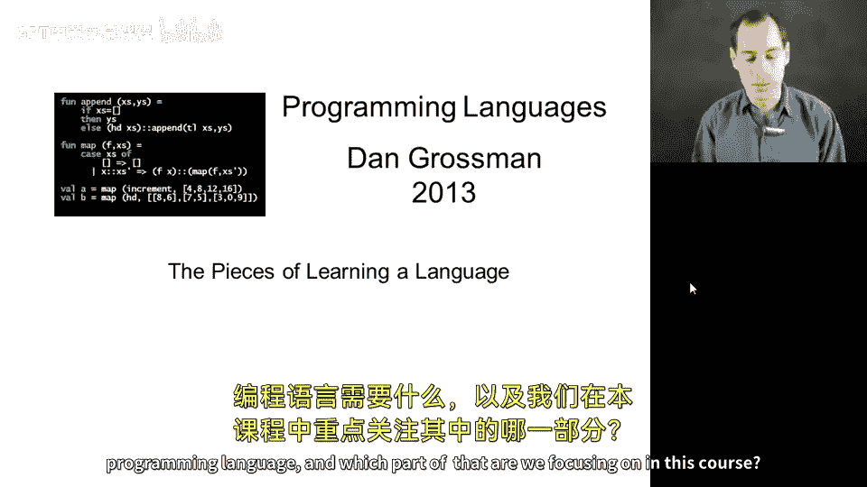
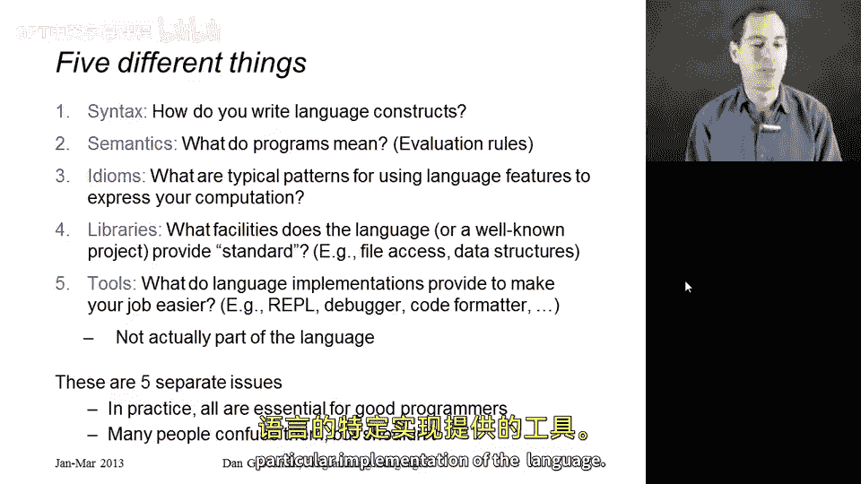
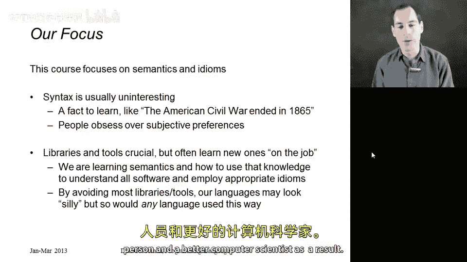

# 028：语言的组成部分 🧩

在本节课中，我们将退一步，从宏观视角审视学习一门编程语言究竟意味着什么。我们已经学习了许多ML语言的知识，现在需要思考：这些是核心内容吗？这是学习编程语言的正确方式吗？我们将探讨学习编程语言需要掌握哪些方面，并明确本课程的重点所在。

## 概述：学习编程语言的五个方面

学习一门编程语言并成为一名更优秀的程序员，需要掌握五个不同的方面。理解这些方面有助于我们明确学习目标，并认识到本课程的核心价值。

以下是构成编程语言知识的五个关键部分：

1.  **语法**：如何书写语言结构。例如，在ML中，函数定义的基本语法是 `fun 函数名 参数 = 表达式`。如果不了解语法，就无法编写程序。
2.  **语义**：类型检查规则和求值规则。例如，理解 `if e1 then e2 else e3` 的语义是：先对 `e1` 求值，若结果为 `true` 则对 `e2` 求值，否则对 `e3` 求值。不了解语义，就无法正确推理程序行为。
3.  **编程惯用法**：识别特定语言特性的典型使用模式。这不仅仅是知道某个结构存在，而是知道何时以及如何使用它。例如，使用嵌套的 `let` 表达式来创建私有辅助函数，就是一种惯用法。
4.  **库**：语言提供的、用于完成特定任务（如文件读写、数据结构）的设施。有些库（如文件操作）是必需的，因为用户无法自行实现；有些（如列表、树）则可以在语言基础上自行构建。
5.  **工具**：语言实现或第三方提供的、用于简化开发工作的程序，例如交互式环境（REPL）、调试器、代码格式化工具等。需要明确，工具并非语言本身的一部分。

在实际编程中，要成为一名高效的程序员，需要精通所有这五个方面。同时，清晰地区分这些概念非常重要。例如，喜欢ML语言**因为**它有REPL，这是一种常见的混淆——REPL是工具，而非语言本身的特性。

## 本课程的重点：语义与惯用法

上一节我们介绍了学习编程语言的五个方面，本节中我们来看看本课程的核心焦点。

本课程将大量精力集中在第二和第三点：**语义**和**编程惯用法**。以下是如此安排的理由：

*   **关于语法**：虽然必须掌握语法，但它通常并非最有趣或最具启发性的部分。就像学习美国历史必须知道内战结束于1865年，但真正的学问在于背后的理论和思想。在我们的语境中，这个“思想”就是语义。此外，语法讨论容易陷入主观偏好之争，而本课程旨在传授客观的、可推理的语义知识。
*   **关于库和工具**：它们确实至关重要，但程序员总是需要学习新的库和工具。本课程更希望教会你如何**思考**任何编程语言。如果你精通了理解和分析语言语义及惯用法的思维技能，那么学习新库也会变得更容易——你会自然地思考：“这个库提供的函数语义是什么？它们通常如何被使用？”

这种聚焦带来的一个结果是，我们编写的程序有时看起来可能过于简单（例如连接列表或求最大值）。请理解，这是为了剥离复杂性，从而专注于核心的语言机制。请不要用课程中的教学示例来评判一门语言本身的能力——如果用同样的教学法来教Java、Python或JavaScript，那些程序看起来也会很“傻”。我们选择ML等语言，正是因为它们是探讨语义和惯用法的最佳载体。这些语言完全有能力用于构建真实的Web应用、桌面软件等，但那不是本课程的重点。

## 总结

本节课中，我们一起学习了构成编程语言知识的五个关键方面：语法、语义、编程惯用法、库和工具。我们明确了本课程的核心在于深入理解**语义**和掌握**编程惯用法**，因为这两者是培养扎实编程思维和快速学习新语言、新库能力的基础。掌握了这些，你将成为一个更优秀的软件工程师和计算机科学家。