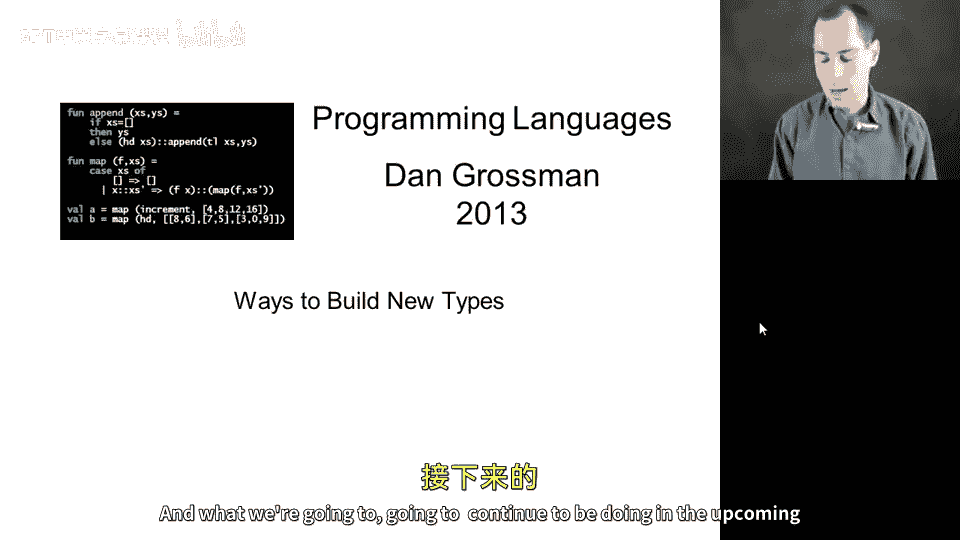
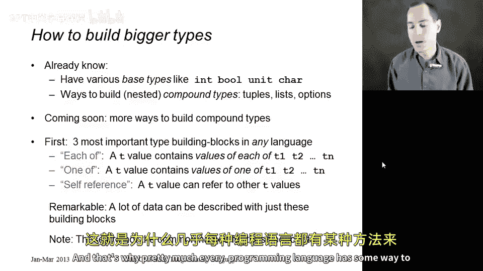
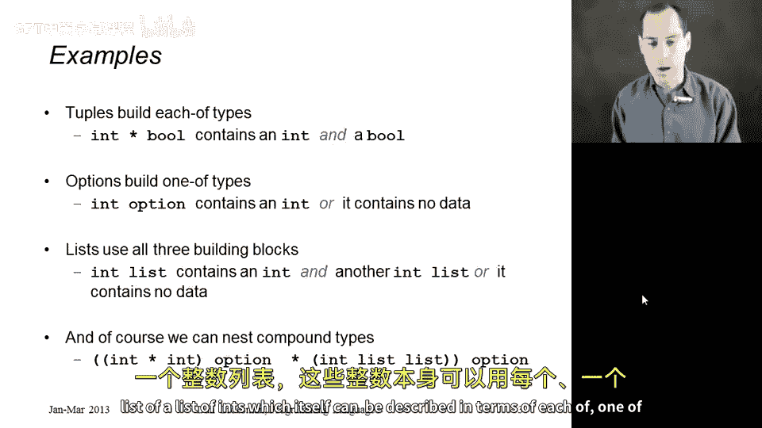
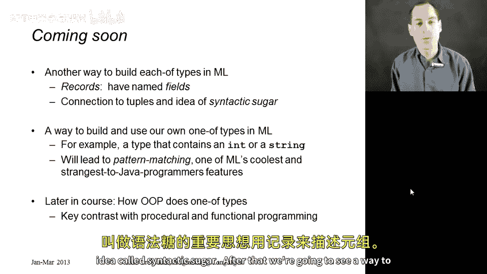
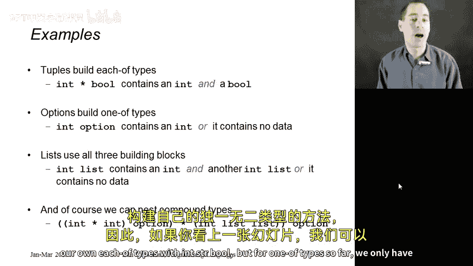
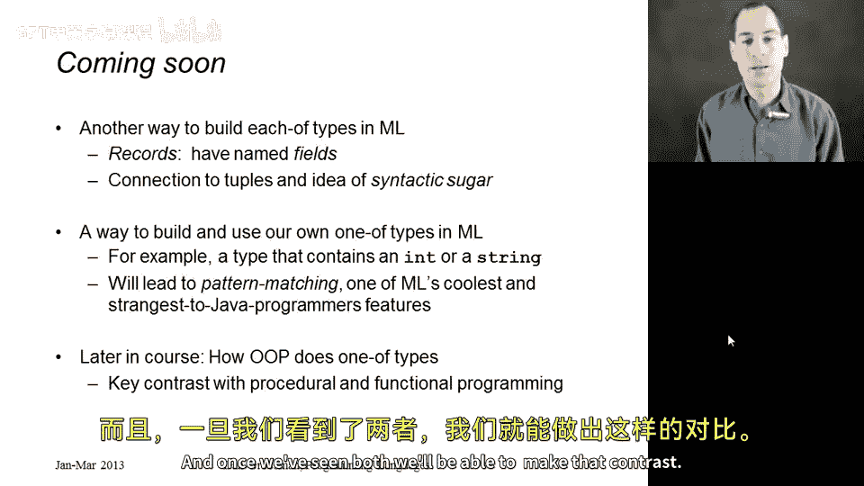

# 029：构建复合类型

在本节课中，我们将学习如何构建新的数据类型。我们将从一个更通用的视角出发，理解构建复合类型的三种基本方式。这不仅有助于我们理解 ML 语言中的现有类型，也为后续学习记录（records）和自定义数据类型（datatypes）打下基础。

## 概述：基础类型与复合类型

在编程语言中，所有类型可以分为两大类：基础类型和复合类型。

*   **基础类型** 描述了语言中最基本的数值，例如 `int`、`bool`、`unit`、`char`、`real`。
*   **复合类型** 则是通过组合其他类型来构建新类型的方式。例如，元组（tuples）、列表（lists）和选项（options）都是复合类型。

在接下来的小节中，我们将学习创建自定义复合类型的新方法，包括记录和数据类型。但在深入学习之前，我们需要退一步，了解构建复合类型的三种通用方式。

## 构建复合类型的三种通用方式

尽管这不是标准的命名，我将这三种方式称为：**“每个”类型（each of）**、**“之一”类型（one of）** 和 **自引用类型（self-reference）**。

以下是这三种方式的定义：

1.  **“每个”类型（Each-of）**：要构建一个“每个”类型 T，意味着类型 T 的每个值都**同时包含**一组其他类型的值。例如，一个包含 `T1`、`T2`、`T3` 的三元组就是一个“每个”类型，因为它的值同时拥有一个 `T1`、一个 `T2` 和一个 `T3`。
2.  **“之一”类型（One-of）**：要构建一个“之一”类型 T，意味着类型 T 的每个值**是**一组其他类型中某一个类型的值。例如，一个值可以是 `τ1` 或 `τ2` 或 `τ3`（这里用希腊字母 τ 泛指类型）。
3.  **自引用类型（Self-reference）**：这种类型允许在定义中引用自身，这对于描述递归结构（如列表、树）至关重要。例如，一个整数列表要么是空列表，要么是一个整数和另一个（更小的）整数列表的组合。

值得注意的是，一旦一门编程语言支持了某种方式来实现“每个”、“之一”和自引用，它就拥有了描述大量有趣数据的强大能力。这解释了为什么几乎所有编程语言都有构建这类复合类型的方法。

## 已学类型的分析

现在，让我们用这三种构建块来分析我们已经学过的 ML 类型：

*   **元组（Tuples）** 直接体现了 **“每个”** 的概念。例如，`int * bool` 类型包含一个 `int` **和** 一个 `bool`。
*   **选项（Options）** 是 **“之一”** 类型的一个例子，尽管它有点特殊。一个 `int option` 类型的值**要么**包含一个 `int`，**要么**不包含任何数据（即 `NONE`）。这里涉及的是“或”的关系，没有“与”。
*   **列表（Lists）** 则同时使用了**所有三种**构建块。一个 `int list` 可以描述为：它**要么**是一个整数**和**另一个整数列表（这是“每个”和自引用），**要么**是空列表（这是“之一”）。这些概念可以任意嵌套，让我们能够描述复杂的数据形状。

例如，考虑一个更复杂的类型：它的值要么没有数据，要么包含一些数据；而这些数据本身要么是一个整数对，要么是一个整数列表的列表。这个类型同样可以用“每个”、“之一”和自引用的概念来描述。

## 后续学习路径

基于这个框架，我们的学习路径将非常清晰：

上一节我们介绍了构建复合类型的通用概念，本节中我们来看看 ML 语言中具体的实现方式。

首先，我们将学习另一种构建 **“每个”类型** 的方法：**记录（Records）**。记录很像元组，但它使用命名字段而不是第一、第二位置来访问数据。我们会看到，记录和元组如此相似，以至于可以用“语法糖”这个概念，用记录来描述元组。

接着，我们将学习如何构建自己的 **“之一”类型**。目前，我们只有选项和列表作为“之一”类型的例子。ML 提供了一种强大的方式来定义自己的类型，例如一个值可以是 `int` 或 `string`。定义这样的类型后，我们需要一种方法来访问其中的数据，这将引入一个可能对你来说非常新颖的概念：**模式匹配（Pattern Matching）**。如果你只学过 Java、C 或 Python，模式匹配会显得与众不同，但它极其强大，我们会逐渐熟悉并使用它。

在本课程更靠后的部分，我们将会接触**面向对象编程（OOP）**。你可能会想，在 Java 或 C++ 中从未见过“之一”类型。实际上，你见过，但面向对象编程通过**子类（subclasses）** 和**子类型（subtypes）** 以一种完全不同的、非常优雅的方式来实现它。这与 ML 这类语言的做法恰恰相反。一旦我们了解了这两种范式，就能对它们进行对比，这将是本课程中最有趣、最具普遍意义的收获之一。

## 总结

本节课中，我们一起学习了构建复合类型的三种通用方式：“每个”类型、“之一”类型和自引用类型。我们分析了 ML 中已有类型（元组、选项、列表）如何对应这些概念，并概述了后续将学习的记录、自定义数据类型和模式匹配。理解这些基础概念，为我们掌握更复杂的数据结构设计和理解不同的编程范式（如函数式与面向对象）奠定了坚实的基础。