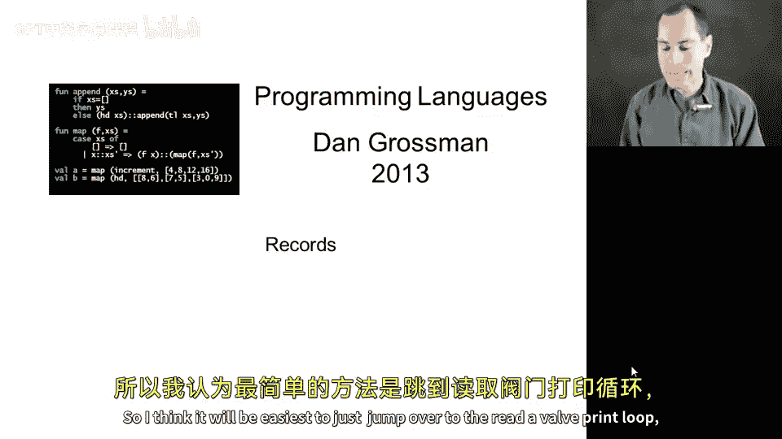
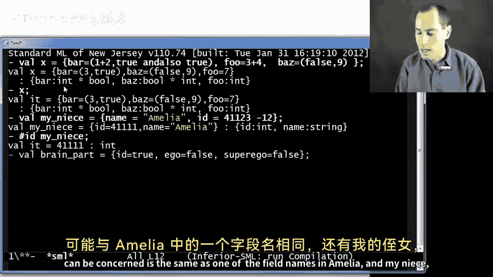
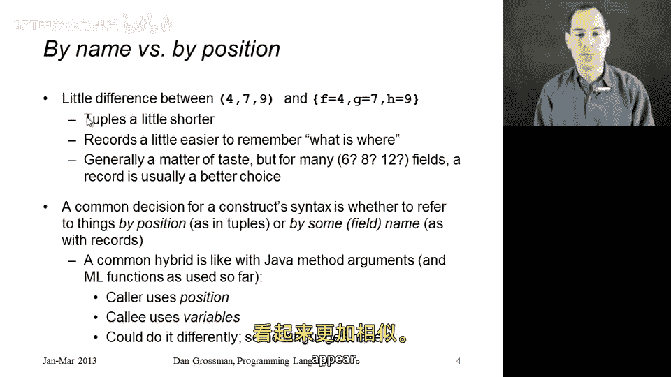

# 030：记录类型

在本节课中，我们将要学习一种新的复合数据类型——记录。记录与之前学过的元组类似，都用于将多个值组合在一起，但记录使用字段名而非位置来访问其组成部分。我们将通过示例学习如何创建和使用记录，并比较记录与元组的异同。

## 创建记录



上一节我们介绍了记录的基本概念，本节中我们来看看如何创建记录。记录使用花括号 `{}` 定义，内部包含一系列字段名和对应的表达式。

以下是创建记录的语法和示例：

```sml
val x = {bar = true andalso true, foo = (3,4), baz = (false,9)}
```

执行上述代码后，变量 `x` 被绑定到一个记录值。该记录包含三个字段：`bar`、`foo` 和 `baz`。REPL 会以字母顺序显示字段，但这不影响记录的实际结构。

## 记录的类型

记录拥有独特的类型，其类型由字段名和每个字段的类型共同决定。类型推断系统会自动推导出记录的类型。

以下是记录类型的表示方法：

```
{bar: bool, baz: bool * int, foo: int}
```

此类型表示一个记录，其中 `bar` 字段为布尔类型，`baz` 字段为 `bool * int` 元组类型，`foo` 字段为整数类型。

## 访问记录字段

要访问记录中的特定字段，我们使用 `#字段名` 语法。这与使用 `#1`、`#2` 访问元组元素的方式类似，但使用的是有意义的名称而非数字索引。



以下是访问记录字段的示例：

```sml
#name myNiece
```

此表达式将返回 `myNiece` 记录中 `name` 字段的值。

## 记录与元组的比较

现在我们已经了解了记录的基本操作，本节中我们来比较记录和元组这两种构造复合类型的方式。两者都用于将多个值组合成一个值，但访问方式不同。

以下是记录与元组的主要区别：

*   **访问方式**：元组通过位置（如 `#1`、`#2`）访问，记录通过字段名（如 `#name`）访问。
*   **可读性与维护性**：当字段数量较多时，使用有意义的字段名（记录）比记住位置顺序（元组）更易于理解和维护代码。
*   **语法简洁性**：创建元组通常比创建记录更简洁。

选择使用记录还是元组，取决于具体场景。一般来说，如果组合的各个部分有明确的语义名称，或者字段数量较多，记录是更好的选择。如果只是临时组合少量值，且顺序自然明确，则可以使用元组。

## 语言设计中的命名与位置

记录和元组的区别引出了一个更广泛的语言设计问题：如何访问复合数据中的各个部分——是通过名称还是通过位置？

函数参数就是一个有趣的混合例子。在调用函数时，我们通过位置传递参数（第一、第二、第三个实参）。但在函数定义内部，我们通过形参名来访问这些值。有些语言允许通过名称传递参数，也有些语言在函数内部通过位置访问参数。理解这种设计选择，有助于我们更深入地掌握编程语言的概念。

## 总结



本节课中我们一起学习了记录类型。我们了解了如何使用花括号和字段名创建记录，如何通过 `#字段名` 语法访问记录中的值，以及记录类型的表示方法。通过将记录与元组进行比较，我们认识到根据数据是否具有明确的名称语义来选择不同的复合类型。最后，我们探讨了在语言设计中，通过名称还是位置来访问数据组成部分这一普遍的设计选择。在接下来的课程中，我们将看到记录和元组之间更深层次的联系。