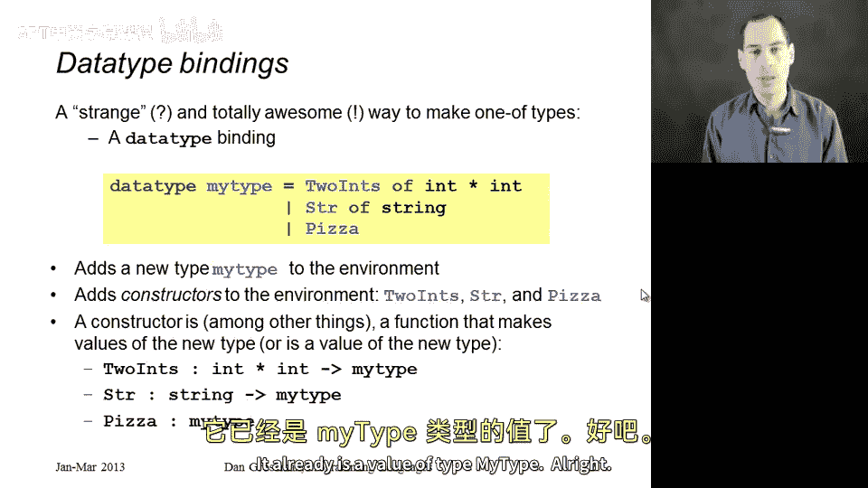
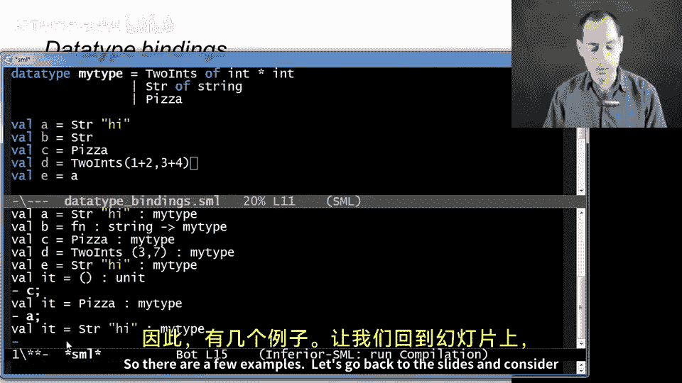
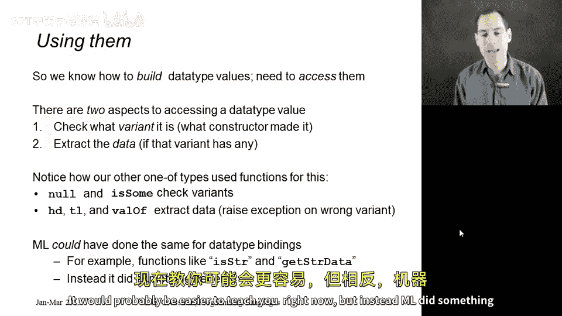

# 032：数据类型绑定

在本节课中，我们将开始学习数据类型。这是 ML 语言中用于创建自定义“多选一”类型（one-of types）的核心概念。这是编程中一个非常重要的特性，但 ML 的实现方式与你可能见过的其他语言有很大不同，因此我们需要一些时间来逐步构建所需的概念。

我们将介绍第三种绑定形式。到目前为止，我们已经学习了使用 `val` 的变量绑定和使用 `fun` 的函数绑定。现在，我们将学习以关键字 `datatype` 开头的数据类型绑定。这种绑定在一个声明中包含了更强大的功能，因此我们需要详细解释使用数据类型绑定时发生的不同事情。

## 数据类型绑定的语法

以下是数据类型绑定的基本结构。你首先写一个任意的类型名称（例如 `mytype`），然后是等号，接着是一系列用竖线 `|` 分隔的可能性。你可以将竖线理解为“或”。

```sml
datatype mytype = TwoInts of int * int
                | Str of string
                | Pizza
```

这段代码定义了一个新类型 `mytype`。创建 `mytype` 类型值的方式有三种：要么携带一个 `int * int` 对，要么携带一个 `string`，要么什么都不携带。因此，它是一个“多选一”类型。每个 `mytype` 类型的值要么是一个整数对，要么是一个字符串，要么是空值。我们可以定义任意数量的可能性。

## 构造函数

现在，我们来解释代码中那些大写字母开头的标识符：`TwoInts`、`Str` 和 `Pizza`。我选择 `Pizza` 是为了强调这些名称可以是任何你想要的。按照惯例，它们通常大写，有些人甚至全部使用大写字母。我们称这些为**构造函数**。

当你引入一个数据类型绑定时，实际上是在向静态环境和动态环境中添加多个新内容：新的类型名称（`mytype`）以及这些构造函数。



构造函数有几个用途，但目前我们可以将它们理解为函数：给定正确类型的参数，它们会返回一个 `mytype` 类型的值。
*   `TwoInts` 现在是一个类型为 `int * int -> mytype` 的函数。给它一个整数对，它会返回一个 `mytype`。
*   `Str` 是一个类型为 `string -> mytype` 的函数。
*   `Pizza` 不是一个函数，因为它不需要任何参数。它本身就是一个 `mytype` 类型的值。

## 在 REPL 中实践

让我们在 REPL 中尝试这个例子。我们定义了上述数据类型，然后使用构造函数以各种方式创建变量绑定。

```sml
datatype mytype = TwoInts of int * int | Str of string | Pizza;

val a = Str "hi";
val b = Str;
val c = Pizza;
val d = TwoInts (3+4, 5+6);
val e = a;
```

REPL 首先会评估数据类型绑定，并打印出整个定义，因为它与后续程序相关。现在我们有了类型 `mytype` 及其构造函数。

*   `val a = Str "hi"`：`Str` 是一个从 `string` 到 `mytype` 的构造函数。用字符串 `"hi"` 调用它，我们得到一个 `mytype` 类型的值 `Str "hi"`。
*   `val b = Str`：这里 `Str` 后面没有参数，所以 `b` 被绑定为函数 `Str` 本身，其类型是 `string -> mytype`。这是一个常见的编程错误，你可能本意是想调用 `Str`，但这在类型检查上是合法的。
*   `val c = Pizza`：`Pizza` 本身就是一个 `mytype` 类型的值，所以 `c` 被绑定为 `Pizza`。
*   `val d = TwoInts (3+4, 5+6)`：首先计算 `(7, 11)`，然后将其传递给构造函数 `TwoInts`，得到值 `TwoInts (7,11)`。
*   `val e = a`：这很简单，`e` 也被绑定到值 `Str "hi"`。

## 值的内部结构

任何 `mytype` 类型的值都是由其中一个构造函数创建的，这就是它被称为“多选一”类型的原因。返回的值实际上包含两部分：
1.  **标签部分**：记录是哪个构造函数创建了这个值。
2.  **数据部分**：存储构造函数携带的相应数据。

例如，表达式 `TwoInts (3+4, 5+4)` 会求值为一个标签为 `TwoInts`、数据部分为 `(7,9)` 的值。表达式 `Str (if true then "hi" else "bye")` 会求值为标签为 `Str`、数据部分为 `"hi"` 的值。



## 访问数据：我们已有的方式

现在我们知道如何构建数据类型的值了。但是，每当在语言中引入一个新类型时，我们既需要构建它们的方法，也需要访问它们的方法。

对于像 `mytype` 这样的“多选一”类型，访问值有两个方面：
1.  我们需要某种方式来检查我们拥有的是哪种变体，即，是哪个构造函数创建了它（标签是什么）。
2.  我们还需要一种方式来获取底层的数据（如果有的话）。对于 `Pizza` 没有数据，但对于 `TwoInts` 和 `Str` 则有。

值得回顾一下我们见过的其他“多选一”类型：列表（list）和选项（option）。它们也有这两种访问方式：
*   `null`（检查列表是否为空）和 `isSome`（检查选项是 `SOME` 还是 `NONE`）是**变体检查函数**。它们只告诉你标签是什么。
*   `hd`、`tl` 和 `valOf` 函数则是**数据提取函数**。`hd` 返回列表的一部分，`tl` 返回列表的另一部分，`valOf` 返回 `SOME` 包裹的值。注意，如果你对错误的变体应用这些函数（例如对空列表应用 `hd`，或对 `NONE` 应用 `valOf`），它们会引发异常。

## ML 的选择

既然我们有了数据类型绑定，ML 本可以这样做：当你引入一个像 `datatype mytype = ...` 这样的绑定时，除了获得构造函数（`TwoInts`、`Str`、`Pizza`）之外，还会自动获得用于检查变体和提取数据的函数。

例如，它可能会向环境中添加 `isStr : mytype -> bool`（如果是 `Str` 创建的值则返回 `true`）和 `getStrData : mytype -> string`（如果是 `Str` 则获取底层字符串，否则引发异常）这样的函数。这将是 `null`/`hd` 工作方式的直接类比。

这会是完全合理的语言设计，可能现在教起来更容易。但是，ML 选择了一种更优的方式，我们将在下一节开始学习它。

## 总结



本节课我们一起学习了 ML 中数据类型绑定的基础。我们了解了如何使用 `datatype` 关键字定义自定义的“多选一”类型，以及如何使用构造函数创建该类型的值。每个值都包含一个标识其变体的标签和相应的数据部分。我们还回顾了访问这类值通常需要的两种操作：检查变体和提取数据，并以列表和选项类型为例进行了说明。最后，我们提到 ML 没有为自定义数据类型自动生成类似 `null`/`hd` 的检查器和提取器，而是采用了一种更强大的机制，这将是后续课程的重点。