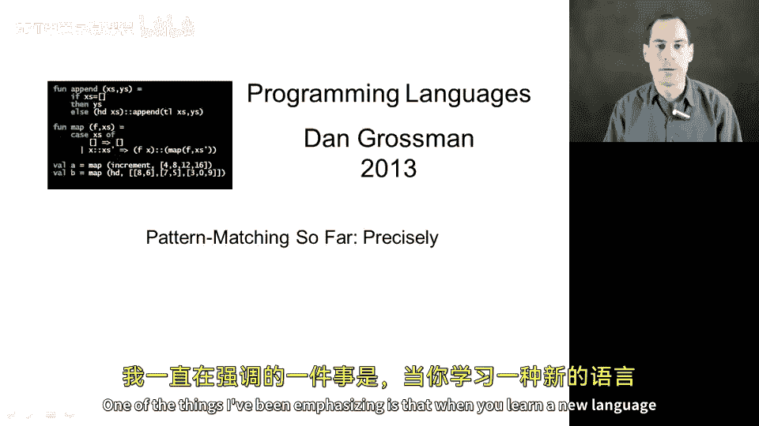
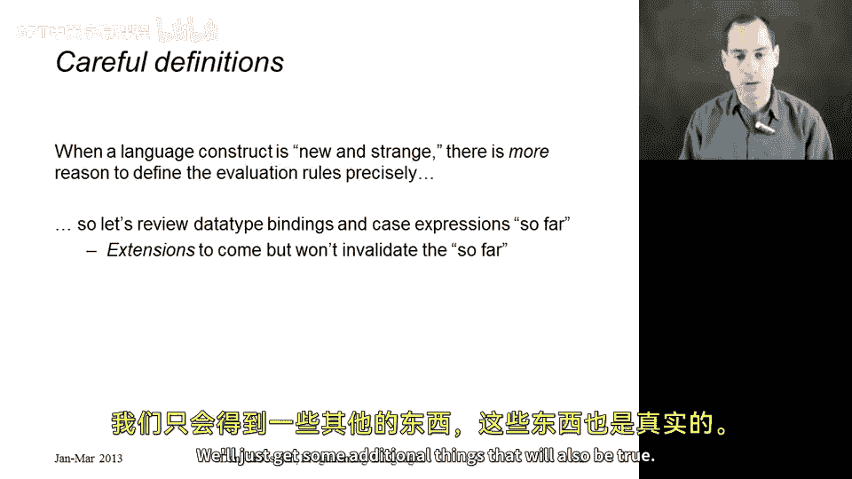
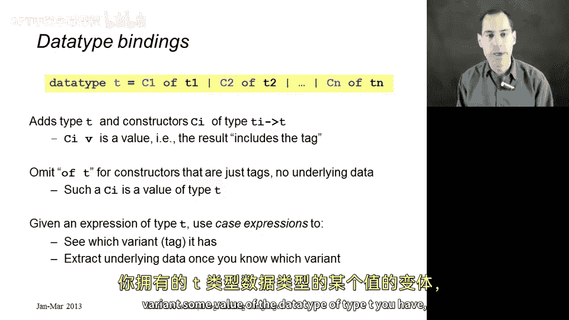
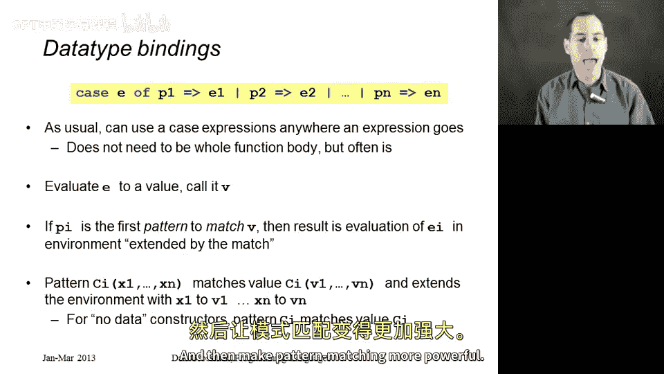

# 035：模式匹配回顾与基础



在本节课中，我们将系统回顾 ML 语言中数据类型绑定和 case 表达式这两个核心构造。我们将精确理解它们的语法、类型检查规则和求值规则，为后续学习更强大的模式匹配功能打下坚实基础。



## 数据类型绑定 📝

上一节我们介绍了函数定义，本节中我们来看看如何定义自己的数据类型。数据类型绑定是 ML 中用于创建新类型和其值构造器的语法。

其基本语法如下：
```sml
datatype T = C1 of t1 | C2 of t2 | ... | Cn of tn
```

*   **引入新类型**：`T` 是一个在程序中此前不存在的新类型名称。
*   **添加构造器**：`C1`、`C2` 等被称为值构造器。它们有两个作用：
    *   作为创建 `T` 类型值的函数。例如，`C1` 的类型是 `t1 -> T`，`C2` 的类型是 `t2 -> T`。
    *   作为值本身的“标签”。
*   **创建值**：将一个构造器应用于一个值，其结果本身就是一个值。例如，`C1 e` 是一个类型为 `T` 的值，它包含了构造器标签 `C1` 和其下承载的值。
*   **无数据构造器**：如果构造器不承载任何数据，则省略 `of` 和类型部分。此时，构造器本身就是一个类型为 `T` 的值，而非函数。例如：`datatype Color = Red | Green | Blue`，其中 `Red` 就是一个 `Color` 类型的值。



## Case 表达式 🔍

现在我们知道如何创建自定义数据类型的值了，接下来看看如何访问和使用这些值内部的组成部分。这需要通过 case 表达式来实现。

case 表达式的语法结构如下：
```sml
case e of
    p1 => e1
  | p2 => e2
  ...
  | pn => en
```

*   **整体是一个表达式**：整个 case 结构本身就是一个表达式，因此可以出现在任何允许表达式出现的地方。虽然常见于函数体，但并非必须。
*   **组成部分**：
    *   `e`：位于 `case` 和 `of` 之间的任意表达式。
    *   多个分支：每个分支由模式 `p`、箭头 `=>` 和表达式 `e` 组成。

其求值规则定义如下：

1.  **求值 `e`**：首先对表达式 `e` 进行求值，得到一个值 `v`。
2.  **顺序匹配**：将值 `v` 按顺序与每个分支的模式 `p1`、`p2`…… `pn` 进行匹配。
3.  **执行匹配分支**：找到第一个匹配的模式 `pi` 后，对其对应的表达式 `ei` 进行求值。该求值结果即为整个 case 表达式的值。**只会执行一个分支**。
4.  **模式匹配与变量绑定**：
    *   目前，我们的模式形如 `C(x1, x2, ...)`，其中 `C` 是构造器名，`x1`、`x2` 等是变量。
    *   当值 `v` 的形式为 `C(v1, v2, ...)` 时，模式匹配成功。
    *   匹配成功后，在求值表达式 `ei` 时，会**扩展当前动态环境**，将变量 `x1`、`x2` 等分别绑定到对应的值 `v1`、`v2` 等。这就是我们提取底层数据的方式。
5.  **无数据构造器的匹配**：对于不承载数据的构造器（如 `Red`），模式中不包含括号和变量。匹配成功后，环境无需扩展，直接求值对应分支的表达式即可。

## 总结与展望 🚀

本节课中我们一起学习了 ML 语言中数据类型绑定和 case 表达式的基础知识。我们明确了：
*   如何使用 `datatype` 关键字定义新的数据类型和构造器。
*   如何使用 case 表达式对不同类型的值进行分情况处理，并通过模式匹配提取其内部数据。
*   理解了从语法到求值规则的完整过程。



目前我们所见的模式匹配功能已经非常实用。在接下来的章节中，我们将扩展模式匹配的概念，使其变得更通用、更强大。届时，我们今天所学的所有规则依然成立，我们只是在此基础上增加一些同样成立的、有用的新规则。