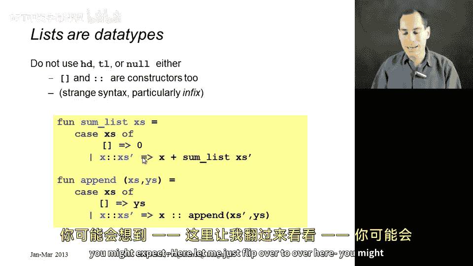
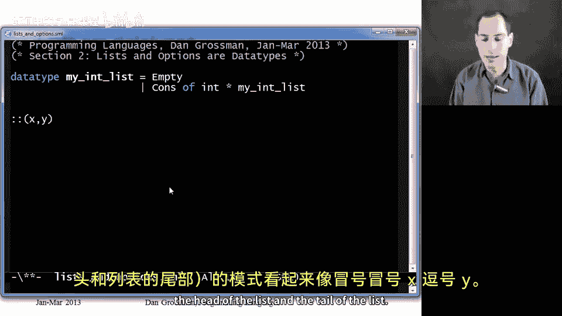
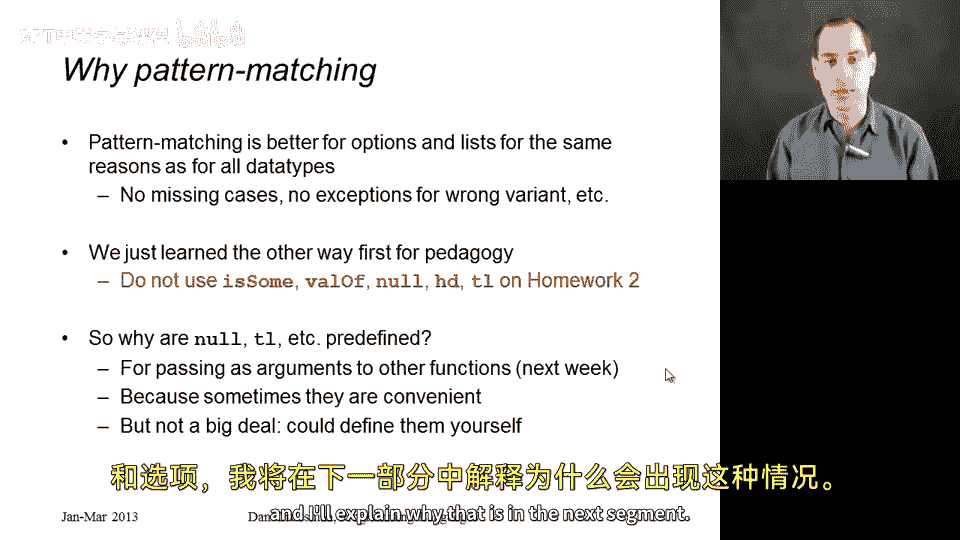

# 038：列表与选项作为数据类型

在本节课中，我们将回顾之前学过的列表和选项类型，并揭示它们的本质：它们实际上是数据类型绑定。我们将学习使用`case`表达式来操作列表和选项，这是一种更优的方式。

## 概述

之前我们学习了如何使用`null`、`head`、`tail`来操作列表，以及使用`isSome`和`valOf`来操作选项。本节课程将揭示，列表和选项本质上是通过数据类型绑定定义的，我们可以使用更安全、更优雅的`case`表达式和模式匹配来替代之前的函数。

## 自定义列表类型

为了理解内置列表的工作原理，我们先看看如何用数据类型绑定定义自己的列表类型。

我们可以定义一个递归的整数列表类型`my_int_list`，它有两种情况：空列表（`Empty`）或由“构造器”（`Cons`）构建的非空列表。`Cons`构造器接受一个整数和另一个`my_int_list`作为参数。

以下是定义：
```sml
datatype my_int_list = Empty | Cons of int * my_int_list
```

使用这个类型，我们可以创建一个列表变量。例如，表示列表`[4, 23, 2008]`的代码如下：
```sml
val x = Cons(4, Cons(23, Cons(2008, Empty)))
```
这段代码从内向外构建列表：`Cons(2008, Empty)` 构成一个单元素列表，然后作为第二个参数传递给外层的`Cons`构造器，依此类推。

接着，我们可以为这个自定义列表类型编写函数，例如`append`函数。我们会使用`case`表达式进行模式匹配，其算法与内置列表的`append`相同。

以下是`append`函数的实现：
```sml
fun append_my_list (xs, ys) =
    case xs of
        Empty => ys
      | Cons(x, xs') => Cons(x, append_my_list(xs', ys))
```
如果`xs`是`Empty`，则直接返回`ys`。否则，将`xs`匹配为`Cons(x, xs')`，然后递归地将`x`添加到`append_my_list(xs', ys)`的结果前面。

需要明确的是，在实际编程中应使用ML内置的列表，这里只是为了演示原理。

## 使用Case表达式处理选项

上一节我们介绍了自定义数据类型，本节我们来看看如何将`case`表达式应用于内置的选项类型。

我之前介绍过，可以使用`NONE`和`SOME`创建选项，用`isSome`检查是否为`SOME`，用`valOf`提取值。现在我将告诉你一个事实：**选项类型也是通过数据类型绑定定义的**，`NONE`和`SOME`就是构造器。

因此，我们可以直接在`case`表达式的模式中使用`NONE`和`SOME`。

例如，以下函数接收一个`int option`，如果是`NONE`则返回0，如果是`SOME i`则返回`i+1`：
```sml
fun inc_or_zero (x : int option) =
    case x of
        NONE => 0
      | SOME i => i + 1
```
模式`NONE`不携带数据，而`SOME i`会将`i`绑定到所包含的值上。

使用`case`表达式比`isSome`和`valOf`更好，原因包括：不会遗漏分支、代码更易读、避免了对`NONE`应用`valOf`导致的运行时错误。因此，在作业2及以后的ML编程中，推荐使用这种风格。



## 使用Case表达式处理列表



理解了选项的处理方式后，对于列表我们也可以采用同样的思路。我们将不再使用`null`、`head`和`tail`，而是使用`case`表达式。

对于内置列表，模式匹配的语法稍有不同：
*   空列表的模式是 `[]`。
*   非空列表的模式是 `x::xs'`。这里`::`是构造器，`x`匹配列表的第一个元素（头），`xs'`匹配剩余部分（尾）。

以下是两个示例函数。

第一个是`sum_list`，用于计算列表所有元素的和：
```sml
fun sum_list (xs : int list) =
    case xs of
        [] => 0
      | x::xs' => x + sum_list(xs')
```
如果列表为空，和为0。否则，将头元素`x`与剩余列表`xs'`的和相加。

第二个是`append`函数，用于连接两个列表：
```sml
fun append (xs : int list, ys : int list) =
    case xs of
        [] => ys
      | x::xs' => x :: append(xs', ys)
```
如果`xs`为空，结果就是`ys`。否则，将`x`与`append(xs', ys)`的结果用`::`连接起来。

使用`case`表达式的优点与选项相同：避免遗漏情况、防止对空列表调用`tail`等错误。为了让大家熟练掌握，在第二次作业中，将要求必须使用`case`表达式进行模式匹配。

你可能会问，既然`case`表达式更好，为什么ML还要提供`null`、`head`、`tail`、`isSome`、`valOf`这些函数呢？原因有几个：
1.  它们有时可以作为参数传递给其他函数（我们将在后续高阶函数章节看到）。
2.  在某些简单场景下，它们写起来更便捷。
3.  它们很容易定义，ML提供它们是为了让所有人使用统一的函数名。

## 总结



本节课中我们一起学习了列表和选项类型的本质。我们看到，ML语言的核心其实更精简：列表和选项并非语言的特殊新增部分，它们只是通过通用的**数据类型绑定**机制预定义的、非常有用的类型。我们使用**case表达式**和**模式匹配**来操作它们，这种方式更安全、更清晰。在接下来的课程中，我们将探索为什么我们无法完全像定义`my_int_list`那样自己定义完全一样的内置列表，这引出了下一个有趣的话题。