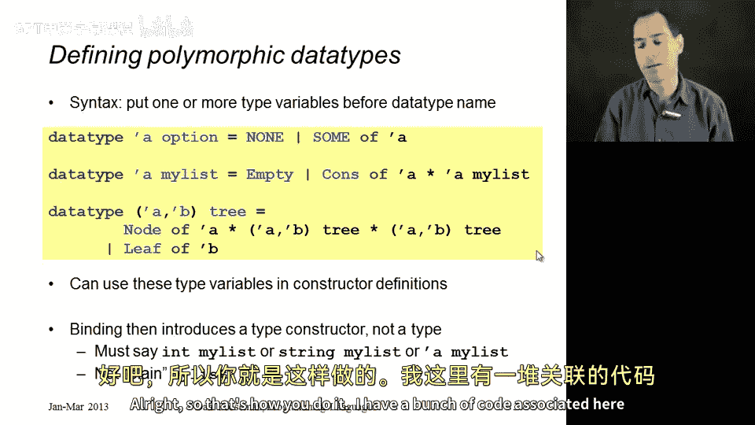
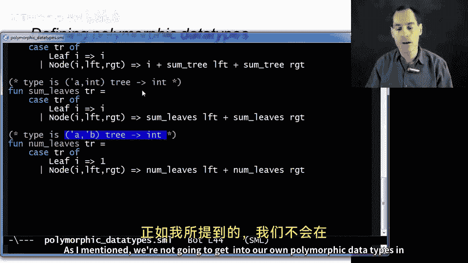
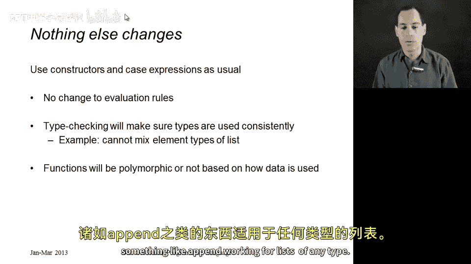

# 039：多态数据类型 🧬

在本节课中，我们将学习如何定义自己的多态数据类型。我们将看到，ML 语言中的列表（list）和选项（option）类型并非特殊的内置结构，而是通过一种通用的多态数据类型定义机制实现的。通过理解这种机制，你将能够创建自己的、可以处理多种类型数据的自定义类型。

## 概述

之前我们提到，ML 中的列表和选项类型并不特殊，它们只是普通的数据类型绑定。但有一个关键区别：列表和选项是**类型构造器**，它们接受类型参数来生成具体的类型（例如 `int list`）。本节课将展示如何在 ML 中定义自己的多态数据类型，从而理解列表和选项的实现原理。

## 多态数据类型的定义语法

上一节我们介绍了普通的数据类型绑定。本节中我们来看看如何为其添加类型参数，使其成为多态类型。

定义多态数据类型的语法是在 `datatype` 关键字后、新类型名称前，声明一个或多个类型参数。这些参数通常用希腊字母表示，如 `'a`（读作“alpha”）。

以下是几个关键示例：

*   **选项类型**：ML 内置的 `option` 类型可以这样定义：
    ```sml
    datatype 'a option = NONE | SOME of 'a
    ```
    这里，`'a` 是一个类型参数。`int option` 和 `string option` 才是具体的类型。`SOME` 构造器携带一个类型为 `'a` 的值。

*   **列表类型**（忽略其特殊语法）：列表的核心结构可以这样定义：
    ```sml
    datatype 'a mylist = Empty | Cons of 'a * ('a mylist)
    ```
    注意，递归部分 `('a mylist)` 必须使用相同的类型参数 `'a`，这保证了列表中的所有元素类型一致。

*   **多参数类型**：我们还可以定义具有多个类型参数的类型。例如，一个二叉树，其内部节点和叶子节点可以存储不同类型的数据：
    ```sml
    datatype ('a, 'b) tree = Leaf of 'b
                           | Node of 'a * ('a, 'b) tree * ('a, 'b) tree
    ```
    这里，`'a` 是内部节点数据的类型，`'b` 是叶子节点数据的类型。它们可以相同，也可以不同。

## 使用多态数据类型编写函数

定义了多态数据类型后，我们可以像使用普通类型一样编写函数。函数的类型会根据其如何使用数据而自动推导。

以下是使用内置列表类型和自定义树类型编写的几个函数示例：



### 处理列表的函数

首先，我们回顾两个处理列表的函数，以观察类型推导的差异。

*   **`sum_list` 函数**：对整数列表求和。
    ```sml
    fun sum_list xs =
        case xs of
            [] => 0
          | x::xs' => x + sum_list xs'
    ```
    类型推导器会发现 `x` 参与了加法运算 `+`，且基准情况返回 `0`（`int` 类型）。因此，它推断出 `sum_list` 的类型必须是 `int list -> int`。

*   **`append` 函数**：连接两个列表。
    ```sml
    fun append (xs, ys) =
        case xs of
            [] => ys
          | x::xs' => x :: append(xs', ys)
    ```
    类型推导器发现，函数实现不依赖于列表元素的特定类型，但要求两个输入列表 `xs` 和 `ys` 的元素类型必须相同（因为我们将 `x` 与 `append` 的结果拼接）。因此，它推断出 `append` 的类型是 `('a list * 'a list) -> 'a list`，这是一个多态类型。

### 处理自定义树的函数

现在，我们使用之前定义的 `('a, 'b) tree` 类型来编写函数，看看类型推导如何工作。

以下是三个函数的定义：

1.  **`sum_tree` 函数**：计算树中所有节点（包括内部节点和叶子）值的总和。
    ```sml
    fun sum_tree tr =
        case tr of
            Leaf i => i
          | Node (i, left, right) => i + sum_tree left + sum_tree right
    ```
    由于函数对叶子节点值 `i` 和内部节点值 `i` 都进行加法操作，类型推导器要求 `'a` 和 `'b` 都必须是 `int`。因此，`sum_tree` 的类型是 `(int, int) tree -> int`。

2.  **`sum_leaves` 函数**：仅计算树中所有叶子节点值的总和。
    ```sml
    fun sum_leaves tr =
        case tr of
            Leaf i => i
          | Node (_, left, right) => sum_leaves left + sum_leaves right
    ```
    这个函数只使用了叶子节点的值 `i`（进行加法），而忽略了内部节点的数据（用 `_` 匹配）。因此，类型推导器只要求叶子类型 `'b` 是 `int`，而内部节点类型 `'a` 可以是任意类型。`sum_leaves` 的类型是 `('a, int) tree -> int`，它是一个多态函数。

3.  **`num_leaves` 函数**：统计树中叶子节点的数量。
    ```sml
    fun num_leaves tr =
        case tr of
            Leaf _ => 1
          | Node (_, left, right) => num_leaves left + num_leaves right
    ```
    这个函数完全不关心节点中存储的具体数据（叶子节点和内部节点的值都用 `_` 忽略）。因此，它对类型参数 `'a` 和 `'b` 都没有限制。`num_leaves` 的类型是 `('a, 'b) tree -> int`，这是一个完全多态的函数。

## 总结

本节课中我们一起学习了 ML 中多态数据类型的核心概念。

*   **定义**：使用 `datatype ‘a mytype = ...` 语法可以定义自己的多态类型，其中 `‘a` 是类型参数。
*   **本质**：列表和选项类型正是利用此机制定义的，并非语言魔法。
*   **类型推导**：函数的类型会根据其**如何使用**数据成员而自动、精确地推导出来。
    *   如果函数对数据进行了特定类型的操作（如整数加法），则对应的类型参数会被具体化（如 `int`）。
    *   如果函数未使用某些数据，则对应的类型参数可以保持多态（如 `‘a`）。
*   **一致性**：核心原则不变——在一个具体的数据结构实例中，所有对应相同类型参数的位置，其类型必须一致。





通过掌握多态数据类型的定义和使用，你便拥有了构建灵活、通用数据结构的强大工具，这正是 ML 类型系统优雅而强大的体现。