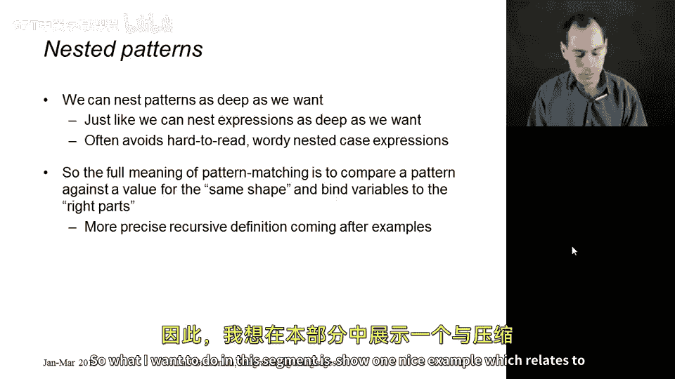
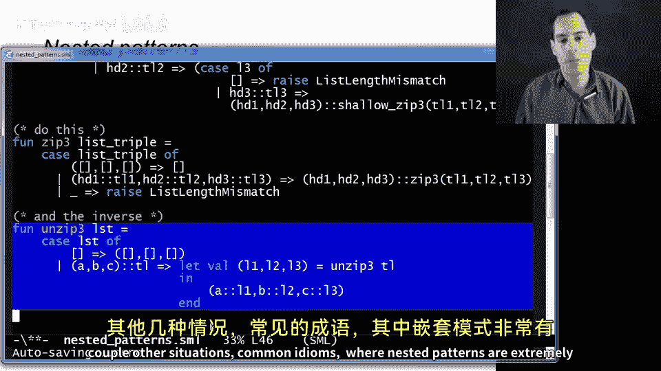

# 043：嵌套模式匹配 🧩

在本节课中，我们将要学习模式匹配的一个强大特性：**嵌套模式**。通过允许我们将模式放入其他模式中，我们可以编写出更简洁、更易读的代码，避免复杂的嵌套 `case` 表达式。

## 概述



上一节我们介绍了基础的模式匹配。本节中，我们来看看如何通过嵌套模式来**泛化**我们之前所学的知识。嵌套模式的核心思想是：在任何可以放置变量或简单模式的地方，我们都可以放置另一个模式。这类似于在构建表达式时，我们可以在任何位置嵌套子表达式。通过递归定义，模式匹配将检查一个值是否具有模式所描述的“形状”，并在匹配时，将变量绑定到值的相应部分。

为了更好地理解，让我们先看一个具体的例子。

## 示例：ZIP与UNZIP函数

一个展示嵌套模式强大之处的经典例子是实现 `zip3` 和 `unzip3` 函数。

*   **`zip3`**：接收三个列表，返回一个元组列表，其中每个元组包含三个输入列表中对应位置的元素。其作用类似于拉链，将独立的部件并排组合。
*   **`unzip3`**：是 `zip3` 的逆操作。接收一个元组列表，返回三个列表，分别包含所有元组的第一个、第二个和第三个元素。

### 不使用模式匹配的实现

首先，我们看看如果不使用模式匹配，`zip3` 函数会多么繁琐且容易出错：

```sml
(* 旧式实现，未使用模式匹配 *)
fun old_zip3 (L1, L2, L3) =
    if null L1 andalso null L2 andalso null L3
    then []
    else if null L1 orelse null L2 orelse null L3
    then raise Empty (* 假设已声明异常 *)
    else (hd L1, hd L2, hd L3) :: old_zip3(tl L1, tl L2, tl L3)
```

这种写法需要手动检查列表是否为空，代码冗长且类型检查器无法提供太多帮助。

### 使用基础模式匹配的实现

即使使用我们目前学过的基础模式匹配，代码也会因为需要枚举所有空/非空组合而显得混乱：

```sml
(* 使用基础模式匹配，代码冗长 *)
fun clumsy_zip3 (L1, L2, L3) =
    case L1 of
        [] => (case L2 of
                  [] => (case L3 of
                            [] => []
                          | _ => raise Empty)
                | _ => raise Empty)
      | x::xs => (case L2 of
                     [] => raise Empty
                   | y::ys => (case L3 of
                                  [] => raise Empty
                                | z::zs => (x,y,z) :: clumsy_zip3(xs, ys, zs)))
```

### 使用嵌套模式匹配的实现

现在，让我们看看如何使用嵌套模式写出优雅的解决方案。以下是 `zip3` 的实现：

```sml
(* 使用嵌套模式匹配 *)
fun zip3 list_triple =
    case list_triple of
        ([], [], []) => []                         (* 模式1：三个空列表 *)
      | (x::xs, y::ys, z::zs) =>                   (* 模式2：三个非空列表 *)
          (x, y, z) :: zip3 (xs, ys, zs)
      | _ => raise Empty                           (* 模式3：其他所有情况 *)
```

让我们详细分析这段代码：

*   **函数定义**：`fun zip3 list_triple =`。函数接收一个参数 `list_triple`，它是一个三元组 `(L1, L2, L3)`。
*   **模式1 `([], [], [])`**：这是一个嵌套模式。它匹配一个三元组，且该三元组的三个分量都是空列表。匹配时，直接返回空列表 `[]`。
*   **模式2 `(x::xs, y::ys, z::zs)`**：这是关键的嵌套模式。它匹配一个三元组，且三个分量都是非空列表（即 `head::tail` 结构）。匹配成功后，变量 `x`, `y`, `z` 被绑定到三个列表的头部元素，`xs`, `ys`, `zs` 被绑定到尾部。然后，递归地对尾部进行 `zip3` 操作。
*   **模式3 `_`**：下划线模式匹配所有未被前两个模式匹配的情况（即列表长度不一致），并抛出异常。

类似地，我们可以用嵌套模式优雅地实现 `unzip3`：

```sml
fun unzip3 lst =
    case lst of
        [] => ([], [], [])                         (* 空列表情况 *)
      | (a, b, c)::tl =>                           (* 非空列表，且头部是三元组 *)
          let val (l1, l2, l3) = unzip3 tl         (* 递归解压缩尾部 *)
          in (a::l1, b::l2, c::l3)                 (* 将头部元素分别cons到结果列表 *)
          end
```

在 `unzip3` 的第二个模式 `(a, b, c)::tl` 中，我们再次看到了嵌套：它匹配一个非空列表，并且**同时**匹配其头部元素必须是一个三元组 `(a, b, c)`。这在一个模式中完成了两层数据的解构。

## 总结

本节课中我们一起学习了**嵌套模式匹配**。通过允许模式中包含其他模式，我们能够：
1.  用更少的代码行数表达复杂的条件判断。
2.  写出结构清晰、更易阅读和维护的程序。
3.  避免深层嵌套的 `case` 表达式。



`zip3` 和 `unzip3` 的例子展示了如何利用嵌套模式同时解构元组和列表。在接下来的课程中，我们将看到更多嵌套模式的常见用法和习惯用语。掌握这一特性，是编写优雅函数式代码的关键一步。