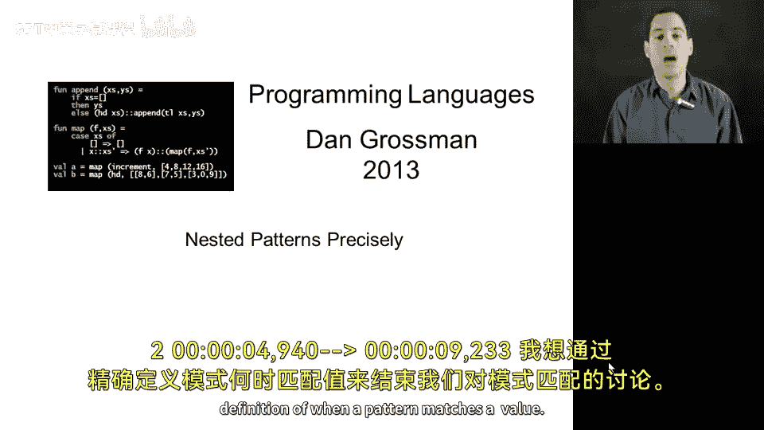
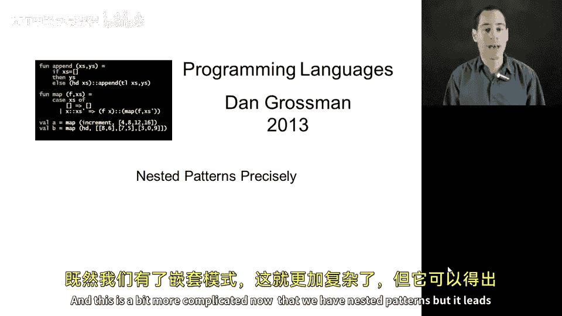
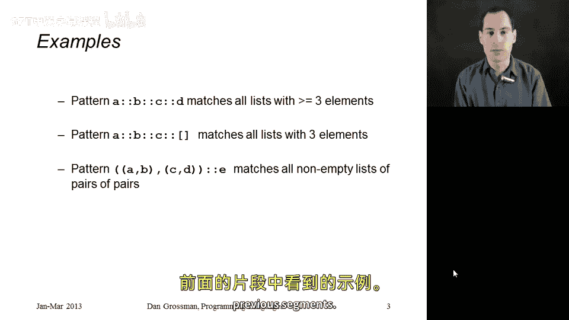

# 045：嵌套模式匹配的精确语义

在本节课中，我们将为模式匹配提供一个精确的定义，以说明一个模式何时与一个值匹配。由于我们引入了嵌套模式，这个定义会稍微复杂一些，但它会引出一个非常自然且优雅的递归定义。

需要明确的是，这里描述的是模式匹配的语义和求值规则。具体来说，就是当你有一个模式和一个值时，如何判断它们是否匹配。例如，这个值通常是 `case` 和 `of` 之间表达式的结果，而模式则是 `case` 表达式中按顺序排列的各个分支。这些规则同样适用于函数绑定或 `val` 绑定中的模式。核心问题是：给定一个模式和一个值，它们是否匹配？如果匹配，会引入哪些变量，这些变量被绑定到什么值？

## 递归定义的基础

在嵌套模式存在的情况下，这是一个递归定义。定义中会为每一种书写模式的方式提供一个分支。虽然幻灯片上没有列出所有情况，但通过以下示例，你将理解其核心思想，并体会到模式匹配在语言定义中本身就是一个递归过程。

让我们从递归的基础情况开始，即模式是变量或通配符（下划线 `_`）的情况。

*   **变量模式**：如果模式是一个变量，那么无论值 `V` 是什么，匹配总是成功。该变量将被绑定到整个值 `V`。
*   **通配符模式**：如果模式是下划线 `_`，匹配也总是成功，并且不会绑定任何变量。

## 递归情况的定义

其他情况都是递归的，它们由更小的嵌套模式构成。这些嵌套模式本身可能是变量这样的基础情况，也可能是更复杂的嵌套模式，此时递归定义将继续适用。

以下是两种主要的递归情况：

**1. 元组模式**

假设我们有一个元组模式，形式为 `(P1, P2, ..., Pn)`。这个模式只会匹配那些同样是包含 `n` 个值的元组。并且，只有当 `P1` 匹配 `V1`、`P2` 匹配 `V2`……直到 `Pn` 匹配 `Vn` 时，整个元组模式才匹配。这里的递归匹配正是引用了同一个模式匹配的递归定义。如果所有这些子模式都匹配，它们会各自引入一系列变量到值的绑定，而整个模式的绑定就是所有这些绑定的并集。模式匹配有一个额外规则：**不允许在同一个模式中多次使用同一个变量名**，编译器会拒绝这样的代码。

**2. 构造器模式**

假设 `C` 是某个已定义数据类型的构造器。我们可以写出形如 `C(P1)` 的模式，其中 `P1` 是一个嵌套模式（通常是一个元组，但也可以是任何模式）。如果一个值是由同一个构造器 `C` 构建的，并且其内部值 `V1` 与嵌套模式 `P1` 匹配，那么这个构造器模式就与该值匹配。然后，由 `P1` 匹配 `V1` 这一递归匹配所产生的变量绑定，就是整个 `C(P1)` 模式匹配 `C(V1)` 值所产生的绑定。

## 示例解析

通过上述递归定义，我们可以更清晰地理解嵌套模式如何与特定形状的值进行匹配。以下是三个例子：

*   **示例一：`a::b::c::d`**
    这个模式将匹配任何**长度大于等于3**的列表。它会递归地将 `a` 匹配到第一个元素，`b` 匹配到第二个，`c` 匹配到第三个，而 `d` 则匹配列表的剩余部分。如果列表太短，最终会尝试用空列表值去匹配 `::` 构造器模式，这将导致匹配失败，程序会转向 `case` 表达式的下一个分支。

*   **示例二：`a::b::c::[]`**
    这个模式将匹配所有**恰好有三个元素**的列表，将 `a`、`b`、`c` 分别绑定到第一、二、三个元素。如果列表过短或过长，都会在递归匹配过程中遇到构造器不匹配的情况（例如用 `[]` 模式匹配非空列表，或用 `::` 模式匹配空列表），从而导致匹配失败。

*   **示例三：`((w,x), (y,z))::e`**
    这个模式包含更多嵌套。它只会匹配一个**非空列表**，并且要求该列表的第一个元素是一个由两个二元组构成的二元组。匹配成功后，将引入 `w`、`x`、`y`、`z`、`e` 这五个变量的绑定。

## 总结

本节课中，我们一起学习了模式匹配的精确递归定义。我们从变量和通配符这两个基础情况开始，然后探讨了如何处理元组模式和构造器模式这两种递归情况。通过具体的列表模式示例，我们看到了这个定义如何清晰地解释嵌套模式的行为。希望这能让你认识到，模式匹配并非一个模糊的概念，而是一个具有精确定义的机制，它能更完整地解释我们在之前课程中看到的各类示例。